# Unifiles 架构设计

> 本文档面向希望深入了解 Unifiles 内部实现的开发者和贡献者。
>
> 如果你是使用 Unifiles 的开发者，请查看[在线文档](https://unifiles.dev/docs)。

# Architecture

Unifiles 采用现代化的分层架构设计，旨在提供高性能、高可用、易扩展的文档处理与知识库服务。

## 核心设计理念

### 以 Markdown 为核心

所有文档内容统一转换为 Markdown 格式作为单一真实来源（Single Source of Truth），实现：

- **内容统一性**：消除多格式带来的不一致性
- **存储高效性**：轻量级文本格式，易于存储和索引
- **处理灵活性**：同一份内容可应用不同的分块和索引策略

### 设计原则

- **高内聚，低耦合**：各模块功能独立，通过清晰的接口交互
- **可扩展性**：采用策略模式，易于添加新功能
- **状态清晰**：完整的状态跟踪和可追溯性
- **异步优先**：核心流程采用异步设计，实现高性能和高并发

## 架构概览

### 分层架构

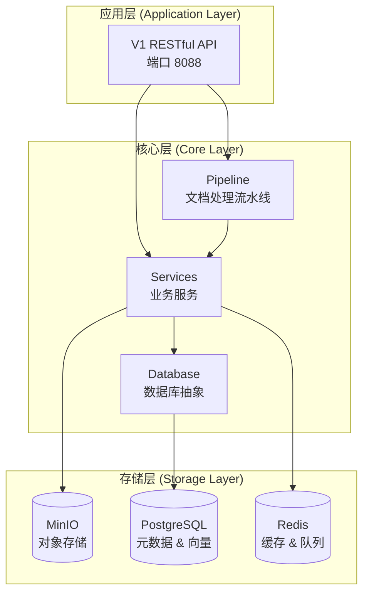

## 三层业务架构

### 第一层：文件管理
- 文件上传、下载、删除
- 文件元数据管理
- 存储空间管理
- 访问权限控制

[详细设计](three-layer-design.md#layer-1)

### 第二层：内容提取
- 文件格式验证和转换
- OCR 文本提取
- 内容结构化处理
- 处理状态管理

[详细设计](three-layer-design.md#layer-2)

### 第三层：知识库管理
- 知识库创建和管理
- 文档索引和向量化
- 知识检索和查询
- 分块策略管理

[详细设计](three-layer-design.md#layer-3)

## 核心组件

### 文档处理流水线

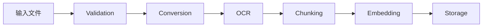

[流水线设计](pipeline-design.md)

### 数据模型

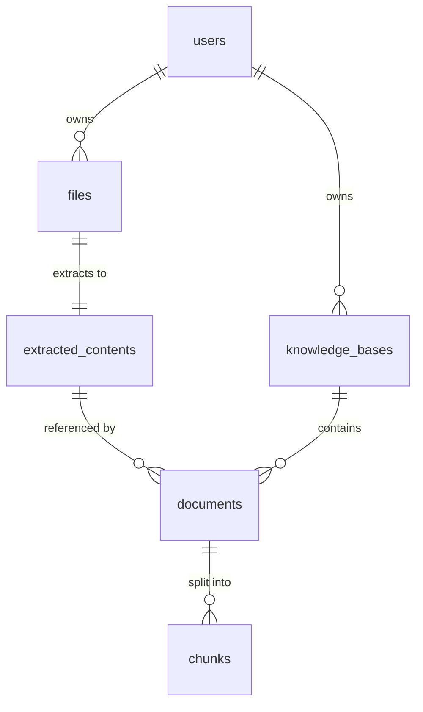

[数据库设计](database-schema.md)

## 技术栈

### Backend
- **Framework**: FastAPI 0.104+
- **Language**: Python 3.11+
- **Async**: asyncio, asyncpg

### Storage
- **Database**: PostgreSQL 15+ with pgvector
- **Object Storage**: MinIO
- **Cache**: Redis 7+

### Observability
- **Logging**: Loguru + Structured Logging
- **Tracing**: OpenTelemetry
- **Monitoring**: Prometheus + Grafana

### Development
- **Package Manager**: uv
- **Testing**: pytest
- **Linting**: ruff
- **Type Checking**: mypy

## 关键特性

### 高性能
- 异步 I/O 处理
- 连接池管理
- Redis 缓存
- 批量操作优化

### 高可用
- 无状态设计
- 水平扩展
- 负载均衡
- 优雅降级

### 安全性
- API Key 认证
- 数据加密（传输和存储）
- 多租户隔离
- 访问控制列表

### 可观测性
- 统一日志系统
- 分布式追踪
- 实时监控
- 告警机制

## 深入阅读

- [系统概览](overview.md) - 系统架构详细说明
- [三层架构设计](three-layer-design.md) - 业务分层架构
- [API 架构](api-architecture.md) - API 设计和实现
- [数据流设计](data-flow.md) - 数据流转和处理
- [数据库设计](database-schema.md) - 数据模型和关系
- [深度分析](deep-analysis.md) - 技术决策和权衡


---

# 详细设计

## 三层业务架构

# 架构设计

本文档详细阐述了 Unifiles Core 的核心架构设计，旨在为开发者提供一个清晰、全面的系统认知。

## 1. 核心设计理念

### 以Markdown为核心

架构的核心思想是**以Markdown作为内容的单一真实来源（Single Source of Truth）**。所有不同格式的输入文件（如PDF, Word, 图片）都会被统一处理和转换为标准化的Markdown格式。

这种设计的优势在于：
- **内容统一性**: 消除多格式带来的不一致性，所有内容处理都基于统一的Markdown结构。
- **存储高效性**: Markdown是轻量级文本格式，易于存储、索引和版本控制。图片等二进制资源被独立存储并引用，避免冗余。
- **处理灵活性**: 同一份Markdown内容可以根据不同业务场景（如问答、分析、检索）应用不同的分块和索引策略，实现内容的一次提取、多次使用。

### 设计原则
- **高内聚，低耦合**: 各模块功能独立，通过清晰的接口交互。
- **可扩展性**: 采用策略模式，可以轻松添加新的文件格式支持、分块算法或嵌入模型。
- **状态清晰**: 对文档处理的每一步进行状态跟踪，确保流程的可追溯性和可恢复性。
- **异步优先**: 核心流程采用异步设计，以实现高性能和高并发。

## 2. 系统架构

系统采用分层架构，自上而下分为应用层、核心层和存储层。

### 2.1 架构分层图

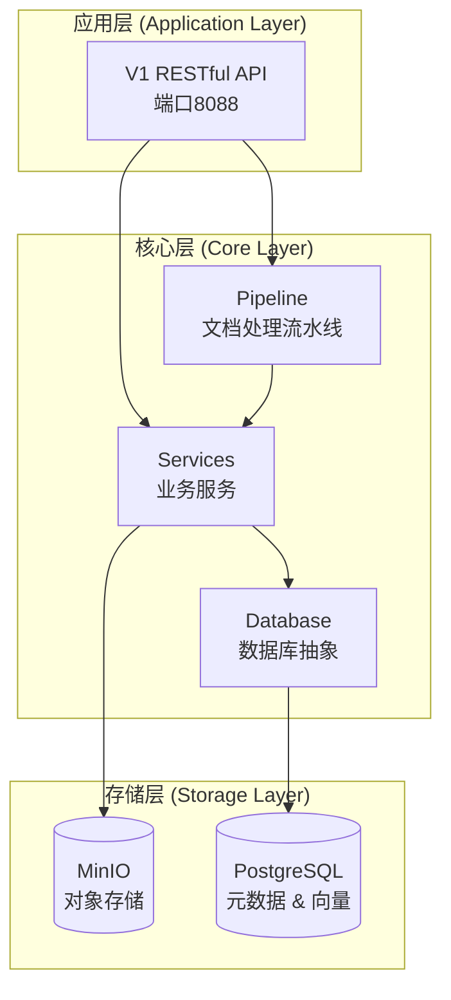

### 2.2 数据处理流程

从文件上传到知识库查询的完整数据流如下：

```mermaid
graph TD
    %% 输入层
    A[用户上传文件] --> B[Files 表]
    
    %% 文件管理层
    B --> C[文件处理队列]
    C --> D[File Processing Logs]
    
    %% 内容提取层
    C --> E[内容提取引擎<br/>(格式转换, OCR)]
    E --> F[Extracted Contents 表<br/>存储完整Markdown]
    E --> G[Extraction Assets 表<br/>存储图片等资源]
    
    %% 知识库层
    H[用户创建知识库] --> I[Knowledge Bases 表]
    F --> J[文档索引到知识库]
    I --> J
    J --> K[Documents 表<br/>引用Extracted Contents]
    K --> L[分块策略应用]
    L --> M[Chunks 表<br/>生成文档块及向量]
    G --> N[Document Assets<br/>资源引用]
    K --> N
    
    %% 查询层
    O[用户查询] --> P[向量搜索]
    P --> M
    M --> Q[返回相关Chunks]
    Q --> R[组装完整响应]
```

## 3. 文档处理流水线 (Pipeline)

文档处理是系统的核心，采用异步Pipeline模式，由一系列可插拔的处理阶段（Stage）串联而成。

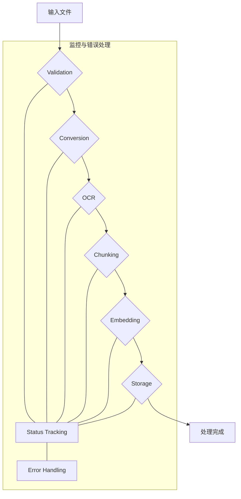

### Pipeline核心组件
- **DocumentProcessor**: 主控制器，负责调度和执行所有处理阶段。
- **ProcessingContext**: 处理上下文，作为一个数据载体，在各个阶段之间传递文档信息、中间产物和状态。
- **ProcessingStage**: 处理阶段的抽象基类，定义了统一的 `process` 接口。每个具体阶段（如转换、OCR）都是它的实现。

### 主要处理阶段
1.  **Validation (验证)**: 检查文件格式、大小和完整性。
2.  **Conversion (格式转换)**: 将各种输入格式（Word, PPT, 图片等）统一转换为PDF格式，为OCR做准备。
3.  **OCR (内容提取)**: 使用OCR技术从PDF文件中提取文本和图片，生成标准化的Markdown内容。支持通过多模态大模型增强图片描述。
4.  **Chunking (分块)**: 根据配置的策略（如分层、语义）将Markdown内容和图片分割成小的逻辑单元（Chunks）。
5.  **Embedding (向量化)**: 使用指定的嵌入模型（如OpenAI, HuggingFace）将文本块和图片块转换为向量。
6.  **Storage (存储)**: 将分块内容、元数据和向量存储到PostgreSQL数据库中，以供后续检索。

## 4. 数据模型

系统的核心数据模型围绕文档处理流程设计，确保数据结构的清晰和一致。

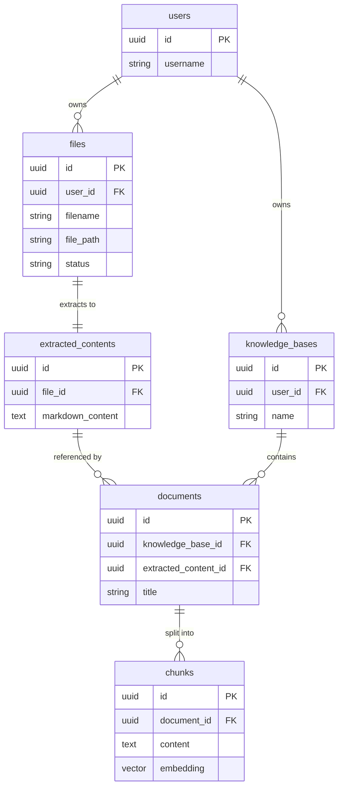

### 关键实体说明
- **User**: 系统用户。
- **File**: 用户上传的原始文件记录。
- **ExtractedContent**: 从原始文件中提取的、标准化的Markdown内容。这是实现“一次提取，多次使用”的关键。
- **KnowledgeBase**: 用户创建的知识库，作为文档的组织单元。
- **Document**: 知识库中的一个文档条目，它引用一个`ExtractedContent`，并定义了该内容的特定处理方式（如分块策略）。
- **Chunk**: `Document`被分割后的最小单元，包含内容和对应的向量，是检索的基本单位。

## 5. 数据库设计

数据库采用PostgreSQL，并利用 `pgvector` 扩展进行高效的向量存储和检索。

### 设计原则
- **零冗余**: `extracted_contents` 表作为内容的唯一真实来源，避免了在不同知识库中重复存储相同内容。
- **高灵活性**: 同一个 `extracted_contents` 可以被多个 `documents` 引用，每个 `document` 可以采用不同的分块策略生成不同的 `chunks` 集合，以适应不同场景。
- **关系清晰**: 表结构严格按照“文件 -> 提取内容 -> 知识库文档 -> 分块”的逻辑层次设计，关系清晰，易于维护。

通过这种设计，系统在保证数据一致性的同时，实现了极高的灵活性和存储效率。

## 6. web服务设计

### 整体架构图
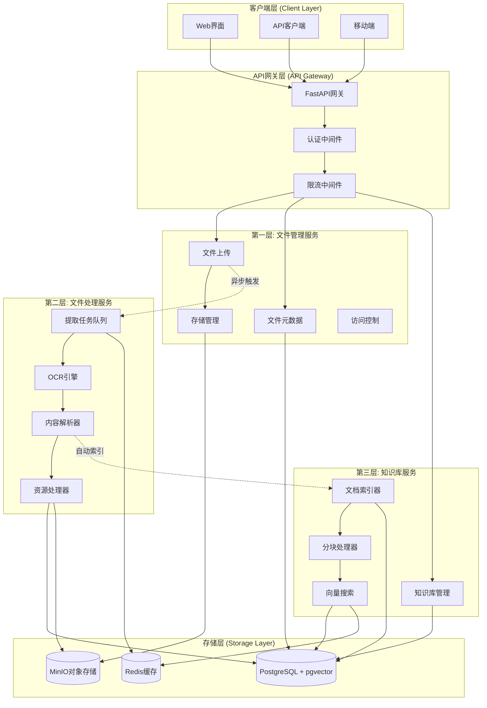

## 7. 提供服务的业务分层
```
第一层: 文件上传和管理服务 (File Management Layer)
├── 文件上传、下载、删除
├── 文件元数据管理  
├── 存储空间管理
└── 访问权限控制

第二层: 文件处理服务 (File Processing Layer)
├── 文件格式验证和转换
├── OCR文本提取
├── 内容结构化处理
└── 处理状态管理

第三层: 知识库管理服务 (Knowledge Base Layer)
├── 知识库创建和管理
├── 文档索引和向量化
├── 知识检索和查询
└── 分块策略管理
```

## 8.
### 架构原则
- **分层解耦**：每层职责明确，接口清晰
- **异步处理**：所有IO操作异步化
- **快速响应**：接口秒返回，后台异步处理
- **可扩展性**：支持水平扩展和微服务化

### 第一层：文件上传和管理服务 (File Management Layer)

**职责**：
- 文件上传、下载、删除
- 文件元数据管理
- 存储空间管理
- 文件访问权限控制

**核心端点**：
- `POST /files` - 文件上传（秒返回）
- `GET /files/{file_id}` - 获取文件信息
- `GET /files/{file_id}/download` - 文件下载
- `DELETE /files/{file_id}` - 删除文件
- `GET /files/types` - 支持的文件类型

**技术实现**：
- 基于现有的 `unifiles/app/v1/routers/unifiles.py`
- 使用 `unifiles/core/storage.py` 的MinIO存储管理
- 异步文件上传，立即返回文件ID和状态

### 第二层：文件处理服务 (File Processing Layer)

**职责**：
- 文件格式验证和转换
- OCR文本提取
- 内容结构化处理
- 处理状态管理

**核心端点**：
- `POST /processors/extract` - 启动文件内容提取

**技术实现**：
- 基于现有的 `unifiles/core/services/document_processor.py`
- 使用 `unifiles/core/pipelines/` 中的处理流水线
- 异步任务队列，支持批量处理

### 第三层：知识库管理服务 (Knowledge Base Layer)

**职责**：
- 知识库创建和管理
- 文档索引和向量化

**核心端点**：
- `GET /knowledge-bases` - 获取知识库列表
- `POST /knowledge-bases` - 创建知识库
- `POST /knowledge-bases/{kb_id}/documents` - 索引文档到知识库
- `GET /knowledge-bases/{kb_id}/documents` - 获取知识库文档
- `POST /knowledge-bases/{kb_id}/search` - 知识库搜索

**技术实现**：
- 基于现有的 `unifiles/app/v1/routers/knowledge_bases.py`
- 使用 `unifiles/core/services/embedding_service.py` 进行向量化
- 集成现有的数据库模型和向量存储

---

## 数据库设计

# Database Schema Diagram

This document illustrates the database entity relationships and schema structure for the Unifiles system.

## Entity Relationship Diagram

```mermaid
erDiagram
    %% User and Authentication Layer
    USERS {
        string id PK
        string username
        string email
        string display_name
        string user_status
        string user_role
        json knowledge_ids
        json user_settings
        datetime created_at
        datetime updated_at
        datetime last_login_at
    }
    
    ACCESS_KEYS {
        string id PK
        string user_id FK
        string access_key
        string name
        json scopes
        boolean is_active
        datetime created_at
        datetime expires_at
        datetime last_used_at
    }
    
    %% Storage Configuration Layer
    STORAGE_CONFIGS {
        string id PK
        string storage_type
        string storage_name
        string endpoint
        string bucket_name
        string region
        string access_key_id
        string secret_access_key
        string base_path
        string public_url_prefix
        boolean is_active
        string config_source
        datetime created_at
        datetime updated_at
    }
    
    %% File Management Layer
    FILES {
        string id PK
        string user_id FK
        string filename
        string original_filename
        string mime_type
        string file_extension
        int bytes
        string file_size_readable
        string file_hash
        string hash_algorithm
        string storage_config_id FK
        string storage_path
        string status
        string upload_source
        boolean is_deleted
        string file_category
        json tags
        json metadata
        json processing_config
        datetime created_at
        datetime updated_at
        datetime uploaded_at
        datetime processed_at
    }
    
    FILE_PROCESSING_LOGS {
        string id PK
        string file_id FK
        string stage
        string status
        string message
        json error_details
        datetime created_at
    }
    
    %% Content Extraction Layer
    EXTRACTED_DOCUMENTS {
        string id PK
        string file_id FK
        string user_id FK
        string extraction_method
        string extraction_version
        string extraction_engine
        text full_markdown
        json structured_content
        json document_structure
        json page_structure
        int total_pages
        int total_chars
        int total_words
        int total_paragraphs
        int total_assets
        int text_blocks_count
        int image_blocks_count
        string extraction_status
        json extraction_metadata
        json processing_config
        json performance_metrics
        datetime created_at
        datetime extraction_started_at
        datetime completed_at
        datetime validated_at
    }
    
    EXTRACTED_ASSETS {
        string id PK
        string extracted_document_id FK
        string asset_type
        string asset_subtype
        string asset_name
        string original_filename
        string storage_config_id FK
        string storage_path
        int file_size
        string file_hash
        string format
        string mime_type
        int position_in_document
        string asset_description
        text extracted_text
        string alt_text
        string caption
        float extraction_confidence
        string processing_status
        string validation_status
        json asset_metadata
        json extraction_metadata
        int access_count
        int reference_count
        datetime created_at
        datetime extracted_at
        datetime last_accessed_at
    }
    
    %% Knowledge Base Layer
    KNOWLEDGE_BASES {
        string id PK
        string user_id FK
        string name
        string display_name
        string description
        string kb_type
        string kb_category
        string visibility
        string access_level
        json default_chunking_strategy
        json vector_config
        json search_config
        int document_count
        int component_count
        int chunk_count
        int photo_count
        int total_size_bytes
        json document_ids
        string parent_kb_id FK
        string hierarchy_path
        int hierarchy_level
        string status
        string processing_status
        string last_updated_by
        json kb_metadata
        json tags
        datetime created_at
        datetime updated_at
        datetime last_document_added_at
        datetime last_processed_at
    }
    
    DOCUMENTS {
        string id PK
        string knowledge_base_id FK
        string extracted_document_id FK
        string title
        string display_name
        string description
        string document_category
        json tags
        json keywords
        json chunking_strategy
        json custom_config
        string processing_status
        string indexing_status
        string validation_status
        int component_count
        int chunk_count
        int photo_count
        int total_chars
        int total_tokens
        json document_permissions
        string access_level
        string hierarchy_path
        string parent_document_id FK
        int document_order
        int version_number
        boolean is_latest_version
        int view_count
        int search_count
        int reference_count
        json document_metadata
        json processing_metadata
        datetime created_at
        datetime processed_at
        datetime indexed_at
        datetime updated_at
        datetime last_accessed_at
    }
    
    KB_STATISTICS {
        string id PK
        string knowledge_base_id FK
        int total_documents
        int total_components
        int total_chunks
        int total_photos
        int total_characters
        int total_words
        int total_tokens
        int total_size_bytes
        int total_searches
        int total_views
        int unique_users_count
        int avg_search_time_ms
        int avg_indexing_time_ms
        datetime last_document_added_at
        datetime last_search_at
        datetime last_updated_at
        datetime created_at
        datetime updated_at
    }
    
    %% Component Abstraction Layer
    COMPONENTS {
        string id PK
        string document_id FK
        string component_type
        int component_index
        text content
        json embedding
        datetime created_at
        datetime updated_at
    }
    
    %% Component Subclass Layer
    CHUNKS {
        string id PK
        string component_id FK
        text text_content
        int char_count
        int word_count
        int token_count
        datetime created_at
        datetime updated_at
    }
    
    PHOTOS {
        string id PK
        string component_id FK
        string extracted_asset_id FK
        string photo_description
        string alt_text
        string photo_subtype
        int width
        int height
        int file_size
        string format
        datetime created_at
        datetime updated_at
    }
    
    %% Relationships
    USERS ||--o{ ACCESS_KEYS : "has"
    USERS ||--o{ FILES : "owns"
    USERS ||--o{ KNOWLEDGE_BASES : "owns"
    USERS ||--o{ EXTRACTED_DOCUMENTS : "owns"
    
    STORAGE_CONFIGS ||--o{ FILES : "stores"
    STORAGE_CONFIGS ||--o{ EXTRACTED_ASSETS : "stores"
    
    FILES ||--o{ FILE_PROCESSING_LOGS : "has"
    FILES ||--|| EXTRACTED_DOCUMENTS : "extracts_to"
    
    EXTRACTED_DOCUMENTS ||--o{ EXTRACTED_ASSETS : "contains"
    EXTRACTED_DOCUMENTS ||--|| DOCUMENTS : "becomes"
    
    KNOWLEDGE_BASES ||--o{ DOCUMENTS : "contains"
    KNOWLEDGE_BASES ||--|| KB_STATISTICS : "has"
    KNOWLEDGE_BASES ||--o{ KNOWLEDGE_BASES : "parent_of"
    
    DOCUMENTS ||--o{ COMPONENTS : "contains"
    DOCUMENTS ||--o{ DOCUMENTS : "parent_of"
    
    COMPONENTS ||--|| CHUNKS : "implements"
    COMPONENTS ||--|| PHOTOS : "implements"
    
    PHOTOS ||--|| EXTRACTED_ASSETS : "references"
```

## Database Layer Architecture

```mermaid
graph TD
    %% Application Layer
    APP[Application Services]
    
    %% Database Abstraction Layer
    DB_MGR[Database Manager]
    BASE_MODEL[Base Model Classes]
    
    %% Model Categories
    USER_MODELS[User & Auth Models]
    FILE_MODELS[File Management Models]
    CONTENT_MODELS[Content Extraction Models]
    KB_MODELS[Knowledge Base Models]
    COMPONENT_MODELS[Component Models]
    
    %% Database Operations
    READ_OPS[Read Operations]
    WRITE_OPS[Write Operations]
    BATCH_OPS[Batch Operations]
    MIGRATION_OPS[Migration Operations]
    
    %% Physical Databases
    POSTGRES[(PostgreSQL<br/>Primary Database)]
    VECTOR_DB[(Vector Database<br/>Embeddings)]
    CACHE[(Redis Cache<br/>Sessions)]
    
    %% Model Relationships
    USER_MODELS --> USERS_TABLE[Users Table]
    USER_MODELS --> ACCESS_KEYS_TABLE[Access Keys Table]
    
    FILE_MODELS --> FILES_TABLE[Files Table]
    FILE_MODELS --> STORAGE_CONFIG_TABLE[Storage Config Table]
    FILE_MODELS --> PROCESSING_LOGS_TABLE[Processing Logs Table]
    
    CONTENT_MODELS --> EXTRACTED_DOCS_TABLE[Extracted Documents Table]
    CONTENT_MODELS --> EXTRACTED_ASSETS_TABLE[Extracted Assets Table]
    
    KB_MODELS --> KB_TABLE[Knowledge Bases Table]
    KB_MODELS --> DOCUMENTS_TABLE[Documents Table]
    KB_MODELS --> KB_STATS_TABLE[KB Statistics Table]
    
    COMPONENT_MODELS --> COMPONENTS_TABLE[Components Table]
    COMPONENT_MODELS --> CHUNKS_TABLE[Chunks Table]
    COMPONENT_MODELS --> PHOTOS_TABLE[Photos Table]
    
    %% Connections
    APP --> DB_MGR
    DB_MGR --> BASE_MODEL
    
    BASE_MODEL --> USER_MODELS
    BASE_MODEL --> FILE_MODELS
    BASE_MODEL --> CONTENT_MODELS
    BASE_MODEL --> KB_MODELS
    BASE_MODEL --> COMPONENT_MODELS
    
    DB_MGR --> READ_OPS
    DB_MGR --> WRITE_OPS
    DB_MGR --> BATCH_OPS
    DB_MGR --> MIGRATION_OPS
    
    READ_OPS --> POSTGRES
    WRITE_OPS --> POSTGRES
    BATCH_OPS --> POSTGRES
    MIGRATION_OPS --> POSTGRES
    
    COMPONENT_MODELS --> VECTOR_DB
    USER_MODELS --> CACHE
    
    %% Physical Table Connections
    USERS_TABLE --> POSTGRES
    ACCESS_KEYS_TABLE --> POSTGRES
    FILES_TABLE --> POSTGRES
    STORAGE_CONFIG_TABLE --> POSTGRES
    PROCESSING_LOGS_TABLE --> POSTGRES
    EXTRACTED_DOCS_TABLE --> POSTGRES
    EXTRACTED_ASSETS_TABLE --> POSTGRES
    KB_TABLE --> POSTGRES
    DOCUMENTS_TABLE --> POSTGRES
    KB_STATS_TABLE --> POSTGRES
    COMPONENTS_TABLE --> POSTGRES
    CHUNKS_TABLE --> POSTGRES
    PHOTOS_TABLE --> POSTGRES
    
    %% Styling
    classDef app fill:#e3f2fd
    classDef manager fill:#e8f5e8
    classDef model fill:#fff3e0
    classDef operation fill:#f3e5f5
    classDef database fill:#fce4ec
    classDef table fill:#e1f5fe
    
    class APP app
    class DB_MGR,BASE_MODEL manager
    class USER_MODELS,FILE_MODELS,CONTENT_MODELS,KB_MODELS,COMPONENT_MODELS model
    class READ_OPS,WRITE_OPS,BATCH_OPS,MIGRATION_OPS operation
    class POSTGRES,VECTOR_DB,CACHE database
    class USERS_TABLE,ACCESS_KEYS_TABLE,FILES_TABLE,STORAGE_CONFIG_TABLE,PROCESSING_LOGS_TABLE,EXTRACTED_DOCS_TABLE,EXTRACTED_ASSETS_TABLE,KB_TABLE,DOCUMENTS_TABLE,KB_STATS_TABLE,COMPONENTS_TABLE,CHUNKS_TABLE,PHOTOS_TABLE table
```

## Data Model Hierarchy

```mermaid
classDiagram
    %% Base Classes
    class BaseModel {
        +string id
        +datetime created_at
        +datetime updated_at
    }
    
    %% User Layer
    class UserModel {
        +string username
        +string email
        +string display_name
        +string user_status
        +string user_role
        +List~string~ knowledge_ids
        +Dict user_settings
        +datetime last_login_at
    }
    
    class AccessKeyModel {
        +string user_id
        +string access_key
        +string name
        +List~string~ scopes
        +boolean is_active
        +datetime expires_at
        +datetime last_used_at
    }
    
    %% File Layer
    class FileModel {
        +string user_id
        +string filename
        +string original_filename
        +string mime_type
        +int bytes
        +string file_hash
        +string storage_path
        +FileStatus status
        +List~string~ tags
        +Dict metadata
    }
    
    class StorageConfigModel {
        +StorageType storage_type
        +string storage_name
        +string endpoint
        +string bucket_name
        +boolean is_active
        +string config_source
    }
    
    %% Content Layer
    class ExtractedDocumentModel {
        +string file_id
        +string user_id
        +string extraction_method
        +string full_markdown
        +Dict structured_content
        +int total_pages
        +ExtractionStatus extraction_status
        +Dict extraction_metadata
    }
    
    class ExtractedAssetModel {
        +string extracted_document_id
        +string asset_type
        +string storage_path
        +int file_size
        +string format
        +float extraction_confidence
        +Dict asset_metadata
    }
    
    %% Knowledge Base Layer
    class KnowledgeBaseModel {
        +string user_id
        +string name
        +string description
        +Dict default_chunking_strategy
        +Dict vector_config
        +int document_count
        +KnowledgeBaseStatus status
        +List~string~ document_ids
    }
    
    class DocumentModel {
        +string knowledge_base_id
        +string extracted_document_id
        +string title
        +List~string~ tags
        +Dict chunking_strategy
        +int component_count
        +string processing_status
    }
    
    %% Component Layer
    class ComponentModel {
        +string document_id
        +ComponentType component_type
        +int component_index
        +string content
        +List~float~ embedding
    }
    
    class ChunkModel {
        +string component_id
        +string text_content
        +int char_count
        +int word_count
        +int token_count
    }
    
    class PhotoModel {
        +string component_id
        +string extracted_asset_id
        +string photo_description
        +string alt_text
        +int width
        +int height
    }
    
    %% Inheritance
    BaseModel <|-- UserModel
    BaseModel <|-- AccessKeyModel
    BaseModel <|-- FileModel
    BaseModel <|-- StorageConfigModel
    BaseModel <|-- ExtractedDocumentModel
    BaseModel <|-- ExtractedAssetModel
    BaseModel <|-- KnowledgeBaseModel
    BaseModel <|-- DocumentModel
    BaseModel <|-- ComponentModel
    BaseModel <|-- ChunkModel
    BaseModel <|-- PhotoModel
    
    %% Relationships
    UserModel ||--o{ AccessKeyModel : "has"
    UserModel ||--o{ FileModel : "owns"
    UserModel ||--o{ KnowledgeBaseModel : "owns"
    FileModel ||--|| ExtractedDocumentModel : "extracts_to"
    ExtractedDocumentModel ||--o{ ExtractedAssetModel : "contains"
    KnowledgeBaseModel ||--o{ DocumentModel : "contains"
    DocumentModel ||--o{ ComponentModel : "contains"
    ComponentModel ||--|| ChunkModel : "implements"
    ComponentModel ||--|| PhotoModel : "implements"
    PhotoModel ||--|| ExtractedAssetModel : "references"
```

## Database Operations Patterns

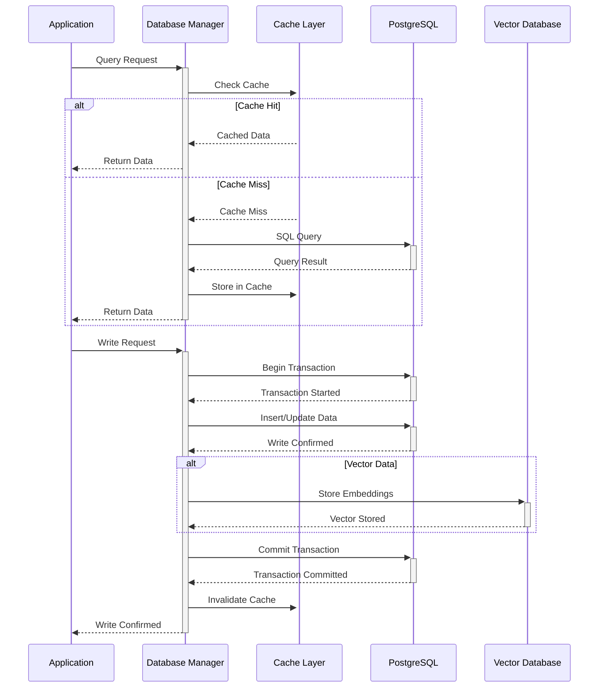

---

## 数据流设计

# Data Flow Diagrams

This document illustrates the data flow patterns within the Unifiles system.

## File Upload and Processing Pipeline

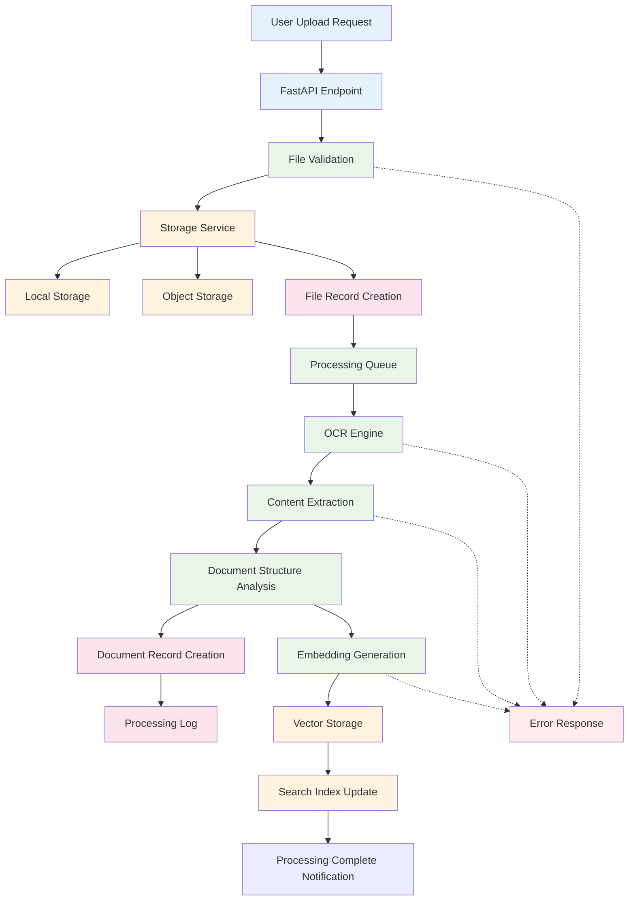

## Embedding Generation Workflow

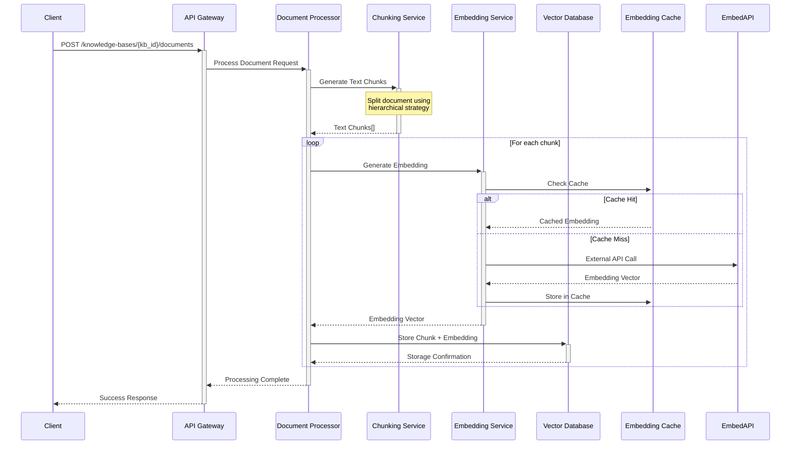

## Knowledge Base Search Flow

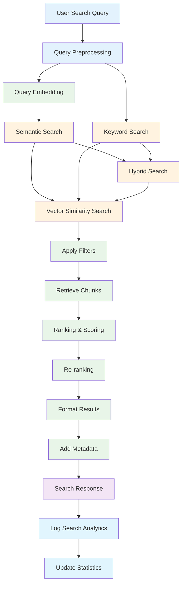

## Database Read/Write Operations

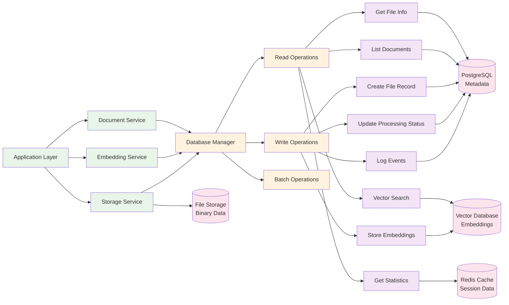

## Storage Service Interactions

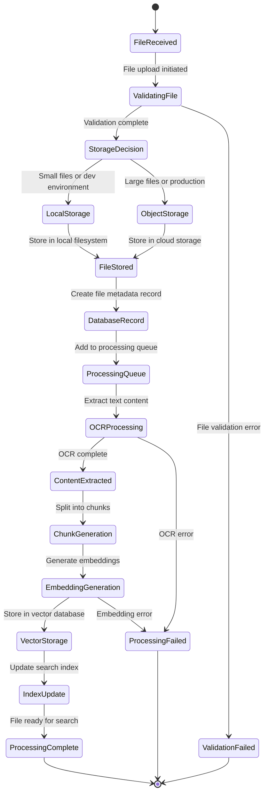

## Component Data Flow

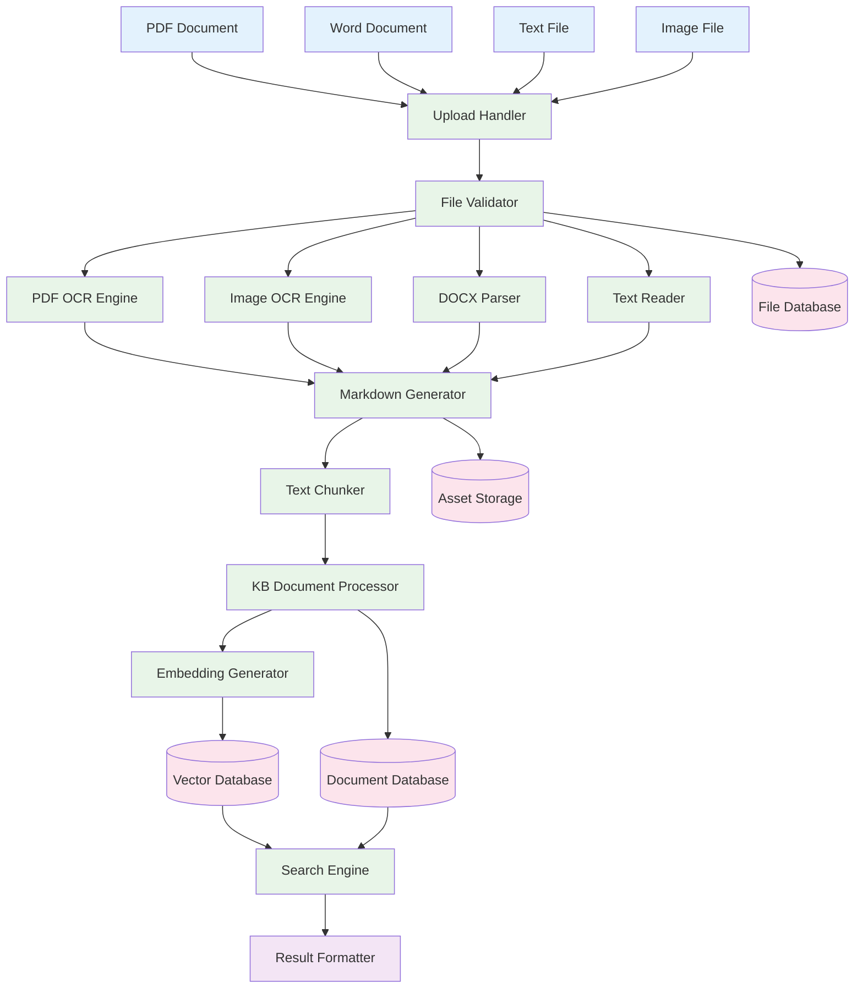

---

## 贡献指南

如果你想为 Unifiles 贡献代码，请查看 [CONTRIBUTING.md](CONTRIBUTING.md)。
