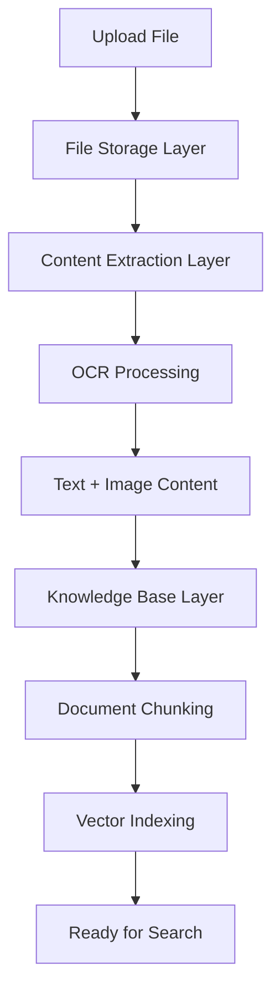

# Unifiles Python Client

[](https://pypi.org/project/unifiles-client/)
[](https://pypi.org/project/unifiles-client/)
[](https://github.com/unifiles/unifiles-client/blob/main/LICENSE)

A powerful Python client for the Unifiles document processing service. Unifiles provides a comprehensive three-layer document processing architecture that makes it easy to upload, extract content from, and index documents for search and retrieval.

## 🌟 Features

### Three-Layer Document Processing Architecture

1. **📁 File Storage Layer** - Upload and manage original files
2. **🔍 Content Extraction Layer** - OCR processing for both text and image content  
3. **📚 Knowledge Base Layer** - Document chunking and vector indexing

### Key Capabilities

- **Simple & Intuitive API** - Pythonic interface following best practices
- **Multiple Content Types** - Handle PDFs, documents, images, and more
- **OCR Processing** - Extract text from images and scanned documents
- **Knowledge Base Management** - Create and manage document collections
- **Fast Content Retrieval** - Quick access to processed document content
- **Error Handling** - Comprehensive error management and retry logic
- **Type Safety** - Full type hints for better development experience

## 🚀 Quick Start

### Installation

```bash
pip install unifiles-client
```

### Basic Usage

```python
from unifiles_client import Unifiles

# Initialize the client
client = Unifiles(
    api_key="your_api_key_here",
    base_url="https://your-unifiles-server.com"
)

# Create a knowledge base
kb = client.create_knowledge_base(
    name="My Documents", 
    description="Important business documents"
)

# Upload and process a document (all three layers automatically)
document = kb.upload_document(
    file_path="path/to/your/document.pdf",
    auto_extract=True,    # Automatic content extraction
    auto_index=True       # Automatic knowledge base indexing
)

# Access processed content
content = document.get_content()
print(f"Text content: {content.get('text_content')}")
print(f"OCR content: {content.get('image_content')}")
```

### One-Click Processing

```python
# Process a document with a single command
document = client.quick_process(
    file_path="path/to/document.pdf",
    knowledge_base_name="Research Papers"
)

print("✅ Document processed through all three layers!")
```

## 📖 Detailed Usage

### Layer 1: File Storage

```python
# Upload a file
document = client.upload_file("document.pdf", is_public=False)
print(f"File uploaded: {document.filename}")

# Get file information
info = document.get_info()
print(f"File size: {info['file_size']} bytes")

# List all files
files = client.list_files(limit=10)
for file in files:
    print(f"- {file.filename}")
```

### Layer 2: Content Extraction

```python
from unifiles_client import ContentType

# Trigger content extraction (choose a mode: simple | mistral | selfhosted | openai)
extraction_result = document.extract_content(mode="mistral")

# Get different types of extracted content
text_content = document.get_content(ContentType.TEXT)
image_content = document.get_content(ContentType.IMAGE)

# Access processed content
all_content = document.get_content()
print(f"Markdown: {all_content.get('markdown_content')}")
print(f"Metadata: {all_content.get('extraction_metadata')}")
```

All extraction modes are handled by the same OCR provider factory; `simple` uses the built-in pdfplumber/PyMuPDF provider, so switching modes just changes the provider name.

### Layer 3: Knowledge Base Operations

```python
# Create knowledge base
kb = client.create_knowledge_base(
    name="Technical Documentation",
    description="All technical docs and manuals"
)

# Index document to knowledge base  
index_result = document.index_to_knowledge_base(
    kb.kb_id, 
    chunk_strategy="semantic"
)

# List knowledge bases
knowledge_bases = client.list_knowledge_bases()
for kb in knowledge_bases:
    print(f"KB: {kb.name} ({kb.document_count} documents)")

# Get documents in a knowledge base
documents = kb.list_documents()
for doc in documents:
    print(f"- {doc.get('filename')}")
```

## 🎯 Advanced Features

### Error Handling

```python
from unifiles_client import (
    UnifilesError, 
    DocumentNotFoundError, 
    AuthenticationError,
    RateLimitError
)

try:
    document = client.upload_file("large_file.pdf")
except AuthenticationError:
    print("Invalid API key")
except RateLimitError:
    print("Too many requests, please wait")
except UnifilesError as e:
    print(f"Upload failed: {e}")
```

### Waiting for Processing

```python
# Upload and wait for extraction to complete
document = client.upload_file("document.pdf")
document.extract_content()

# Wait for processing to finish
if document.wait_for_extraction(timeout=300):
    content = document.get_content()
    print("Content extraction completed!")
```

### PDF Conversion Support

The client automatically handles conversion of Office documents (.docx, .pptx, .xlsx, etc.) to PDF before content extraction. This ensures optimal OCR quality and consistent processing.

#### Auto-Wait Behavior (Default)

By default, `upload_file()` waits for PDF conversion to complete:

```python
# Upload .docx file - automatically waits for PDF conversion
document = client.upload_file("report.docx")
print(f"Conversion status: {document.conversion_status}")  # "completed"
print(f"PDF URL: {document.derived_pdf_url}")  # URL to converted PDF

# Ready for extraction - uses converted PDF automatically
document.extract_content(mode="mistral")
```

#### Async Upload (Opt-Out)

For async behavior, disable auto-wait and manage conversion manually:

```python
# Upload without waiting for conversion
document = client.upload_file("report.docx", wait_for_conversion=False)
print(f"File uploaded: {document.file_id}")

# Do other work...

# Wait for conversion when needed
if document.wait_for_conversion(timeout=300):
    print(f"Conversion completed: {document.derived_pdf_url}")
```

#### Checking Conversion Status

Access conversion information through document properties:

```python
document = client.upload_file("presentation.pptx")

# Check conversion status
print(f"Status: {document.conversion_status}")
# Values: "pending" | "processing" | "completed" | "failed" | "skipped"

# Check if file was converted
print(f"Is converted: {document.is_converted}")  # True/False

# Get converted PDF URL (if available)
if document.is_converted:
    print(f"PDF URL: {document.derived_pdf_url}")
```

#### Conversion Status Values

- **`pending`** - Conversion queued but not started
- **`processing`** - Currently converting
- **`completed`** - Conversion successful, PDF available
- **`failed`** - Conversion failed (extraction will use original file)
- **`skipped`** - No conversion needed (file is already PDF or non-convertible)

#### Smart Extraction Pre-Check

The `extract_content()` method automatically waits for pending conversions:

```python
# Upload without waiting
document = client.upload_file("report.docx", wait_for_conversion=False)

# Extract immediately - automatically waits for conversion first
document.extract_content(mode="mistral", wait=True)
print("Extraction used converted PDF automatically!")
```

#### PDF Files (No Conversion)

PDF files skip conversion entirely:

```python
document = client.upload_file("already.pdf")
print(f"Status: {document.conversion_status}")  # "skipped"
print(f"Is converted: {document.is_converted}")  # False
# No waiting - returns immediately
```

### File Type Support

The client supports various file types:
- **Documents**: PDF, DOC, DOCX, TXT, MD
- **Images**: JPG, JPEG, PNG, TIFF
- **Presentations**: PPT, PPTX  
- **Spreadsheets**: XLS, XLSX

## 🛠️ Configuration

### Environment Variables

```bash
export UNIFILES_API_KEY="your_api_key"
export UNIFILES_BASE_URL="https://your-server.com"
```

### Client Options

```python
from unifiles_client import Unifiles

client = Unifiles(
    api_key="your_key",
    base_url="https://your-server.com",
    timeout=30,          # Request timeout in seconds
    max_retries=3,       # Number of retry attempts
    retry_delay=1.0      # Delay between retries
)
```

## 📊 Document Processing Flow



## 🔧 Development

### Running Tests

```bash
# Install development dependencies
pip install unifiles-client[dev]

# Run tests
pytest

# Run with coverage
pytest --cov=unifiles_client
```

### Code Quality

```bash
# Format code
black unifiles_client/

# Sort imports
isort unifiles_client/

# Type checking
mypy unifiles_client/
```

## 📝 Examples

Check out the [examples](examples/) directory for more detailed usage examples:

- [Basic usage](examples/fast_start.py) - Getting started with the client
- [Batch processing](examples/batch_upload.py) - Process multiple files
- [Knowledge base management](examples/kb_management.py) - Advanced KB operations

## 🤝 Contributing

We welcome contributions! Please see our [Contributing Guide](CONTRIBUTING.md) for details.

## 📄 License

This project is licensed under the MIT License - see the [LICENSE](LICENSE) file for details.

## 🆘 Support

- 📚 [Documentation](https://unifiles-client.readthedocs.io/)
- 🐛 [Issue Tracker](https://github.com/unifiles/unifiles-client/issues)
- 💬 [Discussions](https://github.com/unifiles/unifiles-client/discussions)

## 🎉 Why Choose Unifiles?

- **🚀 Fast Processing** - Optimized three-layer architecture
- **📱 Easy Integration** - Simple Python API  
- **🔒 Secure** - Enterprise-grade security
- **📈 Scalable** - Handle documents from single files to large collections
- **🎯 Accurate** - Advanced OCR and content extraction
- **🛠️ Flexible** - Support for multiple document types and use cases

---

Made with ❤️ by the Unifiles Team
