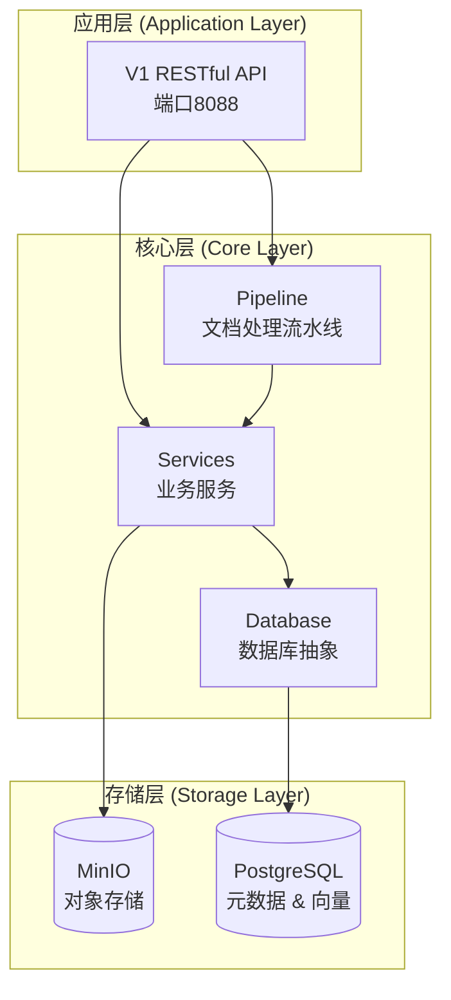
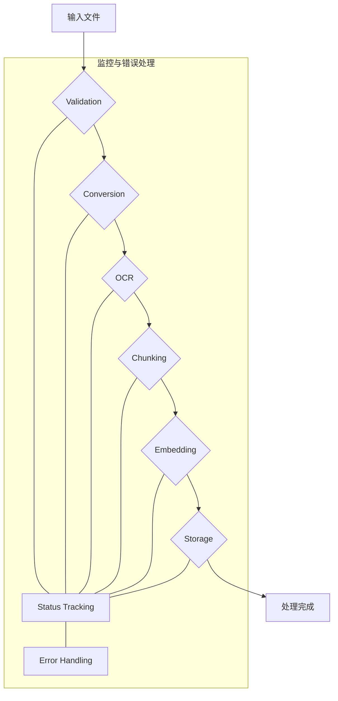
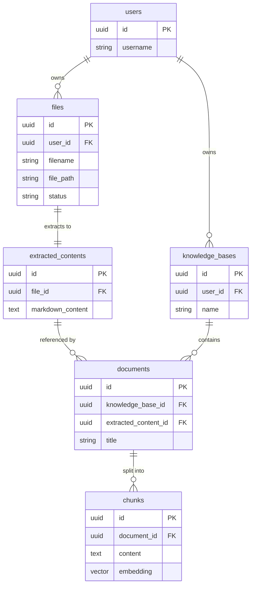

# 架构设计

本文档详细阐述了 Unifiles Core 的核心架构设计，旨在为开发者提供一个清晰、全面的系统认知。

## 1. 核心设计理念

### 以Markdown为核心

架构的核心思想是**以Markdown作为内容的单一真实来源（Single Source of Truth）**。所有不同格式的输入文件（如PDF, Word, 图片）都会被统一处理和转换为标准化的Markdown格式。

这种设计的优势在于：
- **内容统一性**: 消除多格式带来的不一致性，所有内容处理都基于统一的Markdown结构。
- **存储高效性**: Markdown是轻量级文本格式，易于存储、索引和版本控制。图片等二进制资源被独立存储并引用，避免冗余。
- **处理灵活性**: 同一份Markdown内容可以根据不同业务场景（如问答、分析、检索）应用不同的分块和索引策略，实现内容的一次提取、多次使用。

### 设计原则
- **高内聚，低耦合**: 各模块功能独立，通过清晰的接口交互。
- **可扩展性**: 采用策略模式，可以轻松添加新的文件格式支持、分块算法或嵌入模型。
- **状态清晰**: 对文档处理的每一步进行状态跟踪，确保流程的可追溯性和可恢复性。
- **异步优先**: 核心流程采用异步设计，以实现高性能和高并发。

## 2. 系统架构

系统采用分层架构，自上而下分为应用层、核心层和存储层。

### 2.1 架构分层图



### 2.2 数据处理流程

从文件上传到知识库查询的完整数据流如下：

```mermaid
graph TD
    %% 输入层
    A[用户上传文件] --> B[Files 表]
    
    %% 文件管理层
    B --> C[文件处理队列]
    C --> D[File Processing Logs]
    
    %% 内容提取层
    C --> E[内容提取引擎<br/>(格式转换, OCR)]
    E --> F[Extracted Contents 表<br/>存储完整Markdown]
    E --> G[Extraction Assets 表<br/>存储图片等资源]
    
    %% 知识库层
    H[用户创建知识库] --> I[Knowledge Bases 表]
    F --> J[文档索引到知识库]
    I --> J
    J --> K[Documents 表<br/>引用Extracted Contents]
    K --> L[分块策略应用]
    L --> M[Chunks 表<br/>生成文档块及向量]
    G --> N[Document Assets<br/>资源引用]
    K --> N
    
    %% 查询层
    O[用户查询] --> P[向量搜索]
    P --> M
    M --> Q[返回相关Chunks]
    Q --> R[组装完整响应]
```

## 3. 文档处理流水线 (Pipeline)

文档处理是系统的核心，采用异步Pipeline模式，由一系列可插拔的处理阶段（Stage）串联而成。



### Pipeline核心组件
- **DocumentProcessor**: 主控制器，负责调度和执行所有处理阶段。
- **ProcessingContext**: 处理上下文，作为一个数据载体，在各个阶段之间传递文档信息、中间产物和状态。
- **ProcessingStage**: 处理阶段的抽象基类，定义了统一的 `process` 接口。每个具体阶段（如转换、OCR）都是它的实现。

### 主要处理阶段
1.  **Validation (验证)**: 检查文件格式、大小和完整性。
2.  **Conversion (格式转换)**: 将各种输入格式（Word, PPT, 图片等）统一转换为PDF格式，为OCR做准备。
3.  **OCR (内容提取)**: 使用OCR技术从PDF文件中提取文本和图片，生成标准化的Markdown内容。支持通过多模态大模型增强图片描述。
4.  **Chunking (分块)**: 根据配置的策略（如分层、语义）将Markdown内容和图片分割成小的逻辑单元（Chunks）。
5.  **Embedding (向量化)**: 使用指定的嵌入模型（如OpenAI, HuggingFace）将文本块和图片块转换为向量。
6.  **Storage (存储)**: 将分块内容、元数据和向量存储到PostgreSQL数据库中，以供后续检索。

## 4. 数据模型

系统的核心数据模型围绕文档处理流程设计，确保数据结构的清晰和一致。



### 关键实体说明
- **User**: 系统用户。
- **File**: 用户上传的原始文件记录。
- **ExtractedContent**: 从原始文件中提取的、标准化的Markdown内容。这是实现“一次提取，多次使用”的关键。
- **KnowledgeBase**: 用户创建的知识库，作为文档的组织单元。
- **Document**: 知识库中的一个文档条目，它引用一个`ExtractedContent`，并定义了该内容的特定处理方式（如分块策略）。
- **Chunk**: `Document`被分割后的最小单元，包含内容和对应的向量，是检索的基本单位。

## 5. 数据库设计

数据库采用PostgreSQL，并利用 `pgvector` 扩展进行高效的向量存储和检索。

### 设计原则
- **零冗余**: `extracted_contents` 表作为内容的唯一真实来源，避免了在不同知识库中重复存储相同内容。
- **高灵活性**: 同一个 `extracted_contents` 可以被多个 `documents` 引用，每个 `document` 可以采用不同的分块策略生成不同的 `chunks` 集合，以适应不同场景。
- **关系清晰**: 表结构严格按照“文件 -> 提取内容 -> 知识库文档 -> 分块”的逻辑层次设计，关系清晰，易于维护。

通过这种设计，系统在保证数据一致性的同时，实现了极高的灵活性和存储效率。
