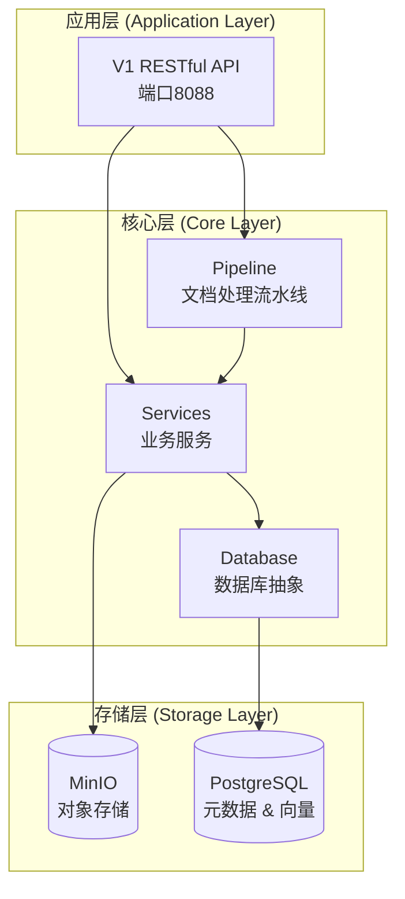
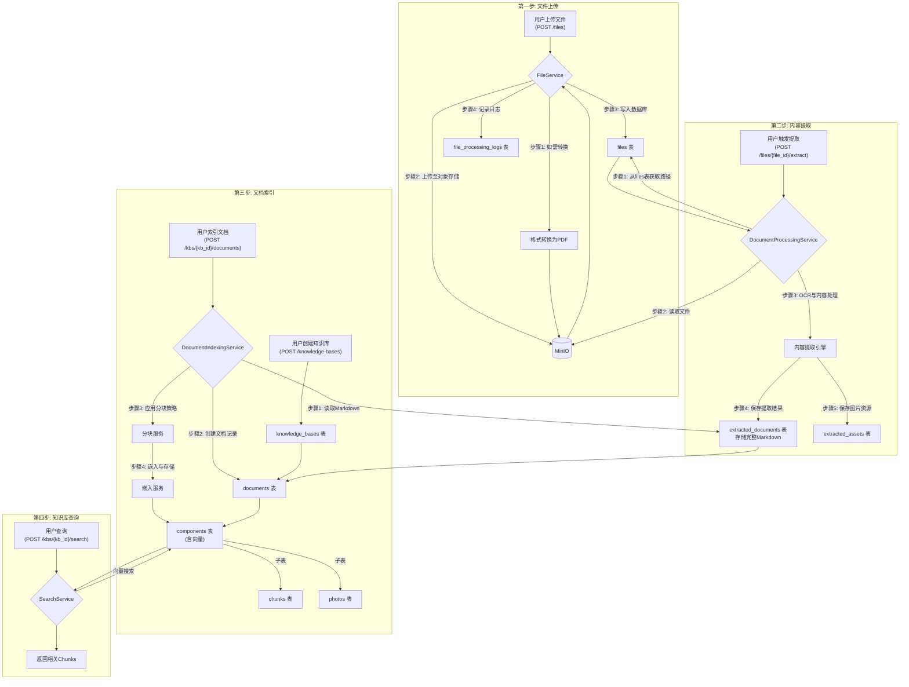
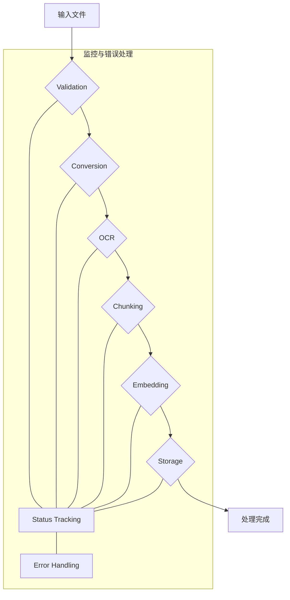
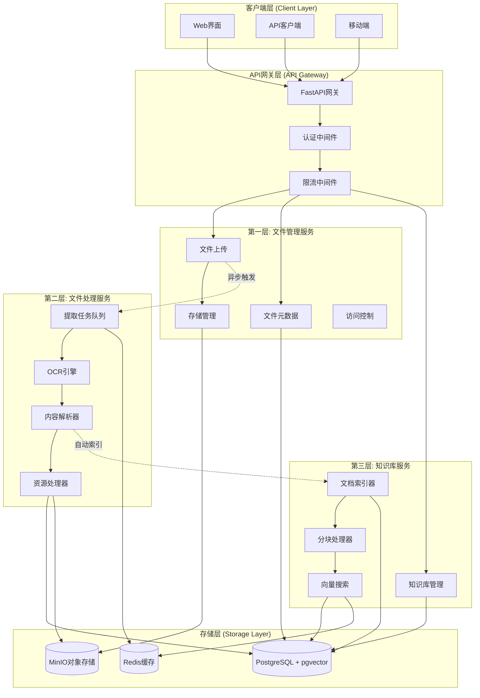

# 架构设计

本文档详细阐述了 Unifiles Core 的核心架构设计，旨在为开发者提供一个清晰、全面的系统认知。

## 1. 核心设计理念

### 以Markdown为核心

架构的核心思想是**以Markdown作为内容的单一真实来源（Single Source of Truth）**。所有不同格式的输入文件（如PDF, Word, 图片）都会被统一处理和转换为标准化的Markdown格式。

这种设计的优势在于：
- **内容统一性**: 消除多格式带来的不一致性，所有内容处理都基于统一的Markdown结构。
- **存储高效性**: Markdown是轻量级文本格式，易于存储、索引和版本控制。图片等二进制资源被独立存储并引用，避免冗余。
- **处理灵活性**: 同一份Markdown内容可以根据不同业务场景（如问答、分析、检索）应用不同的分块和索引策略，实现内容的一次提取、多次使用。

### 设计原则
- **高内聚，低耦合**: 各模块功能独立，通过清晰的接口交互。
- **可扩展性**: 采用策略模式，可以轻松添加新的文件格式支持、分块算法或嵌入模型。
- **状态清晰**: 对文档处理的每一步进行状态跟踪，确保流程的可追溯性和可恢复性。
- **异步优先**: 核心流程采用异步设计，以实现高性能和高并发。

## 2. 系统架构

系统采用分层架构，自上而下分为应用层、核心层和存储层。

### 2.1 架构分层图



### 2.2 数据处理流程

从文件上传到知识库查询的完整数据流如下：


## 3. 文档处理流水线 (Pipeline)

文档处理是系统的核心，采用异步Pipeline模式，由一系列可插拔的处理阶段（Stage）串联而成。



### Pipeline核心组件
- **DocumentProcessor**: 主控制器，负责调度和执行所有处理阶段。
- **ProcessingContext**: 处理上下文，作为一个数据载体，在各个阶段之间传递文档信息、中间产物和状态。
- **ProcessingStage**: 处理阶段的抽象基类，定义了统一的 `process` 接口。每个具体阶段（如转换、OCR）都是它的实现。

### 主要处理阶段
1.  **Validation (验证)**: 检查文件格式、大小和完整性。
2.  **Conversion (格式转换)**: 将各种输入格式（Word, PPT, 图片等）统一转换为PDF格式，为OCR做准备。
3.  **OCR (内容提取)**: 使用OCR技术从PDF文件中提取文本和图片，生成标准化的Markdown内容。支持通过多模态大模型增强图片描述。
4.  **Chunking (分块)**: 根据配置的策略（如分层、语义）将Markdown内容和图片分割成小的逻辑单元（Chunks）。
5.  **Embedding (向量化)**: 使用指定的嵌入模型（如OpenAI, HuggingFace）将文本块和图片块转换为向量。
6.  **Storage (存储)**: 将分块内容、元数据和向量存储到PostgreSQL数据库中，以供后续检索。

## 4. 数据模型

系统的核心数据模型围绕文档处理流程设计，确保数据结构的清晰和一致。

### 关键实体说明
- **UserModel**: 系统用户。
- **AccessKeyModel**: 用户访问密钥。
- **FileModel**: 用户上传的原始文件记录。
- **ExtractedDocumentModel**: 从原始文件中提取的、标准化的Markdown内容。这是实现“一次提取，多次使用”的关键。
- **ExtractedAssetModel**: 从文档中提取的资源（如图片）。
- **KnowledgeBaseModel**: 用户创建的知识库，作为文档的组织单元。
- **DocumentModel**: 知识库中的一个文档条目，它引用一个`ExtractedContent`，并定义了该内容的特定处理方式（如分块策略）。
- **ComponentModel**: `Document`被分割后的最小单元的抽象，是检索的基本单位。
- **ChunkModel**: 文本类型的组件。
- **PhotoModel**: 图片类型的组件。

## 5. 数据库设计

数据库采用PostgreSQL，并利用 `pgvector` 扩展进行高效的向量存储和检索。

### 设计原则
- **零冗余**: `ExtractedDocumentModel` 表作为内容的唯一真实来源，避免了在不同知识库中重复存储相同内容。
- **高灵活性**: 同一个 `ExtractedDocumentModel` 可以被多个 `DocumentModel` 引用，每个 `DocumentModel` 可以采用不同的分块策略生成不同的 `ComponentModel` 集合，以适应不同场景。
- **关系清晰**: 表结构严格按照“文件 -> 提取内容 -> 知识库文档 -> 分块”的逻辑层次设计，关系清晰，易于维护。

通过这种设计，系统在保证数据一致性的同时，实现了极高的灵活性和存储效率。

## 6. web服务设计

### 整体架构图


## 7. 提供服务的业务分层
```
第一层: 文件上传和管理服务 (File Management Layer)
├── 文件上传、下载、删除
├── 文件元数据管理  
├── 存储空间管理
└── 访问权限控制

第二层: 文件处理服务 (File Processing Layer)
├── 文件格式验证和转换
├── OCR文本提取
├── 内容结构化处理
└── 处理状态管理

第三层: 知识库管理服务 (Knowledge Base Layer)
├── 知识库创建和管理
├── 文档索引和向量化
├── 知识检索和查询
└── 分块策略管理

第四层: 用户和系统管理服务 (User and System Management Layer)
├── 用户管理
├── 访问密钥管理
└── 系统状态监控
```

## 8. API Endpoints

### 架构原则
- **分层解耦**：每层职责明确，接口清晰
- **异步处理**：所有IO操作异步化
- **快速响应**：接口秒返回，后台异步处理
- **可扩展性**：支持水平扩展和微服务化

### 文件管理服务 (`unifiles.py`)

**职责**：
- 文件上传、下载、删除
- 文件元数据管理
- 存储空间管理
- 文件访问权限控制

**核心端点**：
- `POST /files` - 文件上传（秒返回）
- `GET /files` - 获取用户文件列表
- `GET /files/{file_id}` - 获取文件信息
- `DELETE /files/{file_id}` - 删除文件
- `GET /files/types` - 支持的文件类型

### 文件处理服务 (`processors.py`)

**职责**：
- 文件格式验证和转换
- OCR文本提取
- 内容结构化处理
- 处理状态管理

**核心端点**：
- `POST /files/{file_id}/extract` - 启动文件内容提取

### 知识库管理服务 (`knowledge_bases.py`)

**职责**：
- 知识库创建和管理
- 文档索引和向量化

**核心端点**：
- `GET /knowledge-bases` - 获取知识库列表
- `POST /knowledge-bases` - 创建知识库
- `POST /knowledge-bases/{kb_id}/documents` - 索引文档到知识库
- `GET /knowledge-bases/{kb_id}/documents` - 获取知识库文档
- `POST /knowledge-bases/{kb_id}/search` - 知识库搜索

### 用户管理服务 (`users.py`)

**职责**：
- 用户创建和管理
- 用户访问密钥管理

**核心端点**：
- `POST /users/create` - 创建新用户
- `GET /users/{user_id}` - 获取用户信息
- `POST /users/{user_id}/access-keys` - 创建用户访问密钥
- `GET /users/{user_id}/access-keys` - 获取用户访问密钥列表

### 系统管理服务 (`manager.py`)

**职责**：
- 系统状态监控

**核心端点**：
- `GET /manager/system/status` - 获取系统状态

## 9. Python 客户端

项目提供一个 Python 客户端 (`unifiles/client/client.py`)，用于与 Unifiles API 进行交互。该客户端封装了 API 请求的细节，提供了更便捷的编程接口。