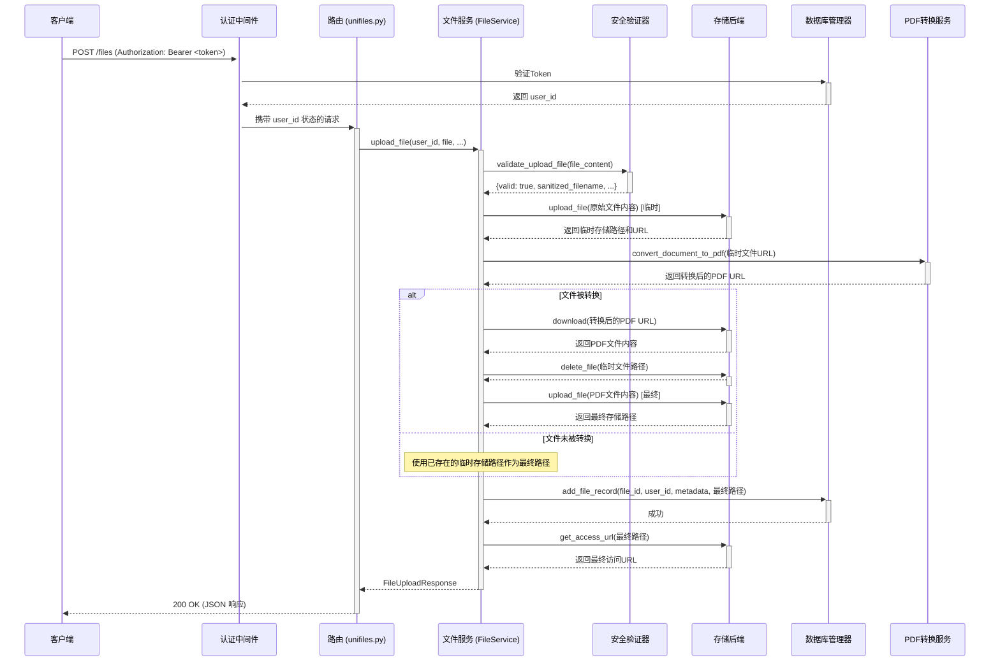

# 文件上传端点工作流程（中文版）

本文档为安全文件上传端点 (`POST /files`) 的全流程提供了详细、逐步的解析。旨在帮助开发人员快速理解系统的数据流和组件间的交互。

## 高层概览

文件上传是一个多阶段工作流，旨在确保安全性、有效性和数据完整性。它涉及身份验证、安全扫描、可选的PDF转换、物理存储以及在数据库中记录元数据。

涉及的主要组件如下：
- **FastAPI 应用**: Web服务器。
- **中间件 (Middleware)**: `AuthMiddleware` 用于用户身份验证。
- **路由 (Router)**: `unifiles.py` 文件，定义了 `/files` 端点。
- **服务层 (Service Layer)**: `FileService` 负责编排整个业务逻辑。
- **安全层 (Security Layer)**: `FileSecurityValidator` 和 `FileAccessControl`。
- **存储层 (Storage Layer)**: `Storage` 类及其后端，如 `MinioStorageBackend` 或 `LocalStorageBackend`。
- **数据库层 (Database Layer)**: `DatabaseManager` 用于与 PostgreSQL 数据库交互。
- **外部服务**: 一个用于PDF转换的服务。

## 时序图 (Sequence Diagram)

## 详细步骤分解

### 1. 用户认证 (`AuthMiddleware`)

- **涉及文件**: `unifiles/app/middlewares.py`
- **触发条件**: 任何未明确标记为公开的HTTP请求。
- **执行动作**:
    1. `AuthMiddleware` 拦截请求。
    2. 它从 `Authorization` 请求头中提取 `Bearer <token>`。
    3. Token（即访问密钥）通过调用 PostgreSQL 中的 `validate_access_key_simple` 函数进行数据库验证。
    4. 如果 Token 有效，对应的 `user_id` 会被获取并存储在请求状态中 (`request.state.user_id`)。
    5. 如果 Token 无效或缺失，中间件会立即返回 `401 Unauthorized` 错误，请求处理终止。

### 2. 路由处理 (`unifiles.py`)

- **涉及文件**: `unifiles/app/routers/unifiles.py`
- **端点**: `POST /files`
- **执行动作**:
    1. 通过身份验证的请求被路由到 `upload_file` 函数。
    2. FastAPI 的依赖注入系统为该函数提供：
        - 通过 `get_user_context` 依赖从请求状态中获取的 `user_id`。
        - 一个 `FileService` 的实例。
    3. 路由器的主要职责是通过调用 `await file_service.upload_file(...)` 将整个操作委托给服务层。

### 3. 安全验证 (`FileService` -> `FileSecurityValidator`)

- **涉及文件**: `unifiles/core/services/file_service.py`
- **执行动作**:
    1. `FileService.upload_file` 方法接管控制权。
    2. 它将整个文件内容读入内存 (`await file.read()`)。
    3. 它调用 `self.validator.validate_upload_file()`，其中 `self.validator` 是 `FileSecurityValidator` 的一个实例。
    4. **这是一个关键的安全步骤**。验证器执行那些被中间件层有意跳过的检查（为了避免过早消耗请求体）。这些检查包括：
        - 文件内容分析（例如，通过“魔数”验证）以检测真实的MIME类型。
        - 文件名清洗，以防止路径遍历等攻击。
        - 其他潜在的安全扫描。
    5. 如果验证失败，将抛出 `400 Bad Request` 异常。如果成功，则返回一个包含清洗后文件名、检测到的MIME类型和文件大小的字典。

### 4. PDF 转换流程 (`FileService` -> `PDFConverter`)

- **涉及文件**: `unifiles/core/services/file_service.py`
- **执行动作**: 为了标准化可处理的文档，系统会尝试将支持的格式（如 `.docx`, `.pptx`）转换为PDF。
    1. **临时上传**: 经过验证的原始文件被上传到存储后端（如MinIO）的一个临时路径。
    2. **URL生成**: 为这个临时文件生成一个公开的URL。
    3. **转换检查**: 服务检查文件格式是否是需要转换的候选格式（例如，是 `.docx` 但不是 `.pdf`）。
    4. **API调用**: 如果需要转换，这个公开URL会被发送到外部的PDF转换服务 (`PDFConverter.convert_document_to_pdf`)。
    5. **处理结果**:
        - **成功**: 服务会收到一个指向新创建的PDF的URL。它下载这个PDF内容，从存储中删除临时的原始文件，并更新其内部变量，以便在后续所有步骤中使用新的PDF内容、文件名和大小。
        - **失败/跳过**: 如果文件不需要转换或转换失败，服务将使用已上传到临时路径的原始文件继续处理。

### 5. 最终文件存储 (`FileService` -> `StorageBackend`)

- **涉及文件**: `unifiles/core/storage/storage.py`
- **执行动作**:
    1. 使用用户ID和新的文件ID生成一个最终的、安全的存储路径（例如 `user-001/file-abc-123/document.pdf`）。
    2. 最终的文件内容（原始文件内容或转换后的PDF内容）被上传到配置好的存储后端（例如MinIO存储桶）的这个路径下。
    3. 存储后端的 `upload_file` 方法处理底层的传输细节。

### 6. 数据库记录 (`FileService` -> `DatabaseManager`)

- **涉及文件**: `unifiles/core/services/file_service.py`, `unifiles/core/database/manager.py`
- **执行动作**:
    1. 文件成功存储后，`FileService` 调用 `self.db.add_file_record()`。
    2. 这个在 `DatabaseManager` 中定义的方法会执行一条 SQL `INSERT` 语句。
    3. 在 `unifiles.files` 表中创建一条新记录，存储所有相关元数据，包括：
        - `id` (唯一文件ID)
        - `user_id` (所有者)
        - `filename` (清洗后的最终文件名)
        - `bytes` (文件大小)
        - `mime_type`
        - `storage_path` (在存储后端中的路径)
        - `is_public` (是否公开的状态)

### 7. API 响应生成 (`FileService`)

- **涉及文件**: `unifiles/core/services/file_service.py`
- **执行动作**:
    1. `FileService` 通过调用 `storage_backend.get_access_url()` 为新上传的文件生成最终的访问URL。如果文件是公开的，这将是一个公共URL；如果是私有的，则是一个临时的、会过期的预签名URL。
    2. 它构建一个 `FileUploadResponse` 对象，其中包含所有客户端需要的信息（文件ID、文件名、大小、URL等）。
    3. 这个响应对象被返回到调用栈上层的路由器，路由器再将其作为JSON响应以 `200 OK` 状态码发送给客户端。
