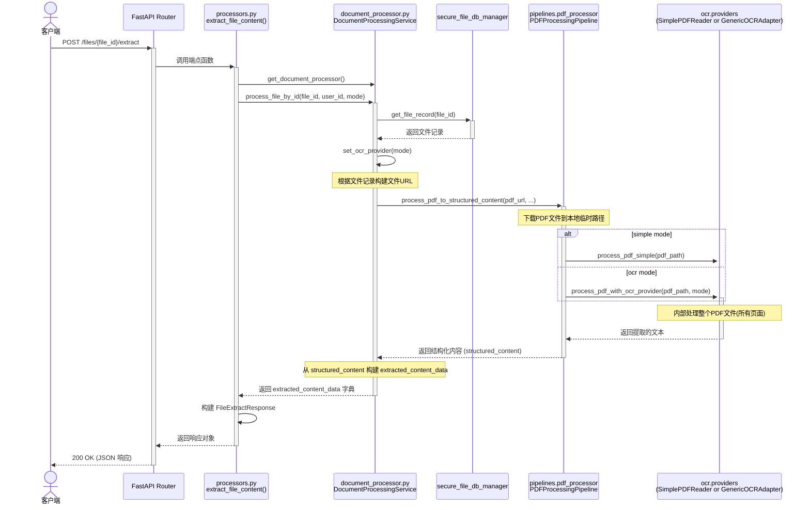

# 文件内容提取端点序列图

本文档概述了 `/files/{file_id}/extract` 端点的函数调用顺序。

```mermaid
sequenceDiagram
    actor 客户端
    participant 路由 as FastAPI Router
    participant 端点 as processors.py<br/>extract_file_content()
    participant 文档处理服务 as document_processor.py<br/>DocumentProcessingService
    participant 数据库 as secure_file_db_manager
    participant PDF处理管道 as pipelines.pdf_processor<br/>PDFProcessingPipeline
    participant OCR适配器 as ocr.providers<br/>(SimplePDFReader or GenericOCRAdapter)

    客户端->>+路由: POST /files/{file_id}/extract
    路由->>+端点: 调用端点函数
    端点->>文档处理服务: get_document_processor()
    端点->>+文档处理服务: process_file_by_id(file_id, user_id, mode)
    
    文档处理服务->>+数据库: get_file_record(file_id)
    数据库-->>-文档处理服务: 返回文件记录

    文档处理服务->>文档处理服务: set_ocr_provider(mode)
    
    Note over 文档处理服务: 根据文件记录构建文件URL

    文档处理服务->>+PDF处理管道: process_pdf_to_structured_content(pdf_url, ...)
    Note over PDF处理管道: 下载PDF文件到本地临时路径
    alt simple mode
        PDF处理管道->>+OCR适配器: process_pdf_simple(pdf_path)
    else ocr mode
        PDF处理管道->>+OCR适配器: process_pdf_with_ocr_provider(pdf_path, mode)
    end
    Note over OCR适配器: 内部处理整个PDF文件(所有页面)
    OCR适配器-->>-PDF处理管道: 返回提取的文本
    PDF处理管道-->>-文档处理服务: 返回结构化内容 (structured_content)

    Note over 文档处理服务: 从 structured_content 构建 extracted_content_data

    文档处理服务-->>-端点: 返回 extracted_content_data 字典
    端点->>端点: 构建 FileExtractResponse
    端点-->>-路由: 返回响应对象
    路由-->>-客户端: 200 OK (JSON 响应)

```
