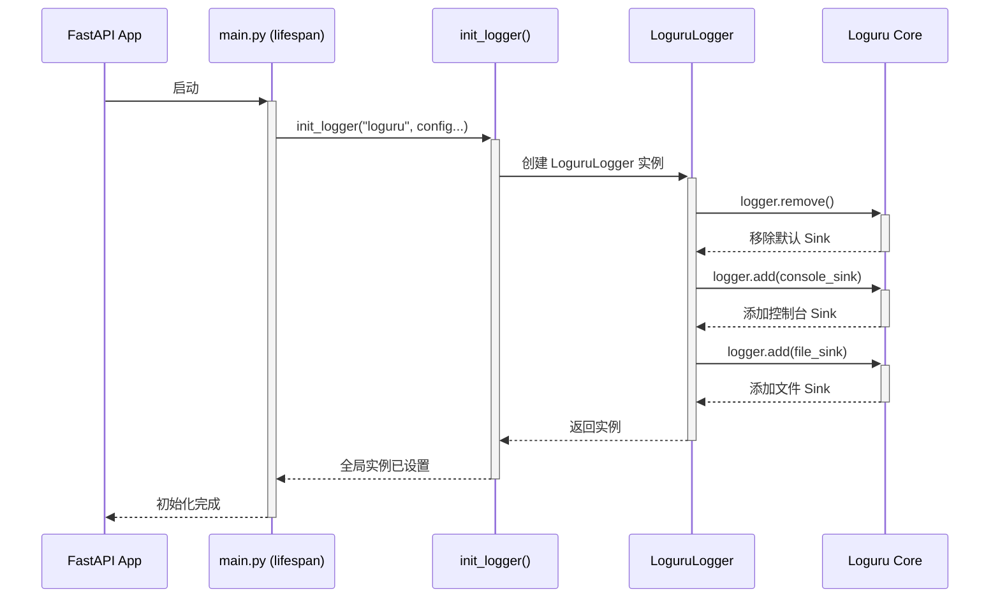

# 日志系统设计文档

本文档深入分析了 `unifiles` 项目的日志系统设计与实现。

## 1. 核心组件与技术栈

项目的日志系统基于以下核心技术构建：

- **核心库**: [**Loguru**](https://github.com/Delgan/loguru)
  - 选择 Loguru 是因为它提供了开箱即用的强大功能，如简洁的 API、颜色标记、文件滚动、线程/进程安全以及结构化日志记录。
- **设计模式**:
  - **抽象基类 (ABC)**: 定义了 `BaseLogger` 接口，统一了日志记录方法（`info`, `error` 等），使得未来可以轻松替换或扩展新的日志实现（例如，数据库日志）。
  - **工厂模式**: `init_logger` 函数作为一个工厂，根据传入的参数创建不同类型的日志记录器实例。
  - **单例模式**: 通过 `get_logger` 函数提供一个全局唯一的日志记录器实例，确保整个应用共享相同的日志配置。

## 2. 架构设计

日志系统设计分为三个层次：抽象层、实现层和访问层。

```mermaid
graph TD
    subgraph 访问层 (Application Code)
        A[其他模块, e.g., main.py, services] --> B{get_logger()};
    end

    subgraph 核心层 (core.logging.logging)
        B --> C[全局 app_logger 实例];
        D[init_logger()] -- 创建 --> C;
        
        subgraph 实现层
            E[LoguruLogger] -- 实现 --> F(BaseLogger);
            G[PostgreSQLLogger] -- (占位) --> F;
            H[HybridLogger] -- (占位) --> F;
        end

        D -- 根据配置选择 --> E;
    end

    style F fill:#f9f,stroke:#333,stroke-width:2px
```

- **抽象层 (`BaseLogger`)**: 定义了所有日志记录器必须遵守的统一接口。
- **实现层 (`LoguruLogger`, `PostgreSQLLogger`)**:
  - `LoguruLogger` 是当前的核心实现，负责处理所有日志记录逻辑，包括输出到控制台和文件。
  - `PostgreSQLLogger` 和 `HybridLogger` 是为未来功能（如将日志写入数据库）预留的占位符，体现了设计的可扩展性。
- **访问层 (`get_logger`, `init_logger`)**:
  - `init_logger`: 在应用启动时被调用，用于根据配置初始化全局日志记录器。
  - `get_logger`: 在应用的任何地方被调用，以获取已配置好的全局日志实例。

## 3. 初始化流程

日志系统的生命周期与 FastAPI 应用的生命周期绑定。

1.  **启动**: 应用在 `unifiles/app/main.py` 的 `lifespan` 管理器中启动。
2.  **调用 `init_logger`**: `lifespan` 函数内部显式调用 `init_logger`，并传入**硬编码**的配置参数。
3.  **创建实例**: `init_logger` 创建一个 `LoguruLogger` 实例，并将其赋值给全局变量 `app_logger`。
4.  **配置 Sinks**: `LoguruLogger` 在其 `_setup` 方法中配置了两个输出目标 (Sink)：
    - **控制台 Sink**: 用于在开发过程中实时显示带颜色的日志。
    - **文件 Sink**: 用于将日志持久化到磁盘文件。
5.  **应用中使用**: 应用各模块通过调用 `get_logger()` 获取该实例并记录日志。
6.  **关闭**: 应用关闭时，`lifespan` 调用 `cleanup_logger()` 来移除 Loguru 的处理器，释放资源。



## 4. 详细配置

日志配置目前在 `unifiles/app/main.py` 中硬编码，具体如下：

- **服务名称 (`service_name`)**: `unifiles-v1` (此名称会通过 `bind` 方法自动添加到每条日志记录中)。
- **日志级别 (`level`)**: `INFO`。只有 `INFO` 及以上级别的日志才会被记录。
- **日志目录 (`log_dir`)**: `unifiles/app/logs/`。
- **日志格式**:
  - **控制台**: `[时间] | [级别] | [模块:函数:行号] | [服务名] | [消息]` (带颜色)
  - **文件**: `{时间} | {级别} | {模块:函数:行号} | {服务名} | {消息}` (无颜色)
- **文件滚动 (`rotation`)**: 当日志文件达到 `100 MB` 时，会自动创建新文件。
- **文件保留 (`retention`)**: 最多保留 `30 days` 的日志文件。
- **压缩 (`compression`)**: 旧的日志文件会被压缩成 `.zip` 格式以节省空间。

## 5. 使用方式

在项目中的任何模块，推荐使用以下方式获取和使用日志记录器：

```python
from loguru import logger

# Loguru 的全局 logger 已在 main.py 中被配置好
# 直接使用即可

def my_function():
    logger.info("这是一条信息日志。")
    logger.warning("这是一条警告日志。")
    try:
        result = 1 / 0
    except ZeroDivisionError:
        logger.exception("发生了一个错误！") # exception 会自动记录堆栈信息
```
**注意**: 尽管项目中提供了 `get_logger()` 函数，但由于 `init_logger` 配置的是 Loguru 的全局实例，因此直接 `from loguru import logger` 是最简洁且推荐的方式。

## 6. 总结与展望

### 当前设计优点
- **结构清晰**: 通过抽象层和实现层分离，设计清晰，易于理解和维护。
- **功能强大**: 借助 Loguru，轻松实现了结构化日志、文件滚动、压缩等高级功能。
- **使用便捷**: 全局单例模式让开发者可以方便地在任何地方记录日志。

### 可改进之处
- **动态配置**: 当前配置是硬编码在代码中的。未来可以将其移至 `config.yaml` 文件，允许在不修改代码的情况下，通过配置文件动态调整日志级别、格式、路径等，从而提高灵活性。例如，可以为开发、测试和生产环境设置不同的日志级别。
- **数据库日志**: `PostgreSQLLogger` 目前是占位符。在需要对日志进行复杂查询和分析的场景下，可以完成该类的实现，将关键日志（如 `ERROR` 和 `CRITICAL` 级别的日志）存入数据库。
