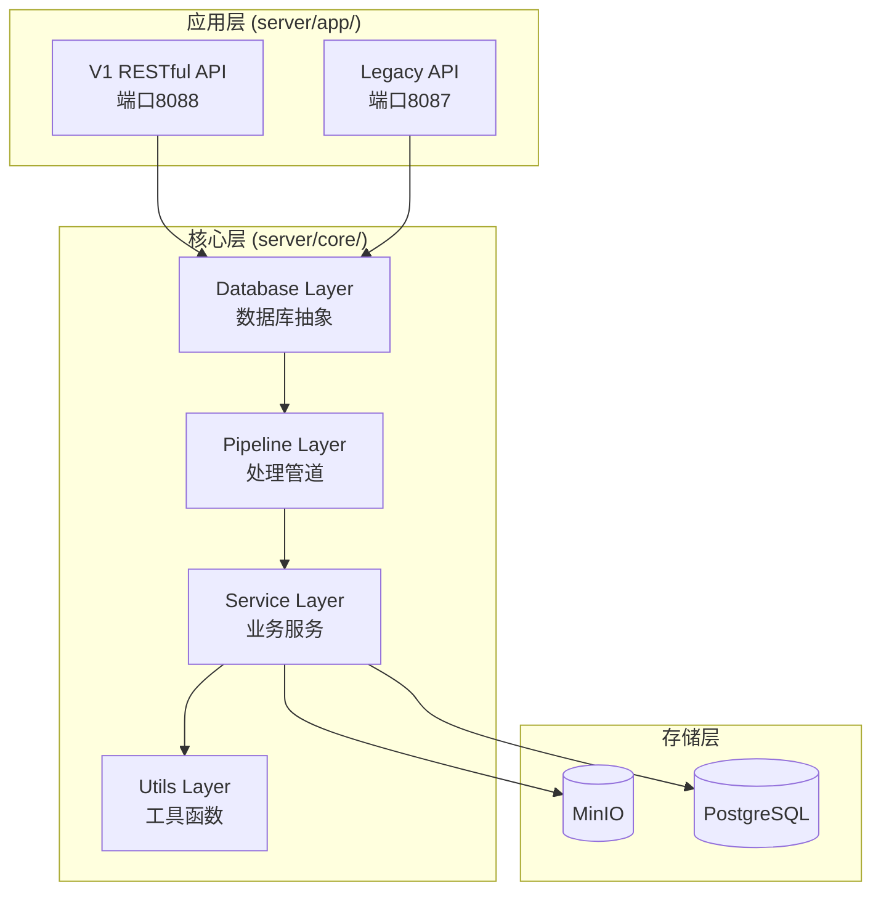

# 🛠️ 开发文档

## 📋 目录

- [开发环境搭建](#开发环境搭建)
- [项目架构](#项目架构) 
- [模块化组件](#模块化组件)
- [开发指南](#开发指南)
- [测试指南](#测试指南)
- [部署指南](#部署指南)
- [贡献指南](#贡献指南)

---

## 🚀 开发环境搭建

### 环境要求

- **Python**: 3.8+
- **数据库**: PostgreSQL 12+ (with pgvector)
- **对象存储**: MinIO或兼容S3
- **开发工具**: uv/pip, git, curl

### 快速搭建

```bash
# 1. 克隆项目
git clone <repository-url>
cd file_server

# 2. 创建虚拟环境
uv venv
source .venv/bin/activate  # Linux/Mac
# .venv\Scripts\activate   # Windows

# 3. 安装依赖
uv sync --dev

# 4. 启动开发服务
docker-compose -f docker-compose.dev.yml up -d

# 5. 初始化数据库
python scripts/init_db.py

# 6. 启动API服务
# V1 RESTful API
cd server/app/v1 && uvicorn main:app --reload --port 8088

# Legacy API
cd server/app/legacy && python start_legacy_server.py
```

---

## 🏗️ 项目架构

### 目录结构

```
file_server/
├── 📁 server/                 # 服务器端代码
│   ├── 📁 core/              # 🎯 核心模块（可复用）
│   │   ├── database/         # 数据库抽象层
│   │   ├── pipelines/        # 处理管道层
│   │   ├── services/         # 业务服务层
│   │   └── utils/           # 工具函数层
│   └── 📁 app/              # 🚀 应用层
│       ├── legacy/          # Legacy兼容API (端口8087)
│       └── v1/              # V1 RESTful API (端口8088)
├── 📁 client/               # 🔄 客户端SDK（计划中）
├── 📁 docs/                 # 📚 项目文档
├── 📁 examples/             # 🧪 示例代码  
├── 📁 tests/                # 🧪 测试代码
├── 📁 scripts/              # 🔧 工具脚本
└── 📁 数据库建表逻辑/         # 🗄️ 数据库架构
```

### 架构分层



---

## 🧩 模块化组件

### 数据库抽象层

#### 数据模型 (`server/core/database/models.py`)

```python
from dataclasses import dataclass
from typing import Optional, List
from enum import Enum

class FileStatus(Enum):
    UPLOADED = "uploaded"
    PROCESSING = "processing" 
    COMPLETED = "completed"
    FAILED = "failed"

@dataclass
class FileModel:
    id: str
    user_id: str
    filename: str
    file_size: int
    content_type: str
    object_path: str
    public_url: str
    status: FileStatus
    created_at: Optional[str] = None
```

#### 数据库管理器 (`server/core/database/manager.py`)

```python
class DatabaseManager:
    """统一数据库操作管理器"""
    
    def __init__(self, pg_config: dict):
        self.pg_config = pg_config
        self.connection_pool = None
    
    async def ensure_user_exists(self, user_id: str) -> UserModel:
        """确保用户存在，不存在则创建"""
        async with self.get_connection() as conn:
            # 设置用户上下文启用RLS
            await conn.execute("SET LOCAL app.user_id = $1", user_id)
            
            user = await conn.fetchrow(
                "SELECT * FROM chunk_schema.users WHERE id = $1", 
                user_id
            )
            
            if not user:
                await conn.execute(
                    "INSERT INTO chunk_schema.users (id) VALUES ($1)",
                    user_id
                )
                user = await conn.fetchrow(
                    "SELECT * FROM chunk_schema.users WHERE id = $1",
                    user_id
                )
            
            return UserModel(**dict(user))
    
    async def save_file(self, file_model: FileModel) -> FileModel:
        """保存文件信息"""
        # 实现保存逻辑
        pass
```

### 处理管道层

#### 格式验证管道 (`server/core/pipelines/format_validator.py`)

```python
from typing import Protocol, Dict, Any

class FileFormatValidator:
    """文件格式验证器"""
    
    SUPPORTED_EXTENSIONS = {
        '.pdf', '.doc', '.docx', '.txt', '.jpg', '.png'
    }
    
    async def validate_file(self, filename: str, content: bytes) -> Dict[str, Any]:
        """验证文件格式"""
        issues = []
        
        # 扩展名检查
        ext = Path(filename).suffix.lower()
        if ext not in self.SUPPORTED_EXTENSIONS:
            issues.append(f"Unsupported extension: {ext}")
        
        # 文件大小检查
        if len(content) > 100 * 1024 * 1024:  # 100MB
            issues.append(f"File too large: {len(content)} bytes")
        
        return {
            'valid': len(issues) == 0,
            'issues': issues,
            'file_info': {
                'size': len(content),
                'extension': ext
            }
        }

class FormatValidationPipeline:
    """格式验证管道"""
    
    def __init__(self, validator: FileFormatValidator):
        self.validator = validator
    
    async def process_file(
        self, 
        filename: str, 
        content: bytes, 
        file_url: str
    ) -> Dict[str, Any]:
        """处理文件格式验证"""
        validation_result = await self.validator.validate_file(filename, content)
        
        if not validation_result['valid']:
            raise ValueError(f"Validation failed: {validation_result['issues']}")
        
        return {
            'filename': filename,
            'file_url': file_url,
            'validation': validation_result
        }
```

#### PDF处理管道 (`server/core/pipelines/pdf_processor.py`)

```python
from typing import Protocol

class OCRProvider(Protocol):
    """OCR提供者协议 - 可插拔设计"""
    
    async def extract_text_from_pdf(self, pdf_path_or_url: str) -> str:
        """从PDF提取文本"""
        ...

class MineruOCRProvider:
    """Mineru OCR提供者实现"""
    
    def __init__(self, api_url: str):
        self.api_url = api_url
    
    async def extract_text_from_pdf(self, pdf_path_or_url: str) -> str:
        """使用Mineru OCR提取文本"""
        # 调用Mineru API的实现
        async with httpx.AsyncClient() as client:
            response = await client.post(
                f"{self.api_url}/extract",
                json={"file_url": pdf_path_or_url}
            )
            return response.json()["text"]

class PDFProcessingPipeline:
    """PDF处理管道"""
    
    def __init__(self, ocr_provider: OCRProvider):
        self.ocr_provider = ocr_provider
    
    async def process_pdf(self, pdf_url: str, options: Dict[str, Any]) -> Dict[str, Any]:
        """处理PDF文档"""
        try:
            # 使用可插拔的OCR提供者
            extracted_text = await self.ocr_provider.extract_text_from_pdf(pdf_url)
            
            return {
                'success': True,
                'text': extracted_text,
                'metadata': {
                    'source_url': pdf_url,
                    'processing_options': options
                }
            }
        except Exception as e:
            return {
                'success': False,
                'error': str(e)
            }
```

### 业务服务层

#### 嵌入服务 (`server/core/services/embedding_service.py`)

```python
from typing import Protocol, List, Dict, Any
import asyncio
from concurrent.futures import ThreadPoolExecutor

class EmbeddingProvider(Protocol):
    """嵌入提供者协议"""
    
    async def embed_text(self, text: str) -> List[float]:
        """文本嵌入"""
        ...

class OpenAIEmbeddingProvider:
    """OpenAI嵌入提供者"""
    
    def __init__(self, api_key: str, model: str = "text-embedding-ada-002"):
        self.api_key = api_key
        self.model = model
    
    async def embed_text(self, text: str) -> List[float]:
        """使用OpenAI API进行文本嵌入"""
        # 实现OpenAI API调用
        pass

class BatchEmbeddingProcessor:
    """批量嵌入处理器"""
    
    def __init__(
        self,
        provider: EmbeddingProvider,
        max_concurrent: int = 5,
        batch_size: int = 10
    ):
        self.provider = provider
        self.semaphore = asyncio.Semaphore(max_concurrent)
        self.batch_size = batch_size
    
    async def embed_content_batch(
        self, 
        content_list: List[Dict[str, Any]]
    ) -> List[Dict[str, Any]]:
        """批量处理内容嵌入"""
        tasks = []
        
        for content_item in content_list:
            task = self._embed_single_content(content_item)
            tasks.append(task)
        
        results = await asyncio.gather(*tasks, return_exceptions=True)
        return [r for r in results if not isinstance(r, Exception)]
    
    async def _embed_single_content(self, content: Dict[str, Any]) -> Dict[str, Any]:
        """处理单个内容的嵌入"""
        async with self.semaphore:
            try:
                embedding = await self.provider.embed_text(content['text'])
                return {
                    **content,
                    'embedding': embedding,
                    'embedding_status': 'success'
                }
            except Exception as e:
                return {
                    **content,
                    'embedding_status': 'failed',
                    'error': str(e)
                }
```

#### 文档处理服务 (`server/core/services/document_processor.py`)

```python
class DocumentProcessingService:
    """文档处理服务 - 主要编排者"""
    
    def __init__(
        self,
        database_manager: DatabaseManager,
        format_pipeline: FormatValidationPipeline,
        pdf_pipeline: PDFProcessingPipeline,
        embedding_service: BatchEmbeddingProcessor,
        storage_service: StorageService
    ):
        self.db = database_manager
        self.format_pipeline = format_pipeline
        self.pdf_pipeline = pdf_pipeline
        self.embedding_service = embedding_service
        self.storage = storage_service
    
    async def process_file_from_url(
        self,
        file_url: str,
        knowledge_base_id: str,
        mode: str,
        user_id: str
    ) -> Optional[Dict[str, str]]:
        """从URL处理文件（端到端处理）"""
        
        try:
            # 1. 确保用户存在
            user = await self.db.ensure_user_exists(user_id)
            
            # 2. 格式验证和转换
            validated_file = await self.format_pipeline.process_file(
                filename=Path(file_url).name,
                content=await self._download_file(file_url),
                file_url=file_url
            )
            
            # 3. PDF处理
            if mode == "simple":
                processing_result = await self.pdf_pipeline.process_pdf(
                    pdf_url=file_url,
                    options={'mode': mode}
                )
                
                if not processing_result['success']:
                    raise ValueError(f"PDF processing failed: {processing_result['error']}")
                
                # 4. 文本分块
                chunks = await self._chunk_text(processing_result['text'])
                
                # 5. 批量嵌入
                embedded_chunks = await self.embedding_service.embed_content_batch(chunks)
                
                # 6. 存储处理结果
                storage_result = await self.storage.store_processed_files(
                    user_id=user_id,
                    knowledge_base_id=knowledge_base_id,
                    original_file_url=file_url,
                    processed_content=processing_result['text'],
                    embedded_chunks=embedded_chunks
                )
                
                return storage_result
            
        except Exception as e:
            logger.error(f"Document processing failed: {str(e)}")
            raise
    
    async def _download_file(self, url: str) -> bytes:
        """下载文件内容"""
        async with httpx.AsyncClient() as client:
            response = await client.get(url)
            response.raise_for_status()
            return response.content
    
    async def _chunk_text(self, text: str, chunk_size: int = 1000) -> List[Dict[str, Any]]:
        """文本分块"""
        words = text.split()
        chunks = []
        
        for i in range(0, len(words), chunk_size):
            chunk_text = ' '.join(words[i:i + chunk_size])
            chunks.append({
                'text': chunk_text,
                'chunk_index': i // chunk_size,
                'word_count': len(chunk_text.split())
            })
        
        return chunks

# 向后兼容接口
async def mineru_process(
    file_url: str, 
    knowledge_base_id: str, 
    mode: str, 
    user_id: str,
    raw_file_url_to_return: str = ""
) -> Optional[Dict[str, str]]:
    """保持向后兼容的处理函数"""
    
    # 初始化所有依赖组件
    db_manager = DatabaseManager(read_pg_config())
    format_validator = FileFormatValidator()
    format_pipeline = FormatValidationPipeline(format_validator)
    
    # 根据配置选择OCR提供者
    ocr_provider = MineruOCRProvider(api_url="http://localhost:8091")
    pdf_pipeline = PDFProcessingPipeline(ocr_provider)
    
    # 初始化嵌入服务
    embedding_provider = OpenAIEmbeddingProvider(api_key=os.getenv("OPENAI_API_KEY"))
    embedding_service = BatchEmbeddingProcessor(embedding_provider)
    
    # 初始化存储服务
    storage_service = StorageService(
        minio_config=read_minio_config(),
        db_manager=db_manager
    )
    
    # 创建文档处理服务
    processor = DocumentProcessingService(
        database_manager=db_manager,
        format_pipeline=format_pipeline,
        pdf_pipeline=pdf_pipeline,
        embedding_service=embedding_service,
        storage_service=storage_service
    )
    
    # 调用处理逻辑
    return await processor.process_file_from_url(
        file_url=file_url,
        knowledge_base_id=knowledge_base_id,
        mode=mode,
        user_id=user_id
    )
```

---

## 🧪 开发指南

### 添加新的OCR提供者

```python
# 1. 实现OCRProvider协议
class CustomOCRProvider:
    def __init__(self, config: dict):
        self.config = config
    
    async def extract_text_from_pdf(self, pdf_path_or_url: str) -> str:
        """实现自定义OCR逻辑"""
        # 你的OCR实现
        return extracted_text

# 2. 在配置中注册
ocr_providers = {
    'mineru': MineruOCRProvider,
    'tesseract': TesseractOCRProvider,
    'custom': CustomOCRProvider  # 新增
}

# 3. 运行时选择
def get_ocr_provider(provider_name: str) -> OCRProvider:
    provider_class = ocr_providers.get(provider_name)
    if not provider_class:
        raise ValueError(f"Unknown OCR provider: {provider_name}")
    return provider_class(config)
```

### 添加新的API端点

```python
# V1 API中添加新端点
@app.post("/files/{file_id}/analyze", response_model=AnalysisResponse, tags=["Files"])
async def analyze_file(
    request: Request,
    file_id: str = FastAPIPath(..., description="文件ID"),
    analysis_type: str = Query("basic", description="分析类型")
):
    """分析文件内容"""
    user_id = request.state.user_id  # 自动从Bearer token解析
    
    # 获取文件信息
    conn = await asyncpg.connect(**pg_config)
    try:
        await conn.execute("SET LOCAL app.user_id = $1", user_id)
        
        file_record = await conn.fetchrow(
            "SELECT * FROM chunk_schema.files WHERE id = $1",
            file_id
        )
        
        if not file_record:
            raise HTTPException(status_code=404, detail="File not found")
        
        # 调用分析服务
        analysis_service = AnalysisService()
        result = await analysis_service.analyze_file(
            file_url=file_record['raw_file_public_url'],
            analysis_type=analysis_type
        )
        
        return AnalysisResponse(
            success=True,
            file_id=file_id,
            analysis_result=result
        )
    
    finally:
        await conn.close()
```

### 中间件开发

```python
# 添加新的中间件
class RequestLoggingMiddleware:
    """请求日志中间件"""
    
    def __init__(self, app):
        self.app = app
    
    async def __call__(self, scope, receive, send):
        if scope["type"] == "http":
            request = Request(scope, receive)
            start_time = time.time()
            
            # 记录请求开始
            logger.info(f"Request started: {request.method} {request.url.path}")
            
            async def send_wrapper(message):
                if message["type"] == "http.response.start":
                    # 记录响应状态
                    status_code = message["status"]
                    duration = time.time() - start_time
                    logger.info(f"Request completed: {status_code} in {duration:.3f}s")
                await send(message)
            
            await self.app(scope, receive, send_wrapper)
        else:
            await self.app(scope, receive, send)

# 在main.py中注册
app.add_middleware(RequestLoggingMiddleware)
```

---

## 🧪 测试指南

### 单元测试

```python
# tests/test_database_manager.py
import pytest
from server.core.database.manager import DatabaseManager
from server.core.database.models import UserModel

@pytest.mark.asyncio
async def test_ensure_user_exists():
    """测试用户创建功能"""
    db_manager = DatabaseManager(test_pg_config)
    
    # 测试创建新用户
    user = await db_manager.ensure_user_exists("test_user_123")
    assert user.id == "test_user_123"
    
    # 测试用户已存在的情况
    user2 = await db_manager.ensure_user_exists("test_user_123")
    assert user2.id == "test_user_123"
```

### 集成测试

```python
# tests/test_api_integration.py
import pytest
import httpx
from fastapi.testclient import TestClient
from server.app.v1.main import app

@pytest.fixture
def client():
    return TestClient(app)

@pytest.fixture
def auth_headers():
    # 创建测试用的access key
    return {"Authorization": "Bearer sk_test_token"}

def test_upload_file(client, auth_headers):
    """测试文件上传接口"""
    with open("test_files/sample.pdf", "rb") as f:
        response = client.post(
            "/files",
            headers=auth_headers,
            files={"file": ("sample.pdf", f, "application/pdf")}
        )
    
    assert response.status_code == 200
    data = response.json()
    assert data["success"] is True
    assert "file_id" in data["file"]

def test_process_document(client, auth_headers):
    """测试文档处理接口"""
    # 先上传文件
    # ... 上传逻辑
    
    # 处理文档
    response = client.post(
        "/knowledge-bases/test_kb/documents",
        headers=auth_headers,
        json={"file_id": "test_file_id", "mode": "simple"}
    )
    
    assert response.status_code == 200
    data = response.json()
    assert data["success"] is True
```

### 性能测试

```python
# tests/test_performance.py
import asyncio
import time
from server.core.services.embedding_service import BatchEmbeddingProcessor

@pytest.mark.asyncio
async def test_batch_embedding_performance():
    """测试批量嵌入性能"""
    processor = BatchEmbeddingProcessor(
        provider=MockEmbeddingProvider(),
        max_concurrent=10,
        batch_size=20
    )
    
    # 准备测试数据
    test_content = [
        {"text": f"Test content {i}", "id": i}
        for i in range(100)
    ]
    
    start_time = time.time()
    results = await processor.embed_content_batch(test_content)
    duration = time.time() - start_time
    
    assert len(results) == 100
    assert duration < 10  # 应该在10秒内完成
    print(f"Processed 100 items in {duration:.2f}s")
```

---

## 🚀 部署指南

### 开发环境

```yaml
# docker-compose.dev.yml
version: '3.8'
services:
  app-v1:
    build:
      context: .
      dockerfile: Dockerfile.dev
    ports: ["8088:8088"]
    volumes:
      - .:/app
      - /app/.venv  # 排除虚拟环境
    environment:
      - PYTHONPATH=/app
      - LOG_LEVEL=DEBUG
    command: uvicorn server.app.v1.main:app --host 0.0.0.0 --port 8088 --reload
    
  app-legacy:
    build:
      context: .
      dockerfile: Dockerfile.dev  
    ports: ["8087:8087"]
    volumes:
      - .:/app
    command: uvicorn server.app.legacy.main:app --host 0.0.0.0 --port 8087 --reload
```

### 生产环境

```dockerfile
# Dockerfile.prod
FROM python:3.11-slim

# 安装系统依赖
RUN apt-get update && apt-get install -y \
    gcc \
    && rm -rf /var/lib/apt/lists/*

WORKDIR /app

# 安装Python依赖
COPY requirements.txt .
RUN pip install --no-cache-dir -r requirements.txt

# 复制源代码
COPY . .

# 创建非root用户
RUN useradd --create-home --shell /bin/bash app \
    && chown -R app:app /app
USER app

# 健康检查
HEALTHCHECK --interval=30s --timeout=30s --start-period=5s --retries=3 \
    CMD curl -f http://localhost:8088/health || exit 1

# 启动命令
CMD ["uvicorn", "server.app.v1.main:app", "--host", "0.0.0.0", "--port", "8088"]
```

### Kubernetes部署

```yaml
# k8s/deployment.yaml
apiVersion: apps/v1
kind: Deployment
metadata:
  name: file-server-v1
spec:
  replicas: 3
  selector:
    matchLabels:
      app: file-server-v1
  template:
    metadata:
      labels:
        app: file-server-v1
    spec:
      containers:
      - name: api
        image: file-server:latest
        ports:
        - containerPort: 8088
        env:
        - name: DATABASE_URL
          valueFrom:
            secretKeyRef:
              name: database-secret
              key: url
        - name: MINIO_ENDPOINT
          value: "minio-service:9000"
        resources:
          requests:
            memory: "256Mi"
            cpu: "250m"
          limits:
            memory: "512Mi"
            cpu: "500m"
        livenessProbe:
          httpGet:
            path: /health
            port: 8088
          initialDelaySeconds: 30
          periodSeconds: 10
        readinessProbe:
          httpGet:
            path: /health
            port: 8088
          initialDelaySeconds: 5
          periodSeconds: 5
```

---

## 🤝 贡献指南

### 代码规范

```python
# 使用类型注解
async def process_file(
    file_url: str,
    mode: str = "simple",
    options: Optional[Dict[str, Any]] = None
) -> Dict[str, Any]:
    """
    处理文件函数
    
    Args:
        file_url: 文件URL
        mode: 处理模式，默认"simple"
        options: 可选处理参数
        
    Returns:
        处理结果字典
        
    Raises:
        ValueError: 当file_url格式无效时
    """
    if not file_url.startswith(('http://', 'https://')):
        raise ValueError(f"Invalid file URL: {file_url}")
    
    return {"status": "processed"}
```

### Git工作流

```bash
# 1. 创建功能分支
git checkout -b feature/add-new-ocr-provider

# 2. 提交代码
git add .
git commit -m "feat: add tesseract OCR provider

- Implement TesseractOCRProvider class
- Add configuration options
- Update documentation"

# 3. 推送分支
git push origin feature/add-new-ocr-provider

# 4. 创建Pull Request
# 在GitHub上创建PR，描述变更内容
```

### 提交信息规范

```
类型(范围): 简短描述

详细描述（可选）

- 变更点1
- 变更点2

Closes #123
```

**类型**:
- `feat`: 新功能
- `fix`: 修复bug
- `docs`: 文档更新
- `style`: 代码格式调整
- `refactor`: 重构
- `test`: 测试相关
- `chore`: 构建/工具相关

### 代码审查清单

- [ ] 代码符合项目规范
- [ ] 包含适当的类型注解
- [ ] 函数有完整的docstring
- [ ] 包含相关的单元测试
- [ ] 测试覆盖率足够
- [ ] 文档已更新
- [ ] 无安全漏洞
- [ ] 性能考虑合理
- [ ] 向后兼容性检查

### 发布流程

```bash
# 1. 更新版本号
bump2version minor  # major.minor.patch

# 2. 生成变更日志
git-changelog > CHANGELOG.md

# 3. 创建发布标签
git tag -a v1.1.0 -m "Release v1.1.0"

# 4. 推送发布
git push origin main --tags

# 5. 构建和发布Docker镜像
docker build -t file-server:1.1.0 .
docker push file-server:1.1.0
```

---

## 🔍 调试指南

### 本地调试

```python
# 启用调试模式
import logging
logging.basicConfig(level=logging.DEBUG)

# 使用pdb调试
import pdb; pdb.set_trace()

# 或使用ipdb（增强版）
import ipdb; ipdb.set_trace()
```

### 远程调试

```python
# 使用debugpy进行远程调试
import debugpy
debugpy.listen(("0.0.0.0", 5678))
debugpy.wait_for_client()  # 等待调试器连接
```

### 性能分析

```python
# 使用cProfile分析性能
import cProfile
import pstats

def profile_function():
    cProfile.runctx('your_function()', globals(), locals(), 'profile.stats')
    stats = pstats.Stats('profile.stats')
    stats.sort_stats('cumulative').print_stats(20)

# 使用memory_profiler分析内存
from memory_profiler import profile

@profile
def memory_intensive_function():
    # 你的代码
    pass
```

---

**🎯 总结**: 本文档提供了完整的开发指南，从环境搭建到生产部署，从模块化架构到贡献规范。通过遵循这些指南，开发者可以高效地参与项目开发，确保代码质量和系统稳定性。