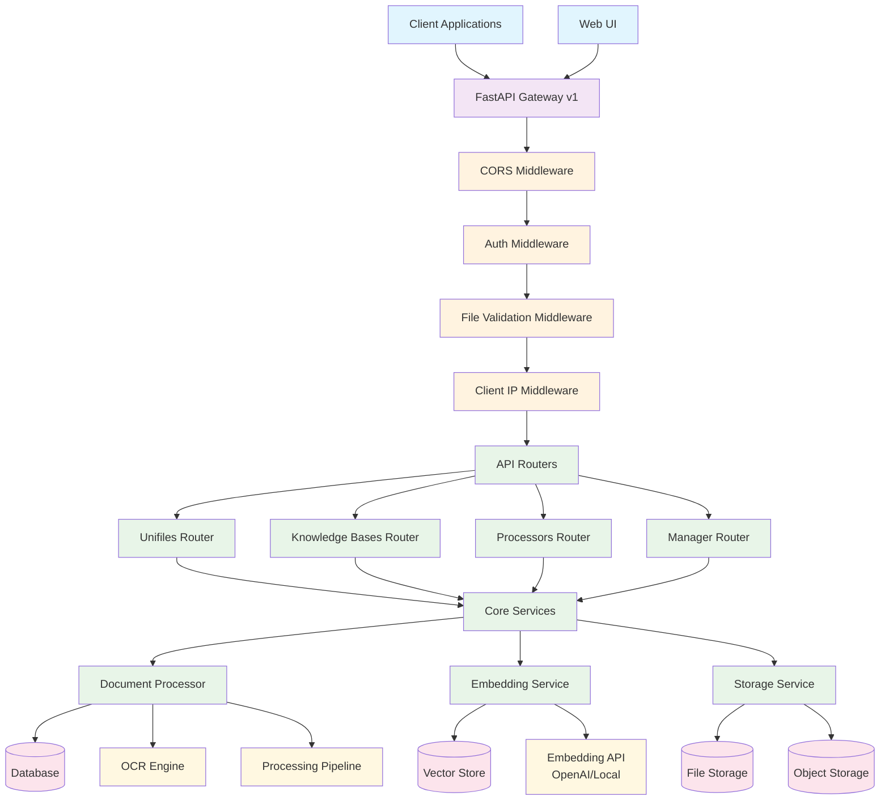

# System Architecture Overview

This document provides a high-level view of the Unifiles system architecture using Mermaid diagrams.

## High-Level System Architecture

## System Components Overview

### Client Layer
- **Client Applications**: Python client library for programmatic access
- **Web UI**: Browser-based interface for document management

### API Gateway Layer
- **FastAPI Gateway v1**: RESTful API implementation
- **Middleware Stack**: CORS, Authentication, File Validation, Client IP tracking

### Application Layer
- **Unifiles Router**: File upload, management, and basic operations
- **Knowledge Bases Router**: Knowledge base creation and management
- **Processors Router**: Document processing and OCR operations
- **Manager Router**: System management and administrative functions

### Core Services Layer
- **Document Processor**: Handles file processing, OCR, and content extraction
- **Embedding Service**: Manages vector embeddings and similarity search
- **Storage Service**: Abstracts file storage across different backends

### Data Layer
- **Database**: Relational data storage (SQLAlchemy)
- **Vector Store**: Vector embeddings storage for semantic search
- **File Storage**: Local and object storage for files and assets
- **Object Storage**: Cloud-based storage integration

### Processing Layer
- **OCR Engine**: Optical Character Recognition for document text extraction
- **Processing Pipeline**: Modular document processing workflow

### External Dependencies
- **Embedding API**: OpenAI or local embedding model services