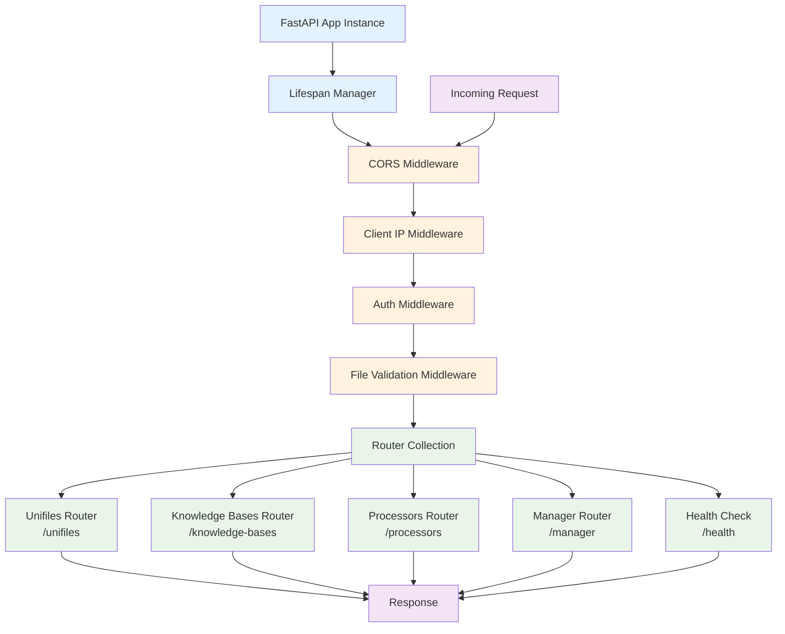
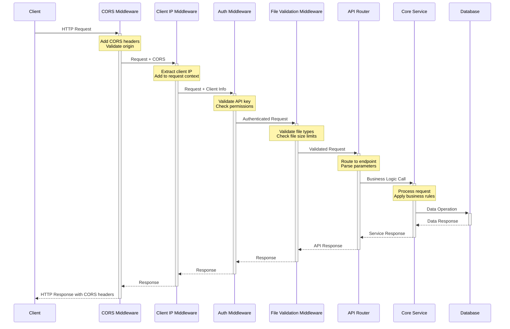
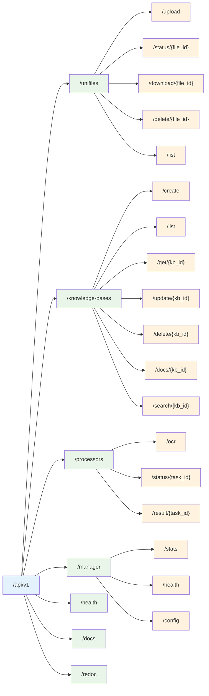
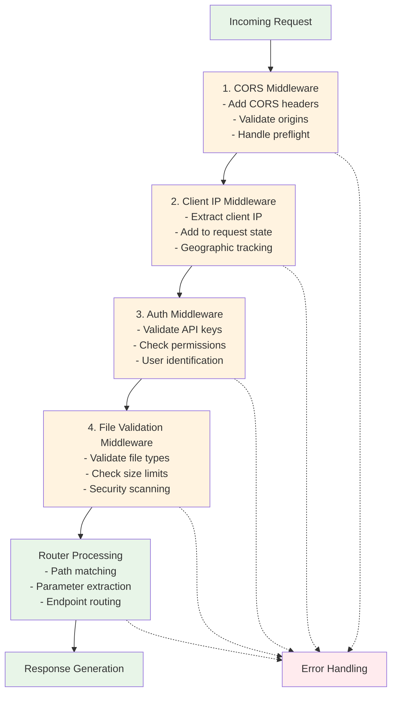
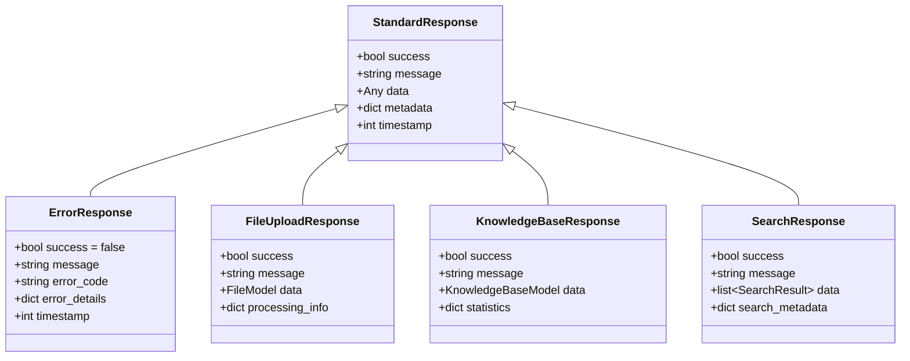

# API Architecture

This document details the FastAPI application structure and request/response flow.

## FastAPI Application Structure

## Request/Response Flow

## API Endpoint Structure

## Middleware Processing Order

## Response Schema Structure

