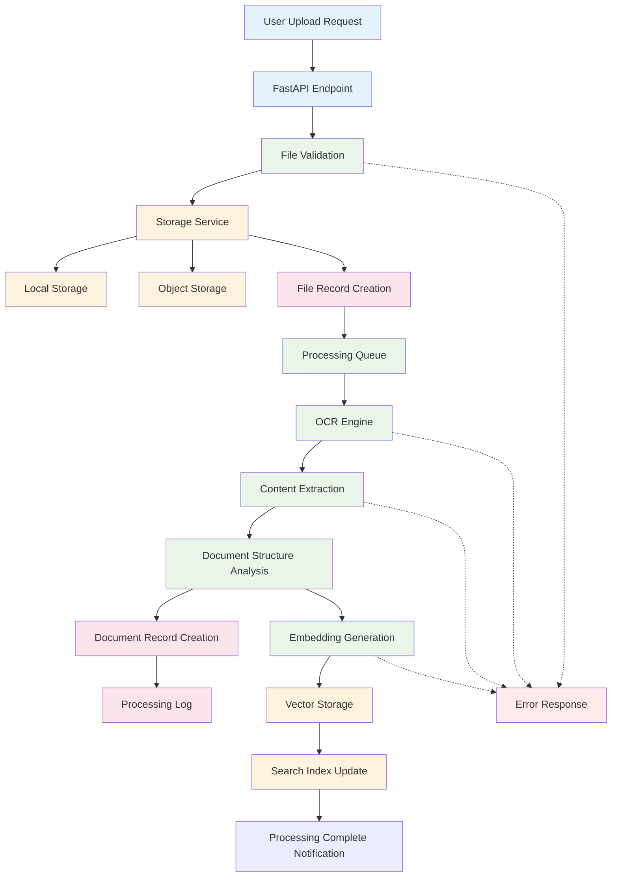
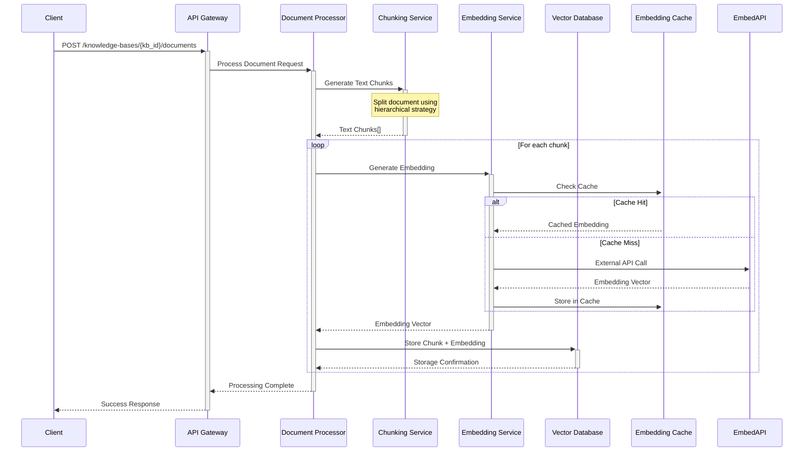
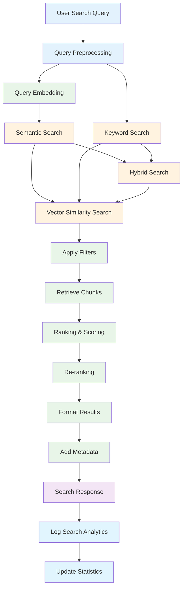
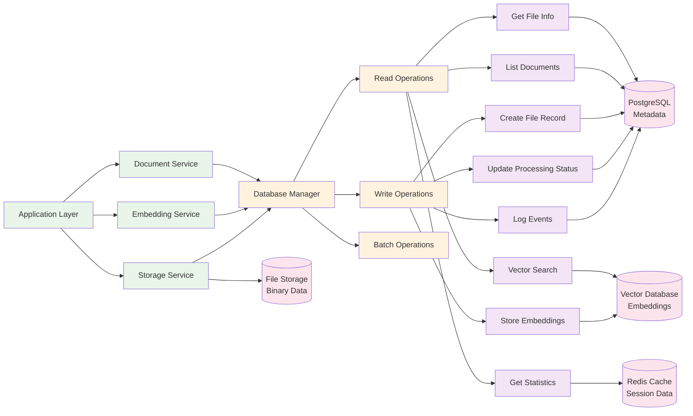
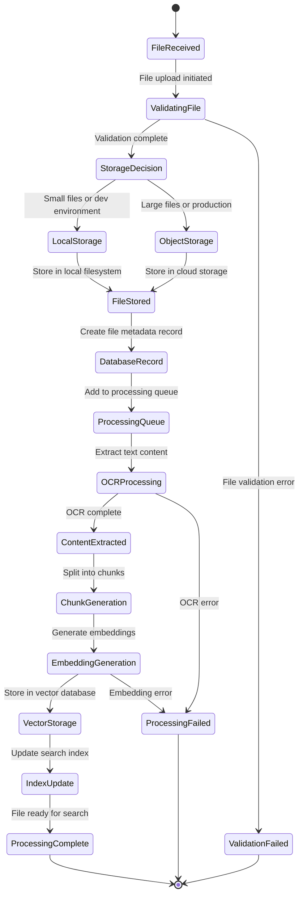
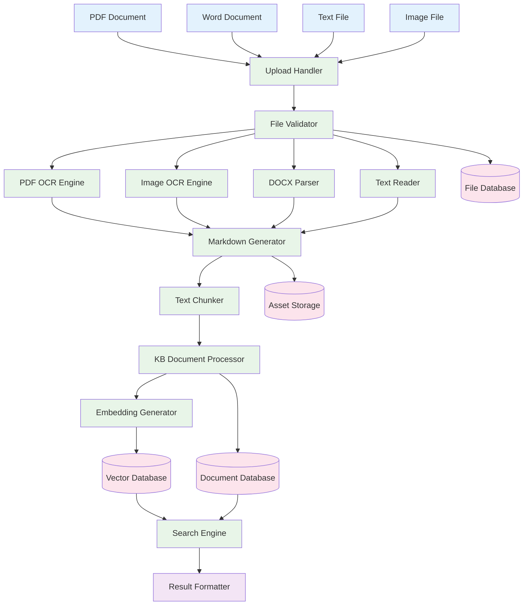

# Data Flow Diagrams

This document illustrates the data flow patterns within the Unifiles system.

## File Upload and Processing Pipeline

## Embedding Generation Workflow

## Knowledge Base Search Flow

## Database Read/Write Operations

## Storage Service Interactions

## Component Data Flow

