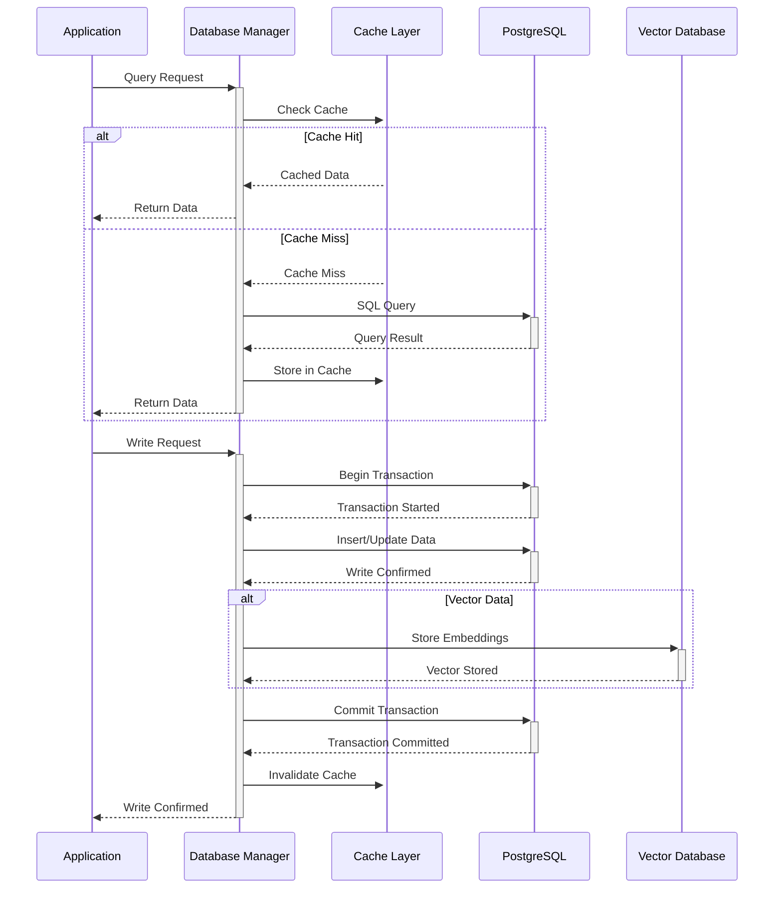

# Database Schema Diagram

This document illustrates the database entity relationships and schema structure for the Unifiles system.

## Entity Relationship Diagram

```mermaid
erDiagram
    %% User and Authentication Layer
    USERS {
        string id PK
        string username
        string email
        string display_name
        string user_status
        string user_role
        json knowledge_ids
        json user_settings
        datetime created_at
        datetime updated_at
        datetime last_login_at
    }
    
    ACCESS_KEYS {
        string id PK
        string user_id FK
        string access_key
        string name
        json scopes
        boolean is_active
        datetime created_at
        datetime expires_at
        datetime last_used_at
    }
    
    %% Storage Configuration Layer
    STORAGE_CONFIGS {
        string id PK
        string storage_type
        string storage_name
        string endpoint
        string bucket_name
        string region
        string access_key_id
        string secret_access_key
        string base_path
        string public_url_prefix
        boolean is_active
        boolean is_default
        datetime created_at
        datetime updated_at
    }
    
    %% File Management Layer
    FILES {
        string id PK
        string user_id FK
        string filename
        string original_filename
        string mime_type
        string file_extension
        int bytes
        string file_size_readable
        string file_hash
        string hash_algorithm
        string storage_config_id FK
        string storage_path
        string status
        string upload_source
        boolean is_deleted
        string file_category
        json tags
        json metadata
        json processing_config
        datetime created_at
        datetime updated_at
        datetime uploaded_at
        datetime processed_at
    }
    
    FILE_PROCESSING_LOGS {
        string id PK
        string file_id FK
        string stage
        string status
        string message
        json error_details
        datetime created_at
    }
    
    %% Content Extraction Layer
    EXTRACTED_DOCUMENTS {
        string id PK
        string file_id FK
        string user_id FK
        string extraction_method
        string extraction_version
        string extraction_engine
        text full_markdown
        json structured_content
        json document_structure
        json page_structure
        int total_pages
        int total_chars
        int total_words
        int total_paragraphs
        int total_assets
        int text_blocks_count
        int image_blocks_count
        string extraction_status
        json extraction_metadata
        json processing_config
        json performance_metrics
        datetime created_at
        datetime extraction_started_at
        datetime completed_at
        datetime validated_at
    }
    
    EXTRACTED_ASSETS {
        string id PK
        string extracted_document_id FK
        string asset_type
        string asset_subtype
        string asset_name
        string original_filename
        string storage_config_id FK
        string storage_path
        int file_size
        string file_hash
        string format
        string mime_type
        int position_in_document
        string asset_description
        text extracted_text
        string alt_text
        string caption
        float extraction_confidence
        string processing_status
        string validation_status
        json asset_metadata
        json extraction_metadata
        int access_count
        int reference_count
        datetime created_at
        datetime extracted_at
        datetime last_accessed_at
    }
    
    %% Knowledge Base Layer
    KNOWLEDGE_BASES {
        string id PK
        string user_id FK
        string name
        string display_name
        string description
        string kb_type
        string kb_category
        string visibility
        string access_level
        json default_chunking_strategy
        json vector_config
        json search_config
        int document_count
        int component_count
        int chunk_count
        int photo_count
        int total_size_bytes
        json document_ids
        string parent_kb_id FK
        string hierarchy_path
        int hierarchy_level
        string status
        string processing_status
        string last_updated_by
        json kb_metadata
        json tags
        datetime created_at
        datetime updated_at
        datetime last_document_added_at
        datetime last_processed_at
    }
    
    DOCUMENTS {
        string id PK
        string knowledge_base_id FK
        string extracted_document_id FK
        string title
        string display_name
        string description
        string document_category
        json tags
        json keywords
        json chunking_strategy
        json custom_config
        string processing_status
        string indexing_status
        string validation_status
        int component_count
        int chunk_count
        int photo_count
        int total_chars
        int total_tokens
        json document_permissions
        string access_level
        string hierarchy_path
        string parent_document_id FK
        int document_order
        int version_number
        boolean is_latest_version
        int view_count
        int search_count
        int reference_count
        json document_metadata
        json processing_metadata
        datetime created_at
        datetime processed_at
        datetime indexed_at
        datetime updated_at
        datetime last_accessed_at
    }
    
    KB_STATISTICS {
        string id PK
        string knowledge_base_id FK
        int total_documents
        int total_components
        int total_chunks
        int total_photos
        int total_characters
        int total_words
        int total_tokens
        int total_size_bytes
        int total_searches
        int total_views
        int unique_users_count
        int avg_search_time_ms
        int avg_indexing_time_ms
        datetime last_document_added_at
        datetime last_search_at
        datetime last_updated_at
        datetime created_at
        datetime updated_at
    }
    
    %% Component Abstraction Layer
    COMPONENTS {
        string id PK
        string document_id FK
        string component_type
        int component_index
        text content
        json embedding
        datetime created_at
        datetime updated_at
    }
    
    %% Component Subclass Layer
    CHUNKS {
        string id PK
        string component_id FK
        text text_content
        int char_count
        int word_count
        int token_count
        datetime created_at
        datetime updated_at
    }
    
    PHOTOS {
        string id PK
        string component_id FK
        string extracted_asset_id FK
        string photo_description
        string alt_text
        string photo_subtype
        int width
        int height
        int file_size
        string format
        datetime created_at
        datetime updated_at
    }
    
    %% Relationships
    USERS ||--o{ ACCESS_KEYS : "has"
    USERS ||--o{ FILES : "owns"
    USERS ||--o{ KNOWLEDGE_BASES : "owns"
    USERS ||--o{ EXTRACTED_DOCUMENTS : "owns"
    
    STORAGE_CONFIGS ||--o{ FILES : "stores"
    STORAGE_CONFIGS ||--o{ EXTRACTED_ASSETS : "stores"
    
    FILES ||--o{ FILE_PROCESSING_LOGS : "has"
    FILES ||--|| EXTRACTED_DOCUMENTS : "extracts_to"
    
    EXTRACTED_DOCUMENTS ||--o{ EXTRACTED_ASSETS : "contains"
    EXTRACTED_DOCUMENTS ||--|| DOCUMENTS : "becomes"
    
    KNOWLEDGE_BASES ||--o{ DOCUMENTS : "contains"
    KNOWLEDGE_BASES ||--|| KB_STATISTICS : "has"
    KNOWLEDGE_BASES ||--o{ KNOWLEDGE_BASES : "parent_of"
    
    DOCUMENTS ||--o{ COMPONENTS : "contains"
    DOCUMENTS ||--o{ DOCUMENTS : "parent_of"
    
    COMPONENTS ||--|| CHUNKS : "implements"
    COMPONENTS ||--|| PHOTOS : "implements"
    
    PHOTOS ||--|| EXTRACTED_ASSETS : "references"
```



## Database Layer Architecture

```mermaid
graph TD
    %% Application Layer
    APP[Application Services]
    
    %% Database Abstraction Layer
    DB_MGR[Database Manager]
    BASE_MODEL[Base Model Classes]
    
    %% Model Categories
    USER_MODELS[User & Auth Models]
    FILE_MODELS[File Management Models]
    CONTENT_MODELS[Content Extraction Models]
    KB_MODELS[Knowledge Base Models]
    COMPONENT_MODELS[Component Models]
    
    %% Database Operations
    READ_OPS[Read Operations]
    WRITE_OPS[Write Operations]
    BATCH_OPS[Batch Operations]
    MIGRATION_OPS[Migration Operations]
    
    %% Physical Databases
    POSTGRES[(PostgreSQL<br/>Primary Database)]
    VECTOR_DB[(Vector Database<br/>Embeddings)]
    CACHE[(Redis Cache<br/>Sessions)]
    
    %% Model Relationships
    USER_MODELS --> USERS_TABLE[Users Table]
    USER_MODELS --> ACCESS_KEYS_TABLE[Access Keys Table]
    
    FILE_MODELS --> FILES_TABLE[Files Table]
    FILE_MODELS --> STORAGE_CONFIG_TABLE[Storage Config Table]
    FILE_MODELS --> PROCESSING_LOGS_TABLE[Processing Logs Table]
    
    CONTENT_MODELS --> EXTRACTED_DOCS_TABLE[Extracted Documents Table]
    CONTENT_MODELS --> EXTRACTED_ASSETS_TABLE[Extracted Assets Table]
    
    KB_MODELS --> KB_TABLE[Knowledge Bases Table]
    KB_MODELS --> DOCUMENTS_TABLE[Documents Table]
    KB_MODELS --> KB_STATS_TABLE[KB Statistics Table]
    
    COMPONENT_MODELS --> COMPONENTS_TABLE[Components Table]
    COMPONENT_MODELS --> CHUNKS_TABLE[Chunks Table]
    COMPONENT_MODELS --> PHOTOS_TABLE[Photos Table]
    
    %% Connections
    APP --> DB_MGR
    DB_MGR --> BASE_MODEL
    
    BASE_MODEL --> USER_MODELS
    BASE_MODEL --> FILE_MODELS
    BASE_MODEL --> CONTENT_MODELS
    BASE_MODEL --> KB_MODELS
    BASE_MODEL --> COMPONENT_MODELS
    
    DB_MGR --> READ_OPS
    DB_MGR --> WRITE_OPS
    DB_MGR --> BATCH_OPS
    DB_MGR --> MIGRATION_OPS
    
    READ_OPS --> POSTGRES
    WRITE_OPS --> POSTGRES
    BATCH_OPS --> POSTGRES
    MIGRATION_OPS --> POSTGRES
    
    COMPONENT_MODELS --> VECTOR_DB
    USER_MODELS --> CACHE
    
    %% Physical Table Connections
    USERS_TABLE --> POSTGRES
    ACCESS_KEYS_TABLE --> POSTGRES
    FILES_TABLE --> POSTGRES
    STORAGE_CONFIG_TABLE --> POSTGRES
    PROCESSING_LOGS_TABLE --> POSTGRES
    EXTRACTED_DOCS_TABLE --> POSTGRES
    EXTRACTED_ASSETS_TABLE --> POSTGRES
    KB_TABLE --> POSTGRES
    DOCUMENTS_TABLE --> POSTGRES
    KB_STATS_TABLE --> POSTGRES
    COMPONENTS_TABLE --> POSTGRES
    CHUNKS_TABLE --> POSTGRES
    PHOTOS_TABLE --> POSTGRES
    
    %% Styling
    classDef app fill:#e3f2fd
    classDef manager fill:#e8f5e8
    classDef model fill:#fff3e0
    classDef operation fill:#f3e5f5
    classDef database fill:#fce4ec
    classDef table fill:#e1f5fe
    
    class APP app
    class DB_MGR,BASE_MODEL manager
    class USER_MODELS,FILE_MODELS,CONTENT_MODELS,KB_MODELS,COMPONENT_MODELS model
    class READ_OPS,WRITE_OPS,BATCH_OPS,MIGRATION_OPS operation
    class POSTGRES,VECTOR_DB,CACHE database
    class USERS_TABLE,ACCESS_KEYS_TABLE,FILES_TABLE,STORAGE_CONFIG_TABLE,PROCESSING_LOGS_TABLE,EXTRACTED_DOCS_TABLE,EXTRACTED_ASSETS_TABLE,KB_TABLE,DOCUMENTS_TABLE,KB_STATS_TABLE,COMPONENTS_TABLE,CHUNKS_TABLE,PHOTOS_TABLE table
```



## Data Model Hierarchy

```mermaid
classDiagram
    %% Base Classes
    class BaseModel {
        +string id
        +datetime created_at
        +datetime updated_at
    }
    
    %% User Layer
    class UserModel {
        +string username
        +string email
        +string display_name
        +string user_status
        +string user_role
        +List~string~ knowledge_ids
        +Dict user_settings
        +datetime last_login_at
    }
    
    class AccessKeyModel {
        +string user_id
        +string access_key
        +string name
        +List~string~ scopes
        +boolean is_active
        +datetime expires_at
        +datetime last_used_at
    }
    
    %% File Layer
    class FileModel {
        +string user_id
        +string filename
        +string original_filename
        +string mime_type
        +int bytes
        +string file_hash
        +string storage_path
        +FileStatus status
        +List~string~ tags
        +Dict metadata
    }
    
    class StorageConfigModel {
        +StorageType storage_type
        +string storage_name
        +string endpoint
        +string bucket_name
        +boolean is_active
        +boolean is_default
    }
    
    %% Content Layer
    class ExtractedDocumentModel {
        +string file_id
        +string user_id
        +string extraction_method
        +string full_markdown
        +Dict structured_content
        +int total_pages
        +ExtractionStatus extraction_status
        +Dict extraction_metadata
    }
    
    class ExtractedAssetModel {
        +string extracted_document_id
        +string asset_type
        +string storage_path
        +int file_size
        +string format
        +float extraction_confidence
        +Dict asset_metadata
    }
    
    %% Knowledge Base Layer
    class KnowledgeBaseModel {
        +string user_id
        +string name
        +string description
        +Dict default_chunking_strategy
        +Dict vector_config
        +int document_count
        +KnowledgeBaseStatus status
        +List~string~ document_ids
    }
    
    class DocumentModel {
        +string knowledge_base_id
        +string extracted_document_id
        +string title
        +List~string~ tags
        +Dict chunking_strategy
        +int component_count
        +string processing_status
    }
    
    %% Component Layer
    class ComponentModel {
        +string document_id
        +ComponentType component_type
        +int component_index
        +string content
        +List~float~ embedding
    }
    
    class ChunkModel {
        +string component_id
        +string text_content
        +int char_count
        +int word_count
        +int token_count
    }
    
    class PhotoModel {
        +string component_id
        +string extracted_asset_id
        +string photo_description
        +string alt_text
        +int width
        +int height
    }
    
    %% Inheritance
    BaseModel <|-- UserModel
    BaseModel <|-- AccessKeyModel
    BaseModel <|-- FileModel
    BaseModel <|-- StorageConfigModel
    BaseModel <|-- ExtractedDocumentModel
    BaseModel <|-- ExtractedAssetModel
    BaseModel <|-- KnowledgeBaseModel
    BaseModel <|-- DocumentModel
    BaseModel <|-- ComponentModel
    BaseModel <|-- ChunkModel
    BaseModel <|-- PhotoModel
    
    %% Relationships
    UserModel ||--o{ AccessKeyModel : "has"
    UserModel ||--o{ FileModel : "owns"
    UserModel ||--o{ KnowledgeBaseModel : "owns"
    FileModel ||--|| ExtractedDocumentModel : "extracts_to"
    ExtractedDocumentModel ||--o{ ExtractedAssetModel : "contains"
    KnowledgeBaseModel ||--o{ DocumentModel : "contains"
    DocumentModel ||--o{ ComponentModel : "contains"
    ComponentModel ||--|| ChunkModel : "implements"
    ComponentModel ||--|| PhotoModel : "implements"
    PhotoModel ||--|| ExtractedAssetModel : "references"
```

## Database Operations Patterns

