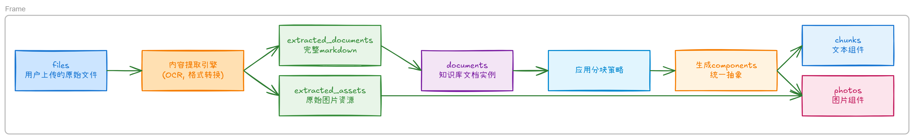
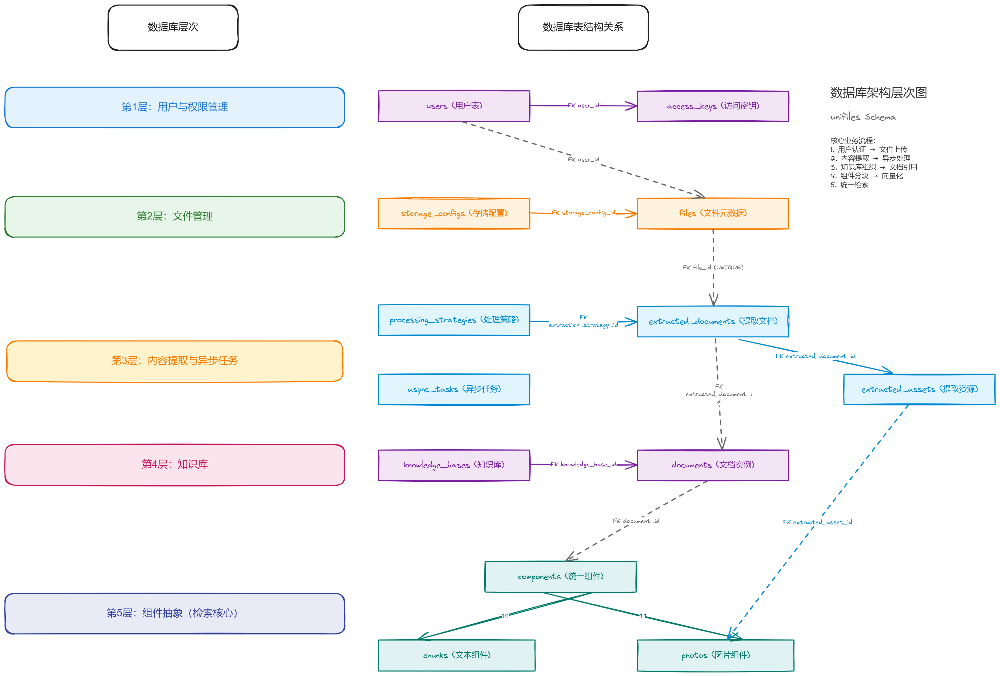
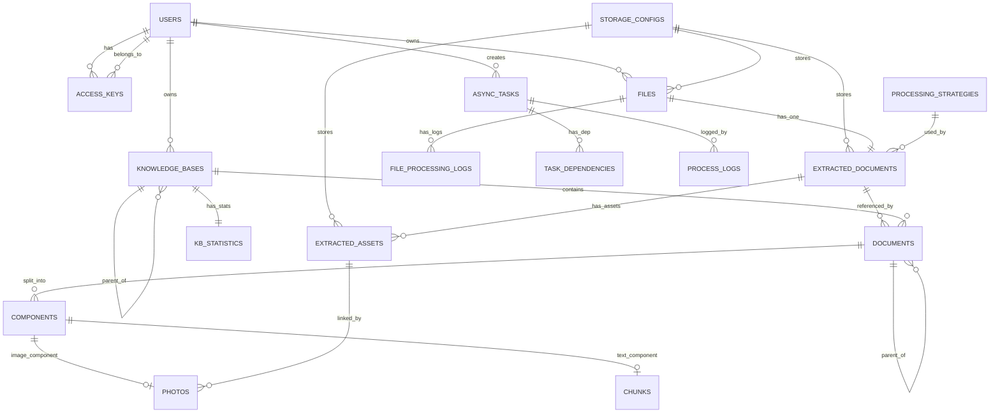

# 数据库设计架构

本文档详细阐述了 Unifiles 系统的数据库设计，严格基于 `scripts/sql` 目录下的 SQL 实现。旨在为开发者提供一个清晰、全面的数据层认知。

## 核心设计理念

系统采用分层设计，以实现数据处理流程的清晰、解耦和可扩展。核心数据流遵循一个清晰的抽象层次：

**文件上传 (`files`) → 内容提取 (`extracted_documents`) → 知识库文档 (`documents`) → 组件化 (`components`) → 具体实现 (`chunks`/`photos`)**

这种设计的优势在于：
- **单一真实来源**：`extracted_documents` 表存储了从原始文件处理后的完整 Markdown，作为后续所有操作的唯一内容源，实现了“一次提取，多次使用”。
- **高度灵活性**：同一个 `extracted_documents` 可以被多个 `documents` 引用，并应用不同的分块策略，以适应不同场景（如精确问答 vs. 篇章总结）。
- **统一检索接口**：所有内容（文本、图片）都被抽象为 `components`，可以在此表上进行统一的向量检索，大大简化了查询逻辑。
- **零数据冗余**：各层级之间通过引用关联，避免了相同内容的重复存储。

## 数据流程图

## 数据表分层详解

数据库 Schema 为 `unifiles`。

### 第1层：用户与权限管理

负责管理用户身份、访问凭证和权限。

#### `users`
存储用户基本信息。

| 字段名          | 数据类型      | 约束                        | 描述                                                    |
| --------------- | ------------- | --------------------------- | ------------------------------------------------------- |
| `id`            | `TEXT`        | `PRIMARY KEY`               | 用户唯一标识                                            |
| `username`      | `TEXT`        |                             | 用户名（可选）                                          |
| `email`         | `TEXT`        |                             | 邮箱（可选）                                            |
| `display_name`  | `TEXT`        |                             | 显示名称                                                |
| `user_status`   | `TEXT`        | `DEFAULT 'active'`          | 用户状态 (`active`, `inactive`, `suspended`, `deleted`) |
| `user_role`     | `TEXT`        | `DEFAULT 'user'`            | 用户角色 (`admin`, `user`, `readonly`)                  |
| `knowledge_ids` | `TEXT[]`      | `DEFAULT '{}'`              | 关联的知识库ID列表                                      |
| `created_at`    | `TIMESTAMPTZ` | `DEFAULT CURRENT_TIMESTAMP` | 创建时间                                                |
| `updated_at`    | `TIMESTAMPTZ` | `DEFAULT CURRENT_TIMESTAMP` | 更新时间                                                |

#### `access_keys`
存储用于 API 认证的访问密钥 (Bearer Token)。

| 字段名                  | 数据类型      | 约束                          | 描述                                   |
| ----------------------- | ------------- | ----------------------------- | -------------------------------------- |
| `id`                    | `TEXT`        | `PRIMARY KEY`                 | 密钥唯一标识                           |
| `user_id`               | `TEXT`        | `NOT NULL`, `FK -> users.id`  | 关联的用户                             |
| `access_key`            | `TEXT`        | `NOT NULL`, `UNIQUE`          | 实际的 Token 字符串                    |
| `name`                  | `TEXT`        | `NOT NULL`                    | Token 的描述名称                       |
| `scopes`                | `TEXT[]`      | `DEFAULT '{"read", "write"}'` | 权限范围 (如 `files:read`, `kb:write`) |
| `is_active`             | `BOOLEAN`     | `DEFAULT TRUE`                | 密钥是否启用                           |
| `expires_at`            | `TIMESTAMPTZ` |                               | 过期时间，NULL表示永不过期             |
| `max_requests_per_hour` | `INTEGER`     | `DEFAULT 1000`                | 每小时最大请求数                       |
| `max_requests_per_day`  | `INTEGER`     | `DEFAULT 10000`               | 每天最大请求数                         |
| `last_used_at`          | `TIMESTAMPTZ` |                               | 最后使用时间                           |
| `created_at`            | `TIMESTAMPTZ` | `DEFAULT CURRENT_TIMESTAMP`   | 创建时间                               |

### 第2层：文件管理

负责记录用户上传的原始文件。

#### `storage_configs`
存储文件存储位置的配置（如本地存储、MinIO）。

| 字段名              | 数据类型  | 约束           | 描述                                     |
| ------------------- | --------- | -------------- | ---------------------------------------- |
| `id`                | `TEXT`    | `PRIMARY KEY`  | 配置的唯一标识                           |
| `storage_name`      | `TEXT`    | `NOT NULL`     | 存储名称（用于显示）                     |
| `connection_config` | `JSONB`   | `NOT NULL`     | 连接参数（provider, endpoint, bucket等） |
| `public_url_prefix` | `TEXT`    |                | 公共访问URL前缀                          |
| `is_active`         | `BOOLEAN` | `DEFAULT TRUE` | 是否启用                                 |

#### `files`
存储用户上传的每个原始文件的元数据。

| 字段名              | 数据类型      | 约束                         | 描述                                    |
| ------------------- | ------------- | ---------------------------- | --------------------------------------- |
| `id`                | `TEXT`        | `PRIMARY KEY`                | 文件唯一标识                            |
| `user_id`           | `TEXT`        | `NOT NULL`, `FK -> users.id` | 文件所有者                              |
| `filename`          | `TEXT`        | `NOT NULL`                   | 原始文件名                              |
| `bytes`             | `BIGINT`      | `NOT NULL`                   | 文件大小（字节）                        |
| `file_hash`         | `TEXT`        |                              | 文件内容的哈希值，用于去重              |
| `storage_config_id` | `TEXT`        | `FK -> storage_configs.id`   | 使用的存储配置                          |
| `storage_path`      | `TEXT`        | `NOT NULL`                   | 原始文件在存储中的路径                  |
| `derived_pdf_path`  | `TEXT`        |                              | 转换后PDF在存储中的路径（如有转换）     |
| `status`            | `TEXT`        | `DEFAULT 'active'`           | 文件状态 (`active`, `error`, `deleted`) |
| `created_at`        | `TIMESTAMPTZ` | `DEFAULT CURRENT_TIMESTAMP`  | 创建时间                                |
| `updated_at`        | `TIMESTAMPTZ` | `DEFAULT CURRENT_TIMESTAMP`  | 更新时间                                |

### 第3层：内容提取与异步任务

负责将原始文件转换为标准化内容，并管理此过程中的异步任务。

#### `processing_strategies`
定义了内容提取的处理策略。

| 字段名              | 数据类型  | 约束           | 描述                                                      |
| ------------------- | --------- | -------------- | --------------------------------------------------------- |
| `id`                | `TEXT`    | `PRIMARY KEY`  | 策略唯一标识                                              |
| `strategy_name`     | `TEXT`    | `NOT NULL`     | 策略名称                                                  |
| `strategy_type`     | `TEXT`    | `NOT NULL`     | 策略类型 (`ocr`, `nlp`, `multimodal`, `hybrid`, `custom`) |
| `processing_config` | `JSONB`   | `NOT NULL`     | 详细的处理器配置（方法、版本、参数等）                    |
| `is_active`         | `BOOLEAN` | `DEFAULT TRUE` | 是否启用                                                  |

#### `extracted_documents`
存储从原始文件提取出的完整、标准化的 Markdown 内容。

| 字段名                   | 数据类型      | 约束                                         | 描述                                                                 |
| ------------------------ | ------------- | -------------------------------------------- | -------------------------------------------------------------------- |
| `id`                     | `TEXT`        | `PRIMARY KEY`                                | 提取文档的唯一标识                                                   |
| `file_id`                | `TEXT`        | `NOT NULL`, `FK -> files.id`, `UNIQUE`       | 关联的原始文件                                                       |
| `user_id`                | `TEXT`        | `NOT NULL`                                   | 用户ID（冗余）                                                       |
| `extraction_strategy_id` | `TEXT`        | `NOT NULL`, `FK -> processing_strategies.id` | 使用的处理策略                                                       |
| `full_markdown`          | `TEXT`        | `NOT NULL`                                   | 提取出的完整 Markdown 内容                                           |
| `extraction_status`      | `TEXT`        | `DEFAULT 'completed'`                        | 提取状态 (`pending`, `processing`, `completed`, `failed`, `partial`) |
| `created_at`             | `TIMESTAMPTZ` | `DEFAULT CURRENT_TIMESTAMP`                  | 创建时间                                                             |

#### `extracted_assets`
存储从文档中提取的二进制资源，如图片。

| 字段名                  | 数据类型 | 约束                                       | 描述                                                            |
| ----------------------- | -------- | ------------------------------------------ | --------------------------------------------------------------- |
| `id`                    | `TEXT`   | `PRIMARY KEY`                              | 资源唯一标识                                                    |
| `extracted_document_id` | `TEXT`   | `NOT NULL`, `FK -> extracted_documents.id` | 关联的提取文档                                                  |
| `asset_type`            | `TEXT`   | `NOT NULL`                                 | 资源类型 (`text`, `image`, `table`, `code`, `chart`, `formula`) |
| `storage_path`          | `TEXT`   | `NOT NULL`                                 | 资源在对象存储中的路径                                          |
| `asset_description`     | `TEXT`   |                                            | 资源描述                                                        |

#### `async_tasks`
统一管理所有异步任务。

| 字段名             | 数据类型      | 约束                            | 描述                                                                                                                    |
| ------------------ | ------------- | ------------------------------- | ----------------------------------------------------------------------------------------------------------------------- |
| `id`               | `TEXT`        | `PRIMARY KEY`                   | 任务唯一标识                                                                                                            |
| `task_type`        | `TEXT`        | `NOT NULL`                      | 任务类型 (`extraction`, `chunking`, `embedding`, `indexing`, `fine_tuning`, `migration`, `cleanup`, `export`, `custom`) |
| `entity_type`      | `TEXT`        |                                 | 关联的实体类型 (`file`, `extracted_document`, `document`, `asset`, `chunk`, `knowledge_base`, `batch`, `pipeline`)      |
| `entity_id`        | `TEXT`        |                                 | 关联的业务实体ID (如 `file_id`, `document_id`)                                                                          |
| `status`           | `TEXT`        | `NOT NULL`, `DEFAULT 'pending'` | 任务状态 (`pending`, `queued`, `processing`, `completed`, `failed`, `cancelled`, `interrupted`, `timeout`)              |
| `progress_percent` | `INTEGER`     | `DEFAULT 0`                     | 任务进度 (0-100)                                                                                                        |
| `progress_message` | `TEXT`        |                                 | 当前阶段描述                                                                                                            |
| `input_params`     | `JSONB`       |                                 | 任务的输入参数                                                                                                          |
| `result_data`      | `JSONB`       |                                 | 任务成功后的结果                                                                                                        |
| `error_message`    | `TEXT`        |                                 | 任务失败的错误信息                                                                                                      |
| `error_code`       | `TEXT`        |                                 | 错误代码                                                                                                                |
| `user_id`          | `TEXT`        | `NOT NULL`, `FK -> users.id`    | 发起任务的用户                                                                                                          |
| `created_at`       | `TIMESTAMPTZ` | `DEFAULT CURRENT_TIMESTAMP`     | 创建时间                                                                                                                |
| `queued_at`        | `TIMESTAMPTZ` |                                 | 入队时间（状态变为 `queued` 时自动记录）                                                                                |
| `started_at`       | `TIMESTAMPTZ` |                                 | 开始时间                                                                                                                |
| `completed_at`     | `TIMESTAMPTZ` |                                 | 完成时间                                                                                                                |

### 第4层：知识库

负责将提取的内容组织成逻辑文档，并为检索做准备。

#### `knowledge_bases`
用户创建的知识库，是文档的顶层组织单元。

| 字段名                      | 数据类型  | 约束                         | 描述                             |
| --------------------------- | --------- | ---------------------------- | -------------------------------- |
| `id`                        | `TEXT`    | `PRIMARY KEY`                | 知识库唯一标识                   |
| `user_id`                   | `TEXT`    | `NOT NULL`, `FK -> users.id` | 知识库所有者                     |
| `name`                      | `TEXT`    | `NOT NULL`                   | 知识库名称                       |
| `default_chunking_strategy` | `JSONB`   |                              | 应用于库内所有文档的默认分块策略 |
| `vector_config`             | `JSONB`   |                              | 默认的向量和搜索配置             |
| `document_count`            | `INTEGER` | `DEFAULT 0`                  | 文档数量                         |
| `status`                    | `TEXT`    | `DEFAULT 'active'`           | 知识库状态                       |

#### `documents`
知识库中的一个文档实例，它**引用**一个 `extracted_documents`。

| 字段名                  | 数据类型      | 约束                                       | 描述                                 |
| ----------------------- | ------------- | ------------------------------------------ | ------------------------------------ |
| `id`                    | `TEXT`        | `PRIMARY KEY`                              | 文档实例的唯一标识                   |
| `knowledge_base_id`     | `TEXT`        | `NOT NULL`, `FK -> knowledge_bases.id`     | 所属知识库                           |
| `extracted_document_id` | `TEXT`        | `NOT NULL`, `FK -> extracted_documents.id` | 引用的已提取内容（统一内容源）       |
| `title`                 | `TEXT`        |                                            | 文档标题（可自定义）                 |
| `display_name`          | `TEXT`        |                                            | 显示名称                             |
| `description`           | `TEXT`        |                                            | 文档描述                             |
| `document_category`     | `TEXT`        |                                            | 文档分类                             |
| `tags`                  | `TEXT[]`      | `DEFAULT '{}'`                             | 文档标签                             |
| `keywords`              | `TEXT[]`      | `DEFAULT '{}'`                             | 关键词                               |
| `chunking_strategy`     | `JSONB`       |                                            | 文档级分块策略（覆盖知识库默认策略） |
| `custom_config`         | `JSONB`       | `DEFAULT '{}'`                             | 自定义配置                           |
| `processing_status`     | `TEXT`        | `DEFAULT 'pending'`                        | 分块/处理状态                        |
| `indexing_status`       | `TEXT`        | `DEFAULT 'pending'`                        | 索引状态                             |
| `validation_status`     | `TEXT`        | `DEFAULT 'pending'`                        | 验证状态                             |
| `component_count`       | `INTEGER`     | `DEFAULT 0`                                | 组件总数                             |
| `chunk_count`           | `INTEGER`     | `DEFAULT 0`                                | 文本块数量                           |
| `photo_count`           | `INTEGER`     | `DEFAULT 0`                                | 图片数量                             |
| `total_chars`           | `INTEGER`     | `DEFAULT 0`                                | 总字符数                             |
| `total_tokens`          | `INTEGER`     | `DEFAULT 0`                                | 总 token 数                          |
| `document_permissions`  | `JSONB`       | `DEFAULT '{}'`                             | 文档权限配置                         |
| `access_level`          | `TEXT`        | `DEFAULT 'inherited'`                      | 文档访问级别                         |
| `hierarchy_path`        | `ltree`       | `DEFAULT 'root'::ltree`                    | 文档层次路径                         |
| `parent_document_id`    | `TEXT`        | `FK -> documents.id`                       | 父文档 ID（支持文档层级）            |
| `document_order`        | `INTEGER`     | `DEFAULT 0`                                | 文档排序                             |
| `version_number`        | `INTEGER`     | `DEFAULT 1`                                | 版本号                               |
| `is_latest_version`     | `BOOLEAN`     | `DEFAULT TRUE`                             | 是否为最新版本                       |
| `view_count`            | `INTEGER`     | `DEFAULT 0`                                | 查看次数                             |
| `search_count`          | `INTEGER`     | `DEFAULT 0`                                | 搜索次数                             |
| `reference_count`       | `INTEGER`     | `DEFAULT 0`                                | 引用次数                             |
| `document_metadata`     | `JSONB`       | `DEFAULT '{}'`                             | 文档元数据                           |
| `processing_metadata`   | `JSONB`       | `DEFAULT '{}'`                             | 处理元数据                           |
| `created_at`            | `TIMESTAMPTZ` | `DEFAULT CURRENT_TIMESTAMP`                | 创建时间                             |
| `processed_at`          | `TIMESTAMPTZ` |                                            | 处理完成时间                         |
| `indexed_at`            | `TIMESTAMPTZ` |                                            | 索引完成时间                         |
| `updated_at`            | `TIMESTAMPTZ` | `DEFAULT CURRENT_TIMESTAMP`                | 更新时间                             |
| `last_accessed_at`      | `TIMESTAMPTZ` |                                            | 最后访问时间                         |

- `UNIQUE (knowledge_base_id, extracted_document_id)`：同一提取文档在同一知识库中只能出现一次。
- `parent_document_id` 为可空字段，用于表示父文档，实现文档的层级结构；当该字段为 `NULL` 时表示顶层文档。

### 第5层：组件抽象（检索核心）

负责将文档内容分解为可独立检索的原子单元。

#### `components`
对分块后的内容进行统一抽象，是检索的基本单位。

| 字段名                 | 数据类型  | 约束                             | 描述                                                          |
| ---------------------- | --------- | -------------------------------- | ------------------------------------------------------------- |
| `id`                   | `TEXT`    | `PRIMARY KEY`                    | 组件唯一标识                                                  |
| `document_id`          | `TEXT`    | `NOT NULL`, `FK -> documents.id` | 所属的知识库文档                                              |
| `component_type`       | `TEXT`    | `NOT NULL`                       | 组件类型 (`chunk` 或 `photo`)                                 |
| `component_index`      | `INTEGER` | `NOT NULL`                       | 组件在文档中的顺序                                            |
| `content`              | `TEXT`    |                                  | 组件的文本内容或图片描述                                      |
| `searchable_text`      | `TEXT`    |                                  | 经过清洗和优化的搜索文本（由应用层生成）                      |
| `search_keywords`      | `TEXT[]`  |                                  | 提取的关键词数组（由应用层生成）                              |
| `content_language`     | `TEXT`    | `DEFAULT 'mixed'`                | 内容语言 (`zh`/`en`/`mixed`/`unknown`，由应用层检测）         |
| `embedding`            | `vector`  |                                  | 内容的向量嵌入                                                |
| `embedding_dimensions` | `INTEGER` |                                  | 向量的维度                                                    |
| `UNIQUE`               |           |                                  | `(document_id, component_index)`                              |

#### `chunks` (文本组件)
`components` 表的文本子类实现。

| 字段名         | 数据类型  | 约束                                        | 描述             |
| -------------- | --------- | ------------------------------------------- | ---------------- |
| `id`           | `TEXT`    | `PRIMARY KEY`                               | 文本块唯一标识   |
| `component_id` | `TEXT`    | `NOT NULL`, `FK -> components.id`, `UNIQUE` | 1:1 关联到组件表 |
| `text_content` | `TEXT`    | `NOT NULL`                                  | 详细的文本内容   |
| `char_count`   | `INTEGER` |                                             | 字符数           |
| `token_count`  | `INTEGER` |                                             | token数          |

#### `photos` (图片组件)
`components` 表的图片子类实现。

| 字段名               | 数据类型  | 约束                                        | 描述                                     |
| -------------------- | --------- | ------------------------------------------- | ---------------------------------------- |
| `id`                 | `TEXT`    | `PRIMARY KEY`                               | 图片块唯一标识                           |
| `component_id`       | `TEXT`    | `NOT NULL`, `FK -> components.id`, `UNIQUE` | 1:1 关联到组件表                         |
| `extracted_asset_id` | `TEXT`    | `FK -> extracted_assets.id`                 | 引用 `extracted_assets` 中的原始图片资源 |
| `photo_description`  | `TEXT`    |                                             | 图片的详细描述                           |
| `alt_text`           | `TEXT`    |                                             | 替代文本                                 |
| `width`              | `INTEGER` |                                             | 宽度                                     |
| `height`             | `INTEGER` |                                             | 高度                                     |

## 关键自动化逻辑 (Triggers)

数据库通过触发器实现了一些自动化逻辑，以保证数据的一致性和实时性。
- **时间戳自动更新**: 大多数表都有 `updated_at` 字段，会在记录更新时通过统一触发器自动刷新。
- **搜索字段生成**: `searchable_text` 和 `search_keywords` 字段由应用层（`DocumentIndexingService`）在插入组件时生成和填充，不再使用数据库触发器（已移除 `trigger_update_component_search_fields`）。
- **文档/知识库统计**: 触发器当前仅刷新 updated_at；document_ids/统计由应用服务更新。
- **异步任务时间记录**: `async_tasks` 表的状态变更会通过触发器自动记录 `queued_at`, `started_at`, `completed_at` 等时间戳。

该设计通过清晰的层次划分和解耦，构建了一个既健壮又灵活的数据模型，能够有效支持复杂的文件处理和智能检索业务。

## RelationShip

本节用自然语言描述各核心表之间的依赖与调用关系，帮助开发者从“业务流程”的视角理解数据库结构。

- **用户与访问控制链路**
  - `users` 是所有业务实体的根：`files`、`knowledge_bases`、`async_tasks` 等都直接或间接关联到用户。
  - `access_keys` 通过 `user_id` 关联 `users`，在认证层面决定哪些用户可以访问哪些业务能力（上传文件、管理知识库等），不直接参与数据内容的组织。

- **文件与内容提取链路**
  - 用户通过 `files` 上传原始文件，`files.user_id` 指向拥有人，`files.storage_config_id` 关联 `storage_configs` 决定落盘位置。
  - 内容处理配置存放在 `processing_strategies` 中，`extracted_documents.extraction_strategy_id` 指向使用的处理策略。
  - 每个 `files` 最多对应一个 `extracted_documents`（`file_id` 唯一），后者保存标准化的 Markdown 内容，是后续所有知识库与检索的**单一内容来源**。
  - 从 `extracted_documents` 中抽取出的资源（图片、表格等）存入 `extracted_assets`，通过 `extracted_document_id` 建立从“文档”到“资源”的 1:N 关系。

- **异步任务与处理流水**
  - `async_tasks` 通过 `entity_type` + `entity_id` 与 `files` / `extracted_documents` / `documents` / `knowledge_bases` 等业务实体解耦关联，用于描述“对哪个实体做了什么后台处理”。
  - `process_logs` 以 `entity_type` + `entity_id` 及 `process_type`、`process_stage` 串联起整个处理流水（如上传 → 提取 → 分块 → 向量化 → 索引），是异步任务执行过程的“详细流水账”。
  - 处理完成后，部分聚合指标会写回 `extracted_documents.performance_metrics`，形成“从任务/日志回流到内容层”的闭环。

- **知识库组织与文档引用链路**
  - `knowledge_bases` 定义知识库的“容器”与全局配置（默认分块策略、向量配置、访问级别等）。
  - `documents` 是知识库中的具体文档实例：`documents.knowledge_base_id` 指向所属知识库，`documents.extracted_document_id` 指向统一内容源 `extracted_documents`。
  - 同一个 `extracted_documents` 可以被多个 `knowledge_bases` 通过不同的 `documents` 引用，实现“同一内容，面向不同知识库的多视图复用”（通过不同的分块策略、权限和标签等进行差异化组织）。
  - knowledge_bases.document_ids 字段存在但不自动维护；请通过查询或应用层更新。

- **组件抽象与检索链路**
  - `components` 以 `document_id` 关联 `documents`，将一个知识库文档拆分为多个可独立检索的原子组件（文本块或图片块），是向量检索和语义搜索的直接操作对象。
  - `chunks` 与 `photos` 分别以 1:1 关系扩展 `components`，承载文本内容和图片元数据：  
    - 文本流程：`documents` → `components`(type=`chunk`) → `chunks.text_content`；  
    - 图片流程：`extracted_assets` → `photos`（通过 `extracted_asset_id`）→ `components`(type=`photo`)。
  - `components.embedding` 统一存放文本或图片描述的向量表示，使得上层检索逻辑只需要针对 `components` 做向量搜索，而不关心底层来自 `chunks` 还是 `photos`。

- **整体调用顺序概览**
  1. 用户创建 `users` / `access_keys`，获取访问凭证。
  2. 用户上传文件，记录到 `files`，物理文件落到由 `storage_configs` 指定的存储。
  3. 通过异步任务 `async_tasks` 和处理策略 `processing_strategies`，对 `files` 执行内容提取，生成 `extracted_documents` 和 `extracted_assets`，过程详情记录在 `process_logs`。
  4. 用户在一个或多个 `knowledge_bases` 中创建 `documents`，引用已有的 `extracted_documents`，形成逻辑上的“知识库文档”。
  5. 后台对 `documents` 进行分块和向量化，将结果写入 `components`、`chunks`、`photos`，并填充 `embedding` 字段，构建统一检索索引。
 6. 检索时，直接在 `components` 层做向量搜索，再通过 `document_id` 回溯到 `documents` / `knowledge_bases`，最终关联回原始 `files` 和 `users`。

`extracted_documents` 是内容维度的唯一来源，`documents` 是知识库维度的组织载体，`components` 是检索维度的统一抽象，而 `async_tasks` 与 `process_logs` 则贯穿整个生命周期，负责驱动和记录各个阶段的异步处理。

## 进阶关系图

### 未来开发参考如下内容

