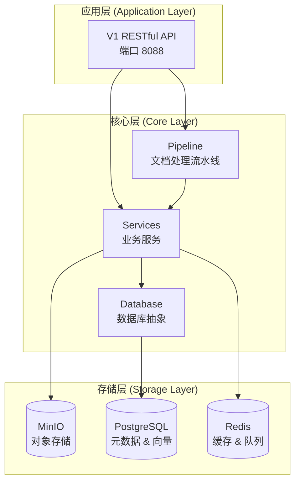
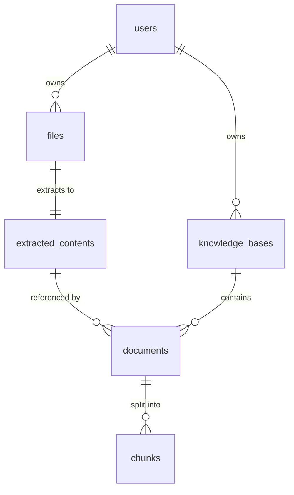

# Architecture

Unifiles 采用现代化的分层架构设计，旨在提供高性能、高可用、易扩展的文档处理与知识库服务。

## 核心设计理念

### 以 Markdown 为核心

所有文档内容统一转换为 Markdown 格式作为单一真实来源（Single Source of Truth），实现：

- **内容统一性**：消除多格式带来的不一致性
- **存储高效性**：轻量级文本格式，易于存储和索引
- **处理灵活性**：同一份内容可应用不同的分块和索引策略

### 设计原则

- **高内聚，低耦合**：各模块功能独立，通过清晰的接口交互
- **可扩展性**：采用策略模式，易于添加新功能
- **状态清晰**：完整的状态跟踪和可追溯性
- **异步优先**：核心流程采用异步设计，实现高性能和高并发

## 架构概览

### 分层架构

## 三层业务架构

### 第一层：文件管理
- 文件上传、下载、删除
- 文件元数据管理
- 存储空间管理
- 访问权限控制

[详细设计](three-layer-design.md#layer-1)

### 第二层：内容提取
- 文件格式验证和转换
- OCR 文本提取
- 内容结构化处理
- 处理状态管理

[详细设计](three-layer-design.md#layer-2)

### 第三层：知识库管理
- 知识库创建和管理
- 文档索引和向量化
- 知识检索和查询
- 分块策略管理

[详细设计](three-layer-design.md#layer-3)

## 核心组件

### 文档处理流水线

[流水线设计](pipeline-design.md)

### 数据模型

[数据库设计](database-schema.md)

## 技术栈

### Backend
- **Framework**: FastAPI 0.104+
- **Language**: Python 3.11+
- **Async**: asyncio, asyncpg

### Storage
- **Database**: PostgreSQL 15+ with pgvector
- **Object Storage**: MinIO
- **Cache**: Redis 7+

### Observability
- **Logging**: Loguru + Structured Logging
- **Tracing**: OpenTelemetry
- **Monitoring**: Prometheus + Grafana

### Development
- **Package Manager**: uv
- **Testing**: pytest
- **Linting**: ruff
- **Type Checking**: mypy

## 关键特性

### 高性能
- 异步 I/O 处理
- 连接池管理
- Redis 缓存
- 批量操作优化

### 高可用
- 无状态设计
- 水平扩展
- 负载均衡
- 优雅降级

### 安全性
- API Key 认证
- 数据加密（传输和存储）
- 多租户隔离
- 访问控制列表

### 可观测性
- 统一日志系统
- 分布式追踪
- 实时监控
- 告警机制

## 深入阅读

- [系统概览](overview.md) - 系统架构详细说明
- [三层架构设计](three-layer-design.md) - 业务分层架构
- [API 架构](api-architecture.md) - API 设计和实现
- [数据流设计](data-flow.md) - 数据流转和处理
- [数据库设计](database-schema.md) - 数据模型和关系
- [深度分析](deep-analysis.md) - 技术决策和权衡
