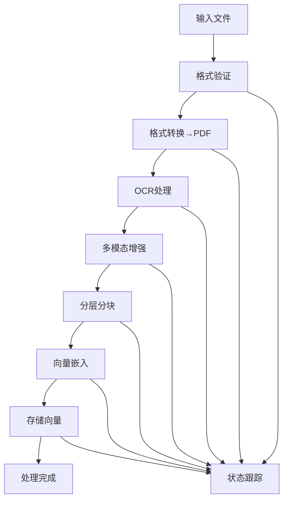

# Core Layer 设计总结

## 📋 总体架构

基于**Pipeline模式 + 策略模式**设计的文档处理核心层，支持多种文档格式的智能处理和向量化。

## 🏗️ 核心组件

### 1. Pipeline 核心
- **DocumentProcessor**: 主控制器，协调整个处理流程
- **ProcessingStage**: 处理阶段抽象，支持可插拔的处理步骤
- **ProcessingContext**: 处理上下文，贯穿整个流程的数据载体

### 2. 处理阶段（按顺序执行）
1. **FileConversionStage**: 所有格式 → PDF
2. **OCRProcessingStage**: PDF → Markdown + 图片提取 + 多模态增强
3. **ChunkingStage**: 分层分块（Markdown结构 + 滑动窗口）
4. **EmbeddingStage**: 文本/图片 → 向量嵌入
5. **VectorStorageStage**: 向量存储到数据库

### 3. 策略模式支持
- **ConversionStrategy**: 支持Office、图片、文本等格式转换
- **ChunkingStrategy**: 支持分层、语义、自适应等分块算法
- **EmbeddingStrategy**: 支持OpenAI、HuggingFace等嵌入模型

## 📊 数据模型设计

### 核心实体
```python
Document           # 文档基本信息
ProcessedDocument  # 处理后的文档（继承Document）
KnowledgeBase     # 知识库信息

TextChunk         # 文本分块
ImageChunk        # 图片分块
EmbeddingResult   # 嵌入结果
VectorRecord      # 向量数据库记录

ProcessingContext # 处理上下文
ProcessingConfig  # 处理配置
ProcessingLog     # 处理日志
```

### 处理模式
- **SIMPLE**: 基础OCR + 简单分块
- **NORMAL**: OCR + 多模态AI + 分层分块
- **ADVANCED**: 全功能 + 自适应分块

## 🔄 处理流程



## 🎯 关键特性

### 1. 高度可扩展
- 可插拔的处理阶段
- 可替换的处理策略
- 灵活的配置系统

### 2. 完整的状态管理
- 实时处理状态跟踪
- 详细的处理日志
- 错误处理和重试机制

### 3. 性能优化
- 异步并发处理
- 批量操作优化
- 资源管理和清理

### 4. 质量保证
- 多层验证机制
- 质量评估指标
- 异常处理覆盖

## 🔧 使用示例

### 基本使用
```python
# 创建配置
config = ProcessingConfig.from_mode(ProcessingMode.NORMAL)

# 创建pipeline
pipeline = DocumentProcessingPipeline(db_session, storage_manager, config)

# 处理文档
result = await pipeline.process_document(
    file_path="document.pdf",
    document_id="doc_001",
    user_id="user_123",
    knowledge_base_id="kb_456",
    filename="document.pdf",
    content_type="application/pdf"
)
```

### API集成
```python
# 在V1 API中集成
@router.post("/knowledge-bases/{kb_id}/documents")
async def process_document(
    kb_id: str,
    request: ProcessDocumentRequest,
    service: DocumentProcessingService = Depends(get_document_service)
):
    result = await service.start_document_processing(
        file_path=file_info.local_path,
        document_id=generate_document_id(),
        user_id=current_user.user_id,
        knowledge_base_id=kb_id,
        mode=ProcessingMode(request.mode)
    )
    
    return StandardResponse(
        success=result.success,
        message=result.message,
        document=result.context.to_api_response()
    )
```

## 📁 目录结构

```
server/core/
├── pipeline/           # Pipeline核心
│   ├── document_processor.py
│   ├── processing_stage.py
│   └── status_tracker.py
├── processors/         # 各种处理器
│   ├── file_converter.py
│   ├── ocr_processor.py
│   ├── multimodal_processor.py
│   └── chunking_processor.py
├── strategies/         # 策略实现
│   ├── conversion/     # 转换策略
│   ├── chunking/       # 分块策略
│   └── embedding/      # 嵌入策略
├── models/            # 数据模型
│   ├── document.py
│   ├── chunks.py
│   ├── embeddings.py
│   ├── processing.py
│   └── config.py
├── storage/           # 存储抽象
│   ├── minio_storage.py
│   ├── vector_store.py
│   └── postgres_vector.py
├── exceptions/        # 异常定义
└── utils/             # 工具类
```

## 🔐 安全和权限

### 1. 用户隔离
- 所有处理过程都基于user_id进行隔离
- 文件存储按用户分层组织
- 向量数据包含用户标识

### 2. 数据安全
- 临时文件自动清理
- 敏感信息不记录到日志
- 处理过程中的数据加密存储

## 📈 监控和性能

### 1. 性能指标
- 各阶段处理时间
- 内存使用情况
- 并发处理数量
- 错误率统计

### 2. 质量指标
- OCR置信度
- 分块质量评分
- 嵌入向量质量
- 整体处理成功率

## 🚀 部署要求

### 依赖服务
- PostgreSQL (with pgvector extension)
- MinIO (对象存储)
- Redis (可选，用于缓存)

### 外部API
- OpenAI API (嵌入和多模态)
- 其他可选的AI服务

### 系统资源
- CPU: 推荐8核心以上
- 内存: 推荐16GB以上
- 存储: SSD推荐
- 网络: 稳定的互联网连接

## 📋 实施步骤

1. **基础设施搭建** (1-2天)
   - 创建目录结构
   - 安装依赖包
   - 配置开发环境

2. **数据模型实现** (2-3天)
   - 实现所有数据模型
   - 创建数据库表结构
   - 编写模型测试

3. **存储层实现** (2-3天)
   - MinIO存储管理器
   - 向量存储实现
   - 存储接口测试

4. **处理器实现** (5-7天)
   - 文件转换器
   - OCR处理器
   - 多模态处理器
   - 各种策略实现

5. **Pipeline核心** (3-4天)
   - 主控制器实现
   - 阶段管理
   - 状态跟踪

6. **API集成** (2-3天)
   - 服务层封装
   - V1 API集成
   - 接口测试

7. **测试和优化** (3-5天)
   - 单元测试
   - 集成测试
   - 性能优化

**预估总时间: 18-27天**

## 🎉 交付物

1. **完整的Core层代码**
2. **API集成代码**
3. **测试套件**
4. **部署脚本**
5. **监控配置**
6. **使用文档**

这个设计提供了一个高度模块化、可扩展、生产就绪的文档处理系统，完全符合你的需求，并且可以无缝集成到现有的V1 API架构中。