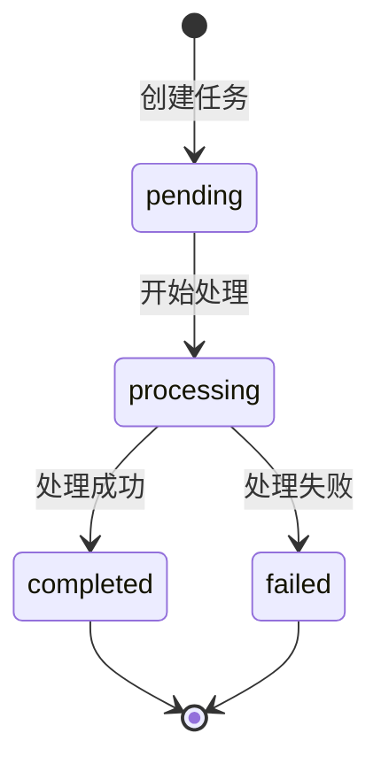

# 设计理念

本文阐述 Unifiles 的核心设计理念，帮助你理解系统架构背后的思考和权衡。

## Markdown 作为单一真实来源

Unifiles 最核心的设计决策是：**将所有输入文档转换为 Markdown 格式，作为内容的单一真实来源（Single Source of Truth, SSOT）**。

### 为什么选择 Markdown？

```
PDF ─────┐
Word ────┤                              ┌── 语义检索
Excel ───┼────► [Markdown SSOT] ────────┼── 全文搜索  
图片 ────┤                              ├── 文本分块
HTML ────┘                              └── LLM 输入
```

**1. 统一性**

不同格式的文档有各自的结构和编码方式。将它们转换为统一的 Markdown 格式后：

- 下游处理逻辑只需关心一种格式
- 消除了格式差异带来的边缘情况
- 简化了分块、索引和检索的实现

**2. 轻量性**

Markdown 是纯文本格式：

- 存储效率高，易于压缩
- 便于版本控制和差异比较
- 可以直接作为 LLM 的输入

**3. 结构化**

Markdown 保留了文档的逻辑结构：

- 标题层级（`#`, `##`, `###`）
- 列表和表格
- 代码块和引用

这些结构信息在分块时非常有价值，可以避免在语义边界中间切割。

**4. 可读性**

Markdown 是人类可读的：

- 便于调试和验证提取质量
- 可以直接预览和编辑
- 降低了系统的黑盒性

### 设计权衡

| 优势 | 代价 |
|------|------|
| 统一的处理逻辑 | 转换过程可能丢失部分格式信息 |
| 轻量高效存储 | 复杂布局（如多栏、浮动图片）难以完美还原 |
| 结构化信息保留 | 需要高质量的转换引擎 |
| LLM 友好 | 非文本内容（音视频）需要额外处理 |

---

## 三层解耦架构

Unifiles 将文档处理分解为三个独立的层，每层都可以单独使用和扩展。

### 为什么要分层？

**1. 渐进式采用**

不是所有用户都需要完整的知识库功能：

- 有些只需要文件存储（Layer 1）
- 有些只需要 OCR 提取（Layer 1 + 2）
- 有些需要完整的 RAG 能力（全部三层）

分层设计让用户可以按需使用，降低了入门门槛。

**2. 独立演进**

每层可以独立优化和升级：

- Layer 1 可以接入不同的存储后端
- Layer 2 可以替换 OCR 引擎
- Layer 3 可以升级向量模型

层与层之间通过清晰的接口通信，互不影响。

**3. 故障隔离**

一层的问题不会影响其他层：

- OCR 服务暂时不可用，不影响文件上传
- 向量数据库维护，不影响内容提取
- 各层可以独立扩缩容

### 层间通信

```python
# Layer 1 → Layer 2: 通过 file_id 关联
file = client.files.upload("document.pdf")
extraction = client.extractions.create(file_id=file.id)

# Layer 2 → Layer 3: 通过 extraction 内容
# (知识库会自动获取提取的 Markdown 内容)
doc = client.knowledge_bases.documents.create(
    kb_id=kb.id,
    file_id=file.id  # 自动关联最新的提取结果
)
```

---

## 命名空间化 SDK 设计

Unifiles SDK 采用命名空间化的设计模式，类似于 Stripe、OpenAI 等主流 SDK。

### 设计原则

**1. 资源导向**

每个资源类型对应一个命名空间：

```python
client.files.*           # 文件操作
client.extractions.*     # 提取操作
client.knowledge_bases.* # 知识库操作
client.api_keys.*        # API 密钥操作
client.webhooks.*        # Webhook 操作
```

**2. CRUD 一致性**

每个命名空间提供一致的 CRUD 操作：

```python
# 创建
client.files.upload(path)
client.knowledge_bases.create(name)

# 读取
client.files.get(file_id)
client.files.list(limit, offset)

# 删除
client.files.delete(file_id)
```

**3. 嵌套资源**

对于嵌套资源，使用子命名空间：

```python
# 知识库下的文档
client.knowledge_bases.documents.create(kb_id, file_id)
client.knowledge_bases.documents.list(kb_id)
client.knowledge_bases.documents.delete(kb_id, doc_id)
```

**4. 链式操作**

某些操作返回的对象支持链式调用：

```python
# 创建提取任务并等待完成
extraction = client.extractions.create(file_id).wait()

# 创建文档并等待索引完成
doc = client.knowledge_bases.documents.create(kb_id, file_id).wait()
```

---

## RESTful API 设计

REST API 遵循标准的 RESTful 设计原则。

### 资源命名

```
# 集合资源 - 复数名词
GET    /v1/files
POST   /v1/files
GET    /v1/knowledge-bases
POST   /v1/knowledge-bases

# 单个资源 - 复数名词 + ID
GET    /v1/files/{file_id}
DELETE /v1/files/{file_id}

# 嵌套资源
GET    /v1/knowledge-bases/{kb_id}/documents
POST   /v1/knowledge-bases/{kb_id}/documents

# 操作端点 - 动词
POST   /v1/knowledge-bases/{kb_id}/search
POST   /v1/knowledge-bases/{kb_id}/hybrid-search
```

### HTTP 方法语义

| 方法 | 语义 | 幂等性 |
|------|------|--------|
| `GET` | 读取资源 | 是 |
| `POST` | 创建资源或执行操作 | 否 |
| `PATCH` | 部分更新资源 | 否 |
| `DELETE` | 删除资源 | 是 |

### 统一响应格式

所有 API 响应遵循统一格式：

```json
// 成功响应
{
  "success": true,
  "data": {
    "id": "f_xxx",
    "filename": "document.pdf",
    ...
  }
}

// 错误响应
{
  "success": false,
  "error": {
    "code": "FILE_NOT_FOUND",
    "message": "The specified file does not exist",
    "details": {
      "file_id": "f_xxx"
    }
  }
}
```

### 分页设计

列表接口采用 offset-based 分页：

```python
# 请求
GET /v1/files?limit=20&offset=40

# 响应
{
  "success": true,
  "data": {
    "items": [...],
    "total": 100,
    "limit": 20,
    "offset": 40,
    "has_more": true
  }
}
```

---

## 异步处理模式

对于耗时操作（如 OCR 提取、文档索引），Unifiles 采用异步处理模式。

### 任务状态机



### 轮询模式

```python
# 创建任务
extraction = client.extractions.create(file_id)

# 轮询直到完成
while extraction.status in ["pending", "processing"]:
    time.sleep(5)
    extraction = client.extractions.get(extraction.id)

if extraction.status == "completed":
    print(extraction.markdown)
else:
    print(f"失败: {extraction.error}")
```

### 阻塞等待模式

```python
# 简化写法，内部自动轮询
extraction = client.extractions.create(file_id)
extraction.wait(timeout=300)  # 最多等待 5 分钟
```

### Webhook 模式

```python
# 配置 Webhook
webhook = client.webhooks.create(
    url="https://your-app.com/webhook",
    events=["extraction.completed", "document.indexed"]
)

# 你的 Webhook 处理器会收到：
{
  "event": "extraction.completed",
  "data": {
    "extraction_id": "e_xxx",
    "file_id": "f_xxx",
    "status": "completed"
  },
  "timestamp": "2024-01-15T10:30:00Z"
}
```

---

## 多租户隔离

Unifiles 原生支持多租户，确保不同用户的数据完全隔离。

### 隔离层级

```
租户（Tenant）
└── 用户（User）
    ├── 文件（Files）
    ├── 提取任务（Extractions）
    └── 知识库（Knowledge Bases）
        └── 文档（Documents）
            └── 分块（Chunks）
```

### 实现机制

1. **API Key 绑定用户**：每个 API Key 关联特定用户
2. **存储路径隔离**：文件存储在用户专属目录
3. **数据库行级隔离**：所有查询自动添加 `user_id` 过滤
4. **向量空间隔离**：不同知识库的向量索引独立

### 跨租户场景

如果你构建 SaaS 应用，需要为你的用户创建隔离的知识库：

```python
# 为每个终端用户创建独立的 API Key
admin_client = UnifilesClient(api_key="<api-key>")

# 创建用户专属 API Key
user_key = admin_client.api_keys.create(
    name=f"user_{user_id}",
    scopes=["files:*", "kb:*"],
    metadata={"tenant_id": tenant_id}
)

# 终端用户使用自己的 Key
user_client = UnifilesClient(api_key=user_key.key)
```

---

## 下一步

<div class="grid cards" markdown>

-   :material-scale-balance: **方案对比**
    
    与 LangChain、LlamaIndex 等方案的对比
    
    [:octicons-arrow-right-24: comparison.md](./comparison.md)

-   :material-api: **API 使用指南**
    
    详细的 API 使用说明
    
    [:octicons-arrow-right-24: using-the-api](../using-the-api/index.md)

-   :material-book-open-variant: **Cookbook**
    
    渐进式实战教程
    
    [:octicons-arrow-right-24: cookbook](../cookbook/index.md)

</div>
