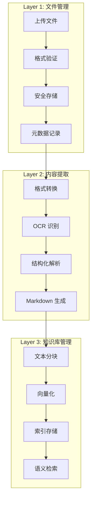
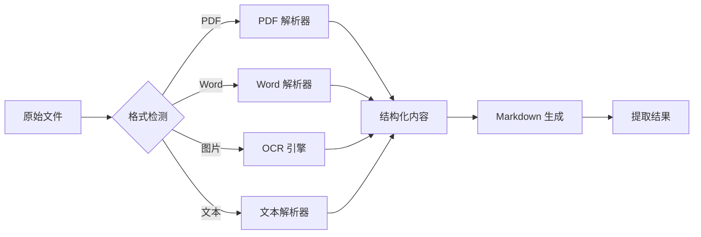
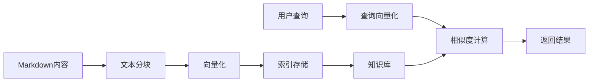
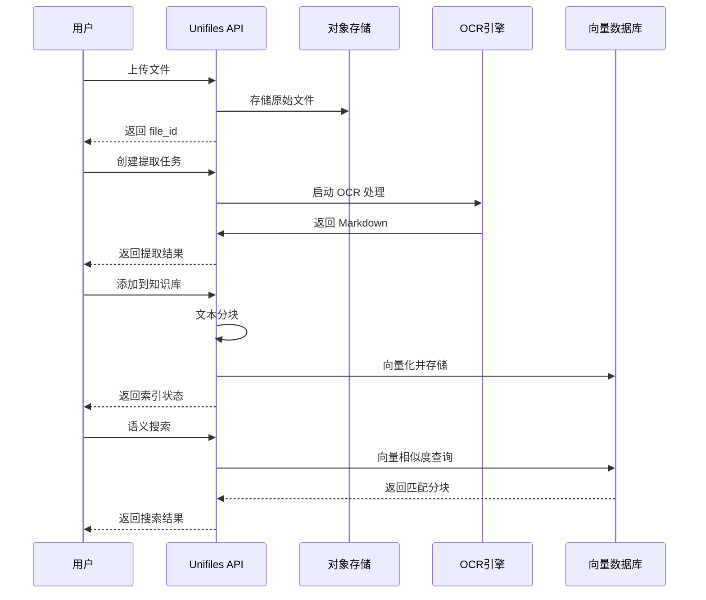

# 工作原理

本文详细介绍 Unifiles 的三层业务架构和数据处理流程，帮助你理解系统的内部运作机制。

!!! info "实现说明"
    0.1 单机 Server 使用 SQLite、本地文件存储和进程内后台任务实现这三层语义；
    REST/SDK 契约不依赖具体存储或队列后端。

## 三层业务架构

Unifiles 将文档处理分解为三个独立且可组合的业务层。这种设计让你可以根据需求选择使用部分或全部功能。



---

## Layer 1: 文件管理

文件管理层负责原始文件的接收、验证和安全存储。

### 核心功能

| 功能 | 说明 |
|------|------|
| **文件上传** | 支持多种格式：PDF、Word、Excel、图片等 |
| **格式验证** | 自动检测文件类型，拒绝不支持的格式 |
| **安全存储** | 加密存储于对象存储（MinIO/S3） |
| **元数据管理** | 记录文件名、大小、类型、上传时间等 |
| **标签系统** | 支持自定义标签，便于分类和检索 |

### API 示例

```python
from unifiles import UnifilesClient

client = UnifilesClient(api_key="sk_...")

# 上传文件
file = client.files.upload(
    path="contract.pdf",
    tags=["legal", "2024"],
    metadata={"project": "merger-acquisition"}
)

print(f"文件ID: {file.id}")
print(f"文件名: {file.filename}")
print(f"大小: {file.size} bytes")
print(f"状态: {file.status}")  # uploaded

# 列出文件
files = client.files.list(limit=50, tags=["legal"])
for f in files.items:
    print(f"{f.id}: {f.filename}")

# 获取文件信息
file = client.files.get(file_id="f_xxx")

# 下载文件
content = client.files.download(file_id="f_xxx")

# 删除文件
client.files.delete(file_id="f_xxx")
```

### 数据模型

```
files
├── id              # 唯一标识符
├── user_id         # 所属用户
├── filename        # 文件名
├── original_filename
├── mime_type       # MIME 类型
├── bytes           # 文件大小
├── file_hash       # 内容哈希
├── storage_path    # 存储路径
├── status          # uploaded | processing | completed | failed
├── tags[]          # 标签列表
├── metadata{}      # 自定义元数据
├── created_at
└── updated_at
```

---

## Layer 2: 内容提取

内容提取层负责将各种格式的文档转换为统一的 Markdown 格式。

### 处理流程



### 提取模式

| 模式 | 说明 | 适用场景 |
|------|------|---------|
| `simple` | 快速文本提取，不进行复杂布局分析 | 纯文本文档、快速预览 |
| `normal` | 标准 OCR 处理，识别文本和基本结构 | 一般 PDF、Word 文档 |
| `advanced` | 多模态增强，使用大模型理解复杂布局 | 扫描件、复杂表格、图表 |

### API 示例

```python
# 创建提取任务
extraction = client.extractions.create(
    file_id=file.id,
    mode="normal",
    options={
        "language": "zh",           # 主要语言
        "extract_tables": True,     # 提取表格
        "extract_images": True      # 提取图片描述
    }
)

print(f"提取任务ID: {extraction.id}")
print(f"状态: {extraction.status}")  # processing

# 等待提取完成
extraction.wait(timeout=300)  # 最多等待5分钟

# 或轮询检查状态
extraction = client.extractions.get(extraction.id)
if extraction.status == "completed":
    print(f"Markdown 内容:\n{extraction.markdown[:500]}...")
    print(f"总页数: {extraction.total_pages}")
    print(f"总字符: {extraction.total_chars}")
```

### 输出格式

提取结果以 Markdown 格式返回，保留文档的结构信息：

```markdown
# 合同标题

## 第一条 定义

本合同中下列术语的含义如下：

1. **甲方**：指 XXX 公司
2. **乙方**：指 YYY 公司

## 第二条 合同标的

| 项目 | 规格 | 数量 | 单价 |
|------|------|------|------|
| 产品A | 标准版 | 100 | ¥1,000 |
| 产品B | 高级版 | 50 | ¥2,000 |

## 第三条 违约责任

...
```

### 数据模型

```
extractions
├── id              # 提取任务ID
├── file_id         # 源文件ID
├── user_id         # 所属用户
├── mode            # simple | normal | advanced
├── status          # pending | processing | completed | failed
├── markdown        # 提取的Markdown内容
├── total_pages     # 总页数
├── total_chars     # 总字符数
├── total_words     # 总词数
├── assets[]        # 提取的图片等资源
├── metadata{}      # 提取元数据
├── created_at
├── completed_at
└── error           # 失败时的错误信息
```

---

## Layer 3: 知识库管理

知识库管理层负责将提取的内容进行分块、向量化，并提供语义检索能力。

### 处理流程



### 分块策略

| 策略 | 说明 | 适用场景 |
|------|------|---------|
| `fixed` | 固定字符数分块 | 简单文档，对边界不敏感 |
| `semantic` | 基于语义边界分块 | 一般文档，保持段落完整性 |
| `hierarchical` | 层级结构分块 | 有明确章节结构的文档 |

### API 示例

```python
# 创建知识库
kb = client.knowledge_bases.create(
    name="product-docs",
    description="产品文档知识库",
    chunking_strategy={
        "type": "semantic",
        "chunk_size": 512,
        "overlap": 50
    }
)

print(f"知识库ID: {kb.id}")
print(f"名称: {kb.name}")

# 添加文档到知识库
doc = client.knowledge_bases.documents.create(
    kb_id=kb.id,
    file_id=file.id,  # 需要已完成内容提取
    title="用户手册 v2.0",
    metadata={"version": "2.0", "category": "manual"}
)

# 等待索引完成
doc.wait()

print(f"文档ID: {doc.id}")
print(f"分块数: {doc.chunk_count}")

# 语义搜索
results = client.knowledge_bases.search(
    kb_id=kb.id,
    query="如何配置用户权限？",
    top_k=5,
    threshold=0.7
)

for chunk in results.chunks:
    print(f"相似度: {chunk.score:.2f}")
    print(f"内容: {chunk.content[:200]}...")
    print(f"来源文档: {chunk.document_id}")
    print("---")

# 混合搜索（向量 + 关键词）
results = client.knowledge_bases.hybrid_search(
    kb_id=kb.id,
    query="用户权限配置",
    vector_weight=0.7,
    keyword_weight=0.3
)
```

### 数据模型

```
knowledge_bases
├── id              # 知识库ID
├── user_id         # 所属用户
├── name            # 名称
├── description     # 描述
├── chunking_strategy{}  # 分块策略配置
├── document_count  # 文档数量
├── chunk_count     # 分块数量
├── created_at
└── updated_at

documents
├── id              # 文档ID
├── kb_id           # 所属知识库
├── file_id         # 源文件ID
├── extraction_id   # 提取任务ID
├── title           # 文档标题
├── chunk_count     # 分块数量
├── status          # indexing | indexed | failed
├── metadata{}      # 自定义元数据
├── created_at
└── indexed_at

chunks
├── id              # 分块ID
├── document_id     # 所属文档
├── content         # 文本内容
├── embedding       # 向量表示
├── position        # 在文档中的位置
├── metadata{}      # 分块元数据
└── created_at
```

---

## 完整数据流

从文件上传到知识库检索的完整数据流：



---

## 下一步

<div class="grid cards" markdown>

-   :material-lightbulb: **设计理念**
    
    理解 Markdown-as-SSOT 设计和 API 设计哲学
    
    [:octicons-arrow-right-24: design-philosophy.md](./design-philosophy.md)

-   :material-rocket-launch: **快速开始**
    
    动手实践三层架构的完整流程
    
    [:octicons-arrow-right-24: quickstart.md](../quickstart.md)

-   :material-api: **API 使用指南**
    
    详细的 API 使用说明
    
    [:octicons-arrow-right-24: using-the-api](../using-the-api/index.md)

</div>
