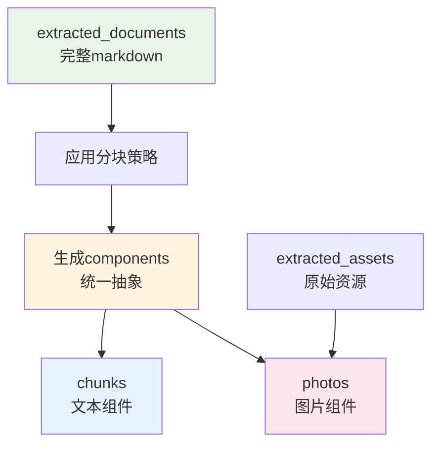

# 基于组件抽象的数据库设计说明

## 🎯 核心设计理念


```
文件 → OCR提取 → 文档(完整markdown) → 分块策略 → 组件 → chunks/photos子类
```

## 🏗️ 清晰的抽象层次

### 1. 提取层：文档为核心
```
extracted_documents: OCR后的完整markdown文档（无信息丢失）
extracted_assets: 文档中的资源文件（图片、表格等）
```

### 2. 知识库层：组件为核心
```
documents: 知识库中的文档实例（引用extracted_documents）
components: 分块后的统一组件抽象
├── chunks: 组件的文本子类
└── photos: 组件的图片子类
```

## 📊 核心抽象关系

### 文档 → 组件的分块过程


### 组件的统一抽象设计
```sql
-- 组件表：统一抽象
components {
    id, document_id, component_type, component_index,
    content,                    -- 统一内容字段
    embedding,                  -- 统一向量字段
    start_position, end_position, section_title
}

-- 文本子类：继承组件
chunks {
    component_id (1:1),         -- 关联组件
    text_content,               -- 文本特有属性
    chunk_subtype,              -- paragraph/heading/code/etc
    char_count, word_count, token_count
}

-- 图片子类：继承组件
photos {
    component_id (1:1),         -- 关联组件
    extracted_asset_id,         -- 引用原始资源
    photo_description,          -- 图片特有属性
    photo_subtype               -- image/chart/diagram/etc
}
```

## 🔄 业务流程

### 阶段1：文件提取（OCR中间件）
```
1. 用户上传文件 → files表
2. OCR处理 → extracted_documents（完整markdown）
3. 资源提取 → extracted_assets（图片、表格等）
```

### 阶段2：知识库索引（分块策略）
```
1. 选择提取文档 → 创建documents（引用extracted_documents）
2. 应用分块策略 → 生成components
3. 文本组件 → chunks表（1:1关系）
4. 图片组件 → photos表（1:1关系，引用extracted_assets）
```

## 🎯 设计优势

### 1. 清晰的抽象层次
- **文档层**：完整的OCR结果，无信息丢失
- **组件层**：统一的分块抽象，支持多种类型
- **子类层**：文本和图片的特化实现

### 2. 高度的灵活性
```sql
-- 同一个文档可以用不同策略分块
-- 文档A：按段落分块
{
  "strategy_type": "paragraph",
  "max_chunk_size": 500
}

-- 文档B：按标题分块
{
  "strategy_type": "markdown_hierarchical", 
  "split_on_headers": true,
  "preserve_structure": true
}
```

### 3. 统一的检索接口
```sql
-- 统一在components层检索
SELECT c.*, 
       CASE 
         WHEN c.component_type = 'chunk' THEN ch.text_content
         WHEN c.component_type = 'photo' THEN p.photo_description
       END as content
FROM components c
LEFT JOIN chunks ch ON c.id = ch.component_id
LEFT JOIN photos p ON c.id = p.component_id
WHERE c.embedding <-> $query_vector < 0.5
ORDER BY c.embedding <-> $query_vector;
```

### 4. 零数据冗余
- `extracted_documents`：单一真实来源
- `components`：统一抽象层
- `chunks/photos`：继承关系，无重复数据

## 📝 核心表说明

### extracted_documents（提取文档）
- **职责**：存储OCR后的完整markdown文档
- **特点**：
  - 保持原始完整性，无信息丢失
  - 一个文件对应一个提取文档
  - 包含质量评分和统计信息

### components（组件抽象）
- **职责**：分块后的统一组件抽象
- **特点**：
  - 统一的向量嵌入字段
  - 统一的位置和内容字段
  - 支持文本和图片两种子类

### chunks（文本组件）
- **职责**：文本组件的特化实现
- **特点**：
  - 与components 1:1关系
  - 包含文本特有属性（字符数、词数等）
  - 支持多种文本子类型

### photos（图片组件）
- **职责**：图片组件的特化实现
- **特点**：
  - 与components 1:1关系
  - 引用extracted_assets（不复制）
  - 包含图片描述和上下文信息

## 🔍 查询示例

### 1. 混合检索（文本+图片）
```sql
-- 统一在components层进行向量检索
WITH similar_components AS (
  SELECT c.*, c.embedding <-> $query_vector as distance
  FROM components c
  WHERE c.embedding <-> $query_vector < 0.5
  ORDER BY distance
  LIMIT 20
)
SELECT 
  sc.*,
  CASE 
    WHEN sc.component_type = 'chunk' THEN ch.text_content
    WHEN sc.component_type = 'photo' THEN p.photo_description
  END as content,
  CASE 
    WHEN sc.component_type = 'photo' THEN ea.asset_url
  END as asset_url
FROM similar_components sc
LEFT JOIN chunks ch ON sc.id = ch.component_id
LEFT JOIN photos p ON sc.id = p.component_id
LEFT JOIN extracted_assets ea ON p.extracted_asset_id = ea.id
ORDER BY sc.distance;
```

### 2. 文档重新分块
```sql
-- 删除旧的组件
DELETE FROM components WHERE document_id = $doc_id;

-- 应用新的分块策略生成新组件
-- 这里会重新分析extracted_documents中的markdown
```

### 3. 资源复用检查
```sql
-- 检查同一个资源在不同文档中的使用情况
SELECT d.title, p.usage_context, ea.asset_name
FROM photos p
JOIN components c ON p.component_id = c.id
JOIN documents d ON c.document_id = d.id
JOIN extracted_assets ea ON p.extracted_asset_id = ea.id
WHERE ea.id = $asset_id;
```

## 🚀 实施优势

### 1. 参考原有实现
- 保留了原有的`documents`、`components`、`chunks`、`photos`概念
- 在此基础上增加了提取层，使职责更清晰

### 2. OCR前置处理
- OCR作为文件处理的中间件
- 生成无信息丢失的完整markdown
- 为后续灵活分块提供基础

### 3. 自定义分块策略
- 用户可以在知识库层自定义分块策略
- 同一个文档可以用不同策略生成不同的组件
- 支持策略的动态调整和优化

这个设计既保持了原有架构的优势，又通过引入提取层和组件抽象，实现了更高的灵活性和可维护性。